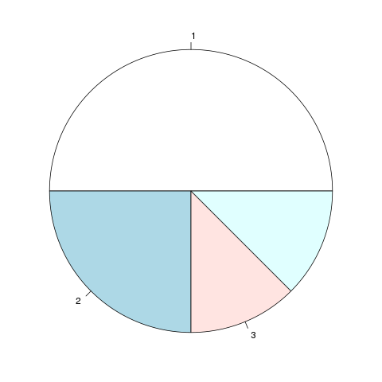

### Das Summenzeichen $\Sigma$ und Rechenregeln

Das grosse Sigma \(\Sigma\) wird verwendet, um längere Summen in einer kurzen Schreibweise darzustellen. Meist wird das Zeichen verwendet, wenn man Kennziffern oder Teststatistiken für eine Stichprobe ausrechnet.

Wir werden hier als Beispiel das Lebensalter von fünf ARD-Zuschauern betrachten, und daraus einen Mittelwert berechnen.

| Person $i$ | Alter $x_i$ |
| ---------- | ----------- |
| $i=1$      | 87          |
| $i=2$      | 13          |
| $i=3$      | 77          |
| $i=4$      | 97          |
| $i=5$      | 67          |


Wir messen hier das Merkmal \(x\), welches das Alter darstellen soll. Der Index \(i\) wird benutzt, um das Alter einer einzelnen Person darzustellen, zum Beispiel steht \(x_3\) für das Alter der dritten Person, \(x_3=77\).

Der Mittelwert \(\bar{x}\) lässt sich nun folgendermaßen berechnen:

\[ \bar{x} = \frac{1}{n} (x_1 + x_2 + x_3 + x_4 + x_5) = \frac{1}{n} \sum_{i=1}^n x_i \]

Das bedeutet nun, dass \(i\) eine Zählvariable ist, die von 1 bis \(n\) läuft (wir haben fünf Personen, also ist \(n=5\)). Es wird für jede Zählvariable \(i\) die Teilsumme \(x_i\) gebildet, und am Ende aufsummiert. In unserem Fall ist die Summe in ausgeschriebener Form:

\[ \begin{aligned} \frac{1}{n} \sum_{i=1}^5 x_i & = \frac{1}{n} (x_1+x_2+x_3+x_4+x_5) \\ & = \frac{1}{5} (87+134+77+97+68) \\ & = 92.6 \end{aligned} \]

**Rechenregeln mit dem Summenzeichen**

Man sollte vielleicht im Hinterkopf halten, dass Summen manchmal in einer abgekürzten Schreibweise aufgeschrieben werden. Wenn klar ist, über welche Zahlen die Zählvariable \(i\) laufen soll, findet man das Summenzeichen oft in Kurzform, zum Beispiel

\[\sum_{i=1}^n (x_i - \mu)^2 = \sum_i (x_i-\mu)^2.\]

Falls hinter dem Summenzeichen keine Klammer steht, die anzeigt, "wie weit" die Summe geht, gilt im Allgemeinen diese Regel: Produkte und Potenzen gehören noch zum Summenzeichen dazu, aber ab dem ersten Plus bzw. Minus ist die Summe zu Ende:

\[\sum_{i=1}^3 i\cdot 2^2 + 5 = (1\cdot 2^2 + 2\cdot 2^2 + 3\cdot 2^2) + 5\]

Wenn man eine Summe, die durch das \(\Sigma\) dargestellt wird, in Gedanken in eine "normale" Summe zerlegt, kann man die folgenden Rechenregeln leicht nachvollziehen, da sie direkt von ausgeschriebenen Summen abgeleitet werden können:

- \(\sum_i a \cdot x_i = a \cdot \sum_i x_i\)
- \(\sum_i (x_i + y_i) = \sum_i x_i + \sum_i y_i\)
- \(\sum_i (a x_i + b y_i) = \sum_i a x_i + \sum_i b y_i = a \sum_i x_i + b \sum_i y_i\)

Die erste Regel in dieser Liste ist das bekannte Ausklammern, und lässt sich nachvollziehen indem man die Summe ausschreibt:

\[\begin{aligned}\sum_i a \cdot x_i & = a x_1 + a x_2 + a x_3 + \ldots \\ & = a \cdot (x_1 + x_2 + x_3 + \ldots) \\ & = a \cdot \sum_i x_i\end{aligned}\]

Die anderen Regeln kann man auf dieselbe Weise ausschreiben und nachvollziehen.

```{exercise, echo=TRUE}

Stellen wir uns vor, es steht eine große Torte auf dem Tisch. Nacheinander laufen nun sehr, sehr viele Leute daran vorbei, und jeder nimmt sich die Hälfte von dem, das im Moment noch übrig ist. Die erste Person nimmt sich also die halbe Torte, die zweite Person die Hälfte vom Rest, d.h. eine Viertel Torte, die nächste Person nimmt sich ein Achtel, usw.

Die Torte wird nie komplett aufgegessen, aber doch immer kleiner. Den gesamten Anteil der Torte , der nach \(n\) Personen schon gegessen wurde, kann man durch eine Summe ausdrücken:

\[ \sum_{i=1}^n \frac{1}{2^i} \]

Um den Umgang mit dem Summenzeichen zu erlernen, bestimme, welcher Anteil der Torte nach \(n=3\) Personen aufgegessen wurde (s. Abb. \@ref(fig:summenzeichen-pie)).
```

```{r summenzeichen-pie, fig.cap="Wieviel wurde schon gegessen, nachdem Person 1, 2, und 3 sich nacheinander die Hälfte vom Rest abgeschnitten haben?"}

```


```{solution, echo=TRUE}
Bei drei Personen sieht die Formel ausgeschrieben so aus:

\[\sum_{i=1}^3 \frac{1}{2^i}= \frac{1}{2^1} + \frac{1}{2^2} + \frac{1}{2^3}= \frac{1}{2} + \frac{1}{4} + \frac{1}{8} = \frac{7}{8} \]

Nachdem sich drei Personen bedient haben, sind also \(\frac{7}{8}\) des Kuchens schon aufgegessen.
```


