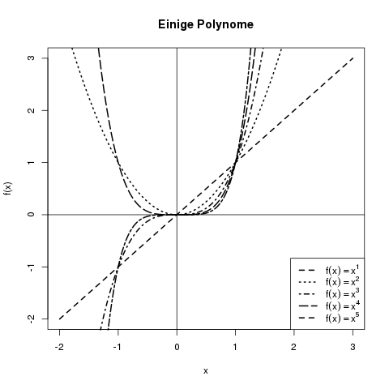
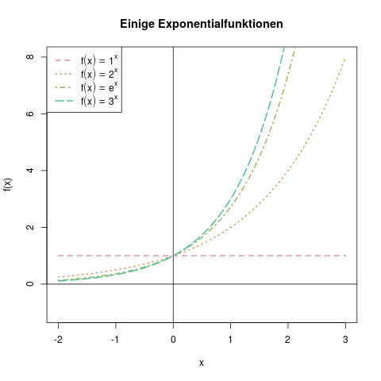
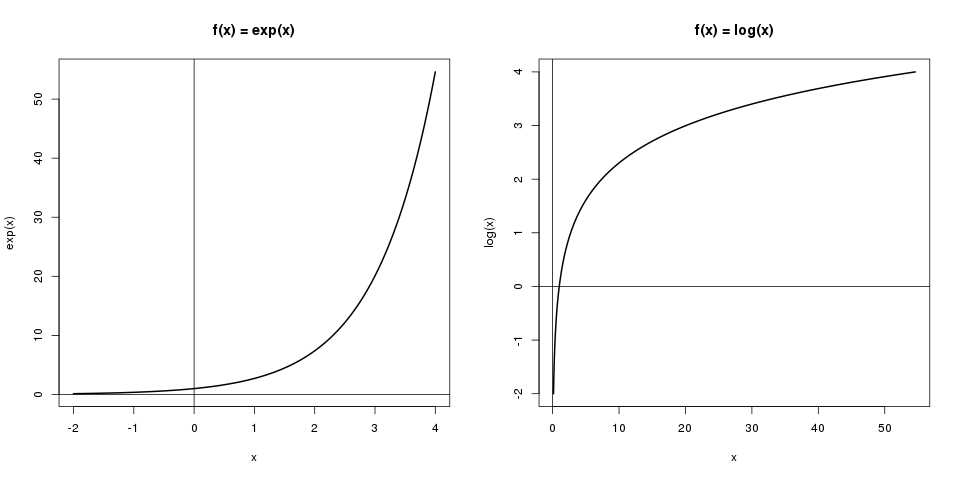
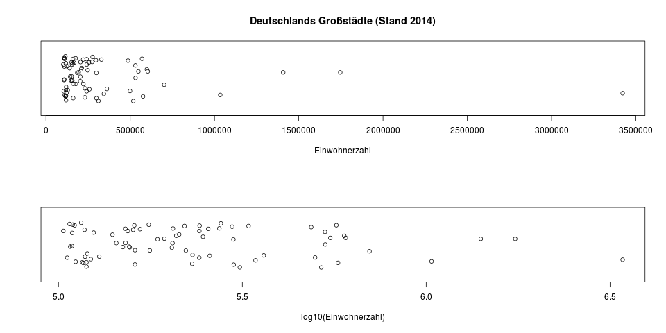

### Exponentialfunktion und Logarithmusfunktion

#### Potenzen

Bevor wir Polynome und Exponentialfunktionen besprechen, frischen wir die Grundlagen über Potenzen nocheinmal auf.

**Potenzen** sind, einfach ausgedrückt, eine Kurzschreibweise für wiederholte Multiplikation. Genauso wie man statt \(4+4+4+4+4\) einfach kurz \(5\cdot 4\) schreiben kann, so kann man \(3\cdot 3\cdot 3\cdot 3\cdot 3\) durch \(3^5\) abkürzen. Hier bezeichnet man die \(3\) als Basis, und die \(5\) als *Exponent.*

Der Sonderfall \(x^0=1\) ist so definiert, da wir quasi "null" Multiplikationen vornehmen, also nur das bei der Multiplikation neutrale Element 1 übrigbleibt.

**Negative Exponenten** verwendet man für wiederholte *Division.* Es gilt also z.B.

\[ 2^{-4} = 1 \div 2 \div 2 \div 2 \div 2 = \frac{1}{2^4} \]

**Brüche als Exponenten** bezeichnen Wurzeln. Zum Beispiel bedeutet \(5^\frac{1}{2}\) dasselbe wie \(\sqrt{5}\), und \(2^\frac{1}{3}\) ist gleichbedeutend mit \(\sqrt[3]{2}\).
Falls im Zähler des Bruches eine andere Zahl als 1 steht, ist das die Potenz der Basis unter dem Bruch:

\[ 2^\frac{3}{4} = \sqrt[4]{2^3} \]

**Reelle Exponenten**, also zum Beispiel \(3^{3.1415926\ldots}\), sind nicht mehr ganz so intuitiv zu erklären. Man kann sich den Exponenten am besten als Interpolation zweier ihm nahe liegender Brüche vorstellen.

**Rechenregeln für Potenzen** gibt es einige. Die wichtigsten sind in der folgenden Übersicht zusammengefasst - links die allgemeine Regel, rechts ein veranschaulichendes Beispiel:

| Regel                                            | Beispiel                                                                             |
| ------------------------------------------------ | ------------------------------------------------------------------------------------ |
| \(x^a \cdot x^b = x^{a+b}\)                      | \(x^3 \cdot x^2 = x \cdot x \cdot x \cdot x \cdot x = x^5 = x^{2+3}\)                |
| \(\frac{x^a}{x^b} = x^{a-b}\)                    | \(\frac{x^4}{x^2} = \frac{x \cdot x \cdot x \cdot x}{x \cdot x} = x^2 = x^{4-2}\)    |
| \((x^r)^s = x^{r\cdot s}\)                       | \((x^2)^2 = x^2 \cdot x^2 = x \cdot x \cdot x \cdot x = x^{2\cdot 2}\)               |
| \(\left(\frac{x}{y}\right)^r = \frac{x^r}{y^r}\) | \(\left(\frac{x}{y}\right)^3 = \frac{x}{y}\frac{x}{y}\frac{x}{y} = \frac{x^3}{y^3}\) |
| \((x\cdot y)^r = x^r \cdot y^r\)                 | \((x\cdot y)^2 = (x\cdot y) \cdot (x\cdot y) = x^2 y^2\)                             |

#### Exponentialfunktion

Die Exponentialfunktion ist eine in der Statistik sehr häufig verwendete Funktion, denn sie kommt in den meisten stetigen und diskreten Dichten vor. Was es damit auf sich hat, werden wir hier besprechen.

Die meisten sind wohl vertraut mit Polynomialfunktionen wie \(f(x) = x^3\). Hier ist die Basis (hier \(x\)) die Variable, und der Exponent (hier \(3\)) eine konstante Zahl. Die dazugehörigen Kurven sehen beispielsweise wie in Abbildung \@ref(fig:einige-polynome) aus.

(ref:einige-polynome-caption) Beispiele für Polynomfunktionen: Die Kurven für \(x^a\) mit \(a=1,2,3,4,5\).

```{r einige-polynome, fig.cap="(ref:einige-polynome-caption)"}

```

**Von der Polynomfunktion zur Exponentialfunktion** gelangt man nun, wenn man nicht die Basis variiert, sondern den Exponenten. Wir nehmen also nicht \(f(x)=x^2\), sondern stattdessen \(f(x)=2^x\). Exponentialfunktionen sehen wie in Abbildung \@ref(fig:einige-exponentialfunktionen) aus.

(ref:einige-exponentialfunktionen-caption) Die Exponentialfunktionen für die Basis 1, 2, \(e\), und 3. Die Funktion \(f(x)=1^x\) ist konstant 1, da z.B. \(1^3=1\) ist.

```{r einige-exponentialfunktionen, fig.cap="(ref:einige-exponentialfunktionen-caption)"}

```

Hier fallen die folgenden Dinge auf:

- Alle Exponentialfunktionen haben an der Stelle 0 den Wert 1, da \(a^0=1\), egal für welches \(a\).
- Im negativen Bereich nehmen die Funktionen Werte zwischen 0 und 1 an, da die negativen Exponenten in diesem Bereich wie oben besprochen zu einem Bruch führen, der kleiner als 1 ist.
- Je größer die Basis ist, desto steiler steigt die Exponentialfunktion an.

Die Funktionen haben den Definitionsbereich \(\mathbb{R}\), denn jede reelle Zahl kann im Exponenten stehen. Weil die Funktion aber nur Werte im positiven Bereich liefert, ist ihr Wertebereich \(\mathbb{R}^+\), die reellen Zahlen größer als Null.

Eine besondere Basis ist die eulersche Zahl \(e\). Sie ist ungefähr \(e \approx 2.71828\) und wird in Dichtefunktionen häufig als Basis verwendet. Dargestellt wird sie häufig in Termen wie \(e^{-\frac{1}{2}x^2}\), oder in der alternativen Schreibweise \(\exp (-\frac{1}{2}x^2)\).

**Rechenregeln für die Exponentialfunktion** lassen sich anhand der Rechenregeln für Potenzen ableiten. Da, wie oben besprochen, zum Beispiel \(x^a \cdot x^b = x^{a+b}\) gilt, ist genauso mit der Basis \(e\) die folgende Gleichung gültig: \(\exp (a) \cdot \exp (b) = \exp (a+b)\).

Mit dem Summenzeichen kann man diese Formel noch auf längere Summen erweitern, und es gilt:

\[ \prod_{i=1}^n \exp (x_i) = \exp (\sum_{i=1}^n x_i) \]

#### Logarithmusfunktion

Der Logarithmus ist die **Umkehrfunktion** zur Exponentialfunktion. Mit einer Umkehrfunktion kann man eine Transformation quasi rückgängig machen. Es ist zum Beispiel die Wurzelfunktion die Umkehrfunktion zur Quadratfunktion, denn mit ihr kann man eine Quadrierung wieder rückgängig machen:

\[ \begin{aligned} 3^2 &= 9 \\ \sqrt{9} &= 3 \end{aligned} \]

Genauso kann man mit dem Logarithmus einer Zahl, der als \(\log (x)\) dargestellt wird, eine Exponentialfunktion wieder rückgängig machen. Es ist also zum Beispiel

\[ \begin{aligned} \exp (3) &\approx 20.086 \\ \log (20.086) &\approx 3 \end{aligned} \]

In diesem Beispiel interpretiert man den Logarithmus so: "\(e\) hoch *wieviel* ist 20.086?". Der Logarithmus gibt die Antwort auf diese Frage (s. Abb. \@ref(fig:logarithmusfkt)).

(ref:logarithmusfkt-caption) Auf der linken Grafik sieht man die Exponentialfunktion \(f(x) = \exp (x)\). Hier kann man ablesen, dass \(\exp (3)\) in etwa 20 ist. Auf der rechten Grafik ist die Logarithmusfunktion, \(f(x) = \log (x)\), dargestellt. Hier kann man die erhaltenen 20 wieder umkehren in \(\log (20) \approx 3\).

```{r logarithmusfkt, fig.cap="(ref:logarithmusfkt-caption)"}

```

Genauso wie es bei Exponentialfunktionen eine Basis gibt (wie z.B. die Basis \(10\) bei der Funktion \(f(x) = 10^x\), so bezieht sich auch ein Logarithmus immer auf eine Basis. Der *natürliche Logarithmus*, den wir bisher betrachtet haben, bezieht sich auf die Basis \(e\). Die verbreitetsten anderen Logarithmen ist der Zweierlogarithmus mit der Basis 2, und der Zehnerlogarithmus mit der Basis 10. Am eindeutigsten notiert man den Logarithmus, indem man die Basis unter das Log-Symbol schreibt, also z.B. \(\log_{10}\) oder \(\log_2\). Wenn keine Zahl als Basis hinzugefügt wurde, meint ein "nacktes" \(\log\)-Symbol zumindest im statistischen Bereich immer den natürlichen Logarithmus, zur Basis \(e\). In manchen angewandten Gebieten kann damit allerdings auch der Zehnerlogarithmus gemeint sein, dort wird dann \(\ln\) für den natürlichen Logarithmus verwendet. Wegen dieser Möglichkeit der Verwechslung ist es empfohlen, die Basis immer explizit dazuzuschreiben.

Der Zehnerlogarithmus ist besonders leicht zu interpretieren, da die Zehnerpotenzen (10, 100, 1000, usw.) eine ganze Zahl ergeben. Er findet oft in Grafiken Anwendung, wo er zur Transformation von Daten verwendet wird, die man in ihrer untransformierten Darstellung schlecht erkennen kann. Das sind meistens Daten, die eine schiefe Verteilung haben - als Beispiele kann man sich das Nettoeinkommen in einer großen Firma, oder die Einwohnerzahl aller deutschen Städte vorstellen (s. Abb. \@ref(fig:einwohnerzahlen)).

(ref:einwohnerzahlen-caption) Die Einwohnerzahlen aller deutschen Großstädte (>100.000 Einwohner). Oben sieht man die untransformierten Daten, und eine sehr schiefe Verteilung, in der sich fast alle Punkte zwischen 100.000 und 500.000 aufhalten. Die vier Städte rechts der 1Mio-Marke sind Berlin, Hamburg, München und Köln. In der unteren Grafik sind die Daten nur mit dem Zehnerlogarithmus transformiert. Man hat hier eine bessere Übersicht über die Streuung der Daten in den niedrigen Bereichen. Da \(\log_{10} (1.000.000) = 6\) ist, sind die vier Millionenstädte in der unteren Grafik die, die rechts der \(6.0\) liegen.

```{r einwohnerzahlen, fig.cap="(ref:einwohnerzahlen-caption)"}

```

Da das Ergebnis einer Exponentialfunktion nur positiv sein kann, kann man umgekehrt den Logarithmus auch nur von einer positiven Zahl nehmen. Ein Wert wie z.B. \(\log (-3)\) ist nicht definiert. Der Definitionsbereich für die Logarithmusfunktion ist also \(\mathbb{R}^+\), die gesamten positiven reellen Zahlen. Der Wertebereich hingegen sind die gesamten reellen Zahlen \(\mathbb{R}\).

**Rechenregeln für den Logarithmus** gibt es natürlich auch. Die wichtigsten sind in der folgenden Tabelle zusammengefasst, wobei links die allgemeine Regel, und rechts eine Anwendung der Regel steht:

| Regel                                          | Beispiel                                                            |
| ---------------------------------------------- | ------------------------------------------------------------------- |
| \(\log \left( \exp (x) \right) = x\)           | \(\log_{10}(10^8) = 8\)                                             |
| \(\exp \left( \log (x) \right) = x\)           | \(10^{\log_{10}(8)} = 8\)                                           |
| \(\log ( x \cdot y ) = \log (x) + \log (y)\)   | \(\log (\prod_{i=1}^n x_i) = \sum_{i=1}^n \log (x_i)\)              |
| \(\log ( \frac{x}{y} ) = \log (x) - \log (y)\) | \(\log (\frac{1}{3}) = \log (1) - \log (3)\)                        |
| \(\log (x^r) = r \cdot \log (x)\)              | \(\log (\sqrt{x}) = \log (x^{\frac{1}{2}}) = \frac{1}{2} \log (x)\) |