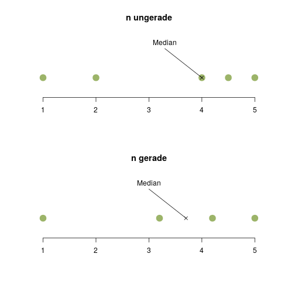

## Lageparameter {#lageparameter}

#### Das Wichtigste in Kürze {-}

Lageparameter beschreiben grob gesagt, wo auf einer Skala sich die Daten befinden. Dabei gibt es verschiedene Methoden der Berechnung, die für verschiedene Merkmalstypen mehr oder weniger Sinn machen. Eine kurze Übersicht sieht man in der folgenden Tabelle. Da der Median ein bestimmtes [Quantil](#sec-quantile) ist (nämlich das 50%-Quantil), sind die beiden Spalten gleich. Mit "Diskret" sind in dieser Tabelle Zähldaten wie etwa die Kinderzahl gemeint.

|                  | Modus | Median | Quantile | Mittelwert |
| ---------------- | ----- | ------ | -------- | ---------- |
| Nominal          | ja    | nein   | nein     | nein       |
| Ordinal          | ja    | ja     | ja       | nein       |
| Diskret          | ja    | ja     | ja       | ja         |
| Stetig klassiert | ja    | ja     | ja       | nein       |
| Stetig           | nein  | ja     | ja       | ja         |

### Arithmetischer Mittelwert {#sec-mittelwert}

Der arithmetische Mittelwert (oft auch "arithmetisches Mittel" oder nur "Mittelwert" genannt) ist der bekannteste Lageparameter. Er wird gebildet, indem man alle Ausprägungen aufsummiert und durch die Gesamtzahl von Ausprägungen teilt. Für die Beobachtungen \(x_1, x_2, \ldots, x_n\) sieht das arithmetische Mittel \(\bar{x}\) folgendermaßen aus:

\[ \bar{x} = \frac{1}{n} \sum_{i=1}^n x_i \]

Angenommen, wir befragen 7 Familien nach der Kinderzahl im Haushalt und bekommen die in der folgenden Tabelle dargestellten Antworten.

| Familie | Merkmal | Kinder |
| ------- | ------- | ------ |
| Weber   | \(x_1\) | 1      |
| Kaiser  | \(x_2\) | 2      |
| Kandl   | \(x_3\) | 6      |
| Nöbauer | \(x_4\) | 1      |
| Sturm   | \(x_5\) | 1      |
| Baumann | \(x_6\) | 3      |
| Dürr    | \(x_7\) | 2      |


Der Mittelwert berechnet sich demnach zu \(\frac{1}{7}(1+2+6+1+1+3+2) = 2.2857\).

### Median {#sec-median}

Der Median ist der Wert, der die Daten in zwei gleich große Hälften teilt. Genauer gesagt ist es der Wert, für den mindestens die Hälfte der Daten kleiner oder gleich dem Median, und mindestens die Hälfte der Daten größer oder gleich dem Median sind. Warum man das so kompliziert formulieren muss, sehen wir gleich am folgenden Beispiel.

Schauen wir uns nochmal die Kinderzahlen an, um die es beim arithmetischen Mittel schon ging. Um für diese Daten den Median von Hand zu bestimmen, müssen wir die Merkmalsausprägungen zuerst aufsteigend in eine sogenannte *geordnete Urliste* sortieren:

| Merkmal     | Kinder |
| ----------- | ------ |
| \(x_{(1)}\) | 1      |
| \(x_{(2)}\) | 1      |
| \(x_{(3)}\) | 1      |
| \(x_{(4)}\) | 2      |
| \(x_{(5)}\) | 2      |
| \(x_{(6)}\) | 3      |
| \(x_{(7)}\) | 6      |

Wenn der Index - wie hier - in Klammern steht, handelt es sich immer um *sortierte* Daten.

Nun brauchen wir eine Zahl (das muss, genau wie beim Mittelwert, nicht unbedingt eine Merkmalsausprägung aus der Datenreihe sein), für die mindestens die Hälfte der Daten größer/gleich diesem Wert sind, und mindestens die Hälfte kleiner/gleich.

Würden wir die Zahl 1 nehmen, sind \(\frac{3}{7}\), also ca. 43% der Daten kleiner/gleich der 1, und 100% der Daten größer/gleich der 1. Hätten wir z.B. die Zahl 1.5 gewählt, wären immer noch 43% der Daten kleiner/gleich der 1.5, aber jetzt sind nur noch \(\frac{4}{7}\), also ca. 57\% der Daten größer/gleich der 1.5. Nehmen wir jetzt die Zahl 2 als möglichen Median. Es sind nun \(\frac{5}{7}\), also ca 71% kleiner/gleich der 2, und \(\frac{4}{7}\), also ca. 57% größer/gleich der 2. Wir haben unseren Median gefunden.

Der Median ist übrigens ein *robuster* Lageparameter, da er auf Ausreißer in den Daten nicht so stark reagiert wie z.B. der Mittelwert. Falls die Familie Kandl einen unerwarteten Kinderschub bekommt, könnte unsere Urliste auf einmal wie in der folgenden Tabelle aussehen:


| Merkmal     | Kinder |
| ----------- | ------ |
| \(x_{(1)}\) | 1      |
| \(x_{(2)}\) | 1      |
| \(x_{(3)}\) | 1      |
| \(x_{(4)}\) | 2      |
| \(x_{(5)}\) | 2      |
| \(x_{(6)}\) | 3      |
| \(x_{(7)}\) | 127    |

Das ist natürlich eine etwas optimistische Kinderplanung. Aber der wichtige Punkt ist dieser: Der Mittelwert ist jetzt 19.57, aber der Median ist immer noch 2.

Mit Hilfe der Schreibweise \(x_{(i)}\) für *sortierte* Daten lässt sich der Median nun sehr leicht mathematisch hinschreiben:

\[ x_\mathrm{med} = \begin{cases} x_{(\frac{n+1}{2})} & n \text{ ungerade}\\ \frac{1}{2} (x_{(\frac{n}{2})} + x_{(\frac{n}{2}+1)}) & n \text{ gerade} \end{cases} \]

Die zweiteilige Definition ist deswegen notwendig, weil wir bei einer ungeraden Anzahl von Daten einfach den "mittleren" Datenpunkt nehmen können - bei fünf Datenpunkten also einfach den dritten (Abbildung \@ref(fig:mediandots) klärt das vielleicht). Falls wir eine gerade Anzahl von Datenpunkten (z.B. vier) haben, gibt es keinen direkten "mittleren" Punkt, und wir müssen den Mittelwert aus den "beiden mittleren" (z.B. dem zweiten und dritten Punkt) bilden.

(ref:mediandots-caption) Der Median einer Datenreihe mit einer ungeraden bzw. geraden Anzahl von Elementen. Bei einer ungeraden Anzahl gibt es ein "mittleres" Element, nämlich das \(\frac{n+1}{2}\)-te Element \(x_{(\frac{n+1}{2})}\). Bei einer geraden Anzahl bildet man den Mittelwert zwischen den zwei Elementen in der Mitte, dem \(\frac{n}{2}\)-ten und dem \((\frac{n}{2}+1)\)-ten Element: \(\frac{1}{2}(x_{(\frac{n}{2})}+x_{(\frac{n}{2}+1)})\)

```{r mediandots, fig.cap="(ref:mediandots-caption)"}

```

### Modus

Der Modus (oder *Modalwert*) ist nur für nicht-stetige Daten definiert. Er ist die Ausprägung, die in der Stichprobe am häufigsten gezählt wurde. Für unsere Stichprobe zur Kinderanzahl ist der Modus also 1, da drei Familien ein Kind haben. Kein allzu großes Geheimnis.

```{exercise, echo=TRUE}

Schauen wir uns in der folgende Tabelle Beispieldaten eines diskreten Merkmals für 7 Personen an. Wir berechnen für diese Datenreihe den Mittelwert, Median, Modus, und das 75%-Quantil.

| Person | Merkmal |
| ------ | ------- |
| A      | 3       |
| B      | 2       |
| C      | 0       |
| D      | 5       |
| E      | 1       |
| F      | 4       |
| G      | 4       |

Der Mittelwert berechnet sich zu \(\frac{1}{7}(3+2+0+5+1+4+4) \approx 2.714\). Für den Median ordnen wir unsere Daten. Da \(n\) ungerade ist, können wir direkt das mittlere, vierte Element in der geordneten Liste verwenden:

Geordnetes Merkmal: (0, 1, 2, 3, 4, 4, 5)

Der Median ist also 3. Der Modus ist 4, da diese Ausprägung am häufigsten (zweimal) vorkommt.

Zum 75%-Quantil: Wir wollen also einen Wert bestimmen, der die Daten so aufteilt, dass mindestens 75% kleiner/gleich und mindestens 25% größer/gleich diesem Wert sind. Diese Datenreihe kann man nicht genau in 75% und 25% aufteilen, d.h. \(np\) ist keine ganze Zahl. Über die Formel \(x_{(\lfloor np \rfloor + 1)}\) kommen wir zu \(x_{(5+1)}\), also dem sechsten Wert in der geordneten Liste, nämlich 4.
```