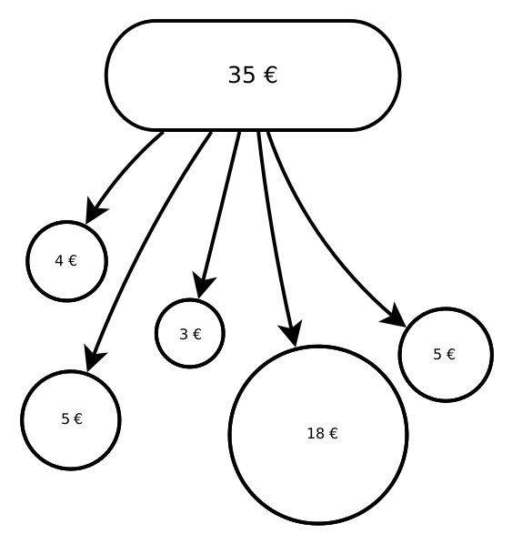
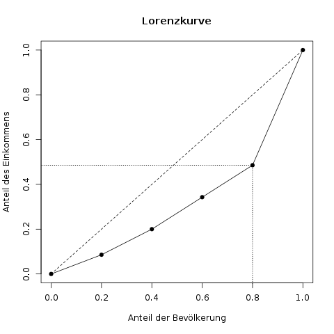
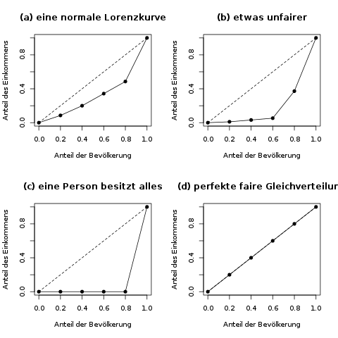

### Lorenzkurve {#sec-lorenzkurve}

#### Das Wichtigste in Kürze {-}

Die grundlegende Frage, die durch die Lorenzkurve beantwortet wird, ist die folgende: Welcher Anteil der sortierten Grundgesamtheit besitzt welchen Anteil an der Merkmalssumme?

Um die Kurve zu zeichnen, benötigt man also eine Liste von Anteilen (das wird die \(x\)-Achse), und eine Liste der kumulierten Merkmalssummen, die diesen Anteilen gehören (das wird die \(y\)-Achse).

#### Idee der Lorenzkurve {-}

Die Lorenzkurve ist ein beliebtes grafisches Mittel, um so eine Ungleichmäßigkeit zu visualisieren. An ihr kann man ablesen, wie sehr eine Verteilung von einer völlig gerechten Gleichverteilung abweicht (s. Abb. \@ref(fig:lorenzkurve-idee))

```{r lorenzkurve-idee, fig.cap="Ist das eine gerechte Verteilung eines Einkommens auf fünf Personen, oder ist sie zu konzentriert?"}

```

#### Erstellen einer Lorenzkurve {-}

Nehmen wir zur Vereinfachung ein Land mit 5 Einwohnern an. Die fünf Personen verdienen 3€, 4€, 5€, 5€ bzw. 18€. Zugegeben, das ist ein sehr kleines Land mit sehr niedrigem Lohn - aber wir möchten es ja einfach halten. Wir möchten nun für diese Einwohner und ihre Einkommensverteilung eine Lorenzkurve bilden.

Zuerst müssen dazu die Merkmalsausprägungen der Einheiten nach der Größe sortiert werden. Das weitere Vorgehen wird anhand der folgenden Tabelle Zeile für Zeile gezeigt.

```{r}
tbl = tibble(
   `Einheit i` = 1:5,
   Einkommen = c(3, 4, 5, 5, 18),
   `Aufsummiertes Einkommen` = c(3, 7, 12, 17, 35),
   `Anteil an der Gesamtsumme (y-Achse)` = c(0.086, 0.2, 0.343, 0.486, 1),
   `Prozent der Ärmsten (x-Achse)` = c("20%", "40%", "60%", "80%", "100%")
)

if(knitr::is_html_output()){
    knitr::kable(tbl)
} else if(knitr::is_latex_output()){
    knitr::kable(tbl, format='latex', booktabs=TRUE) %>%
        kableExtra::kable_styling(full_width = TRUE, latex_options="striped")
}
```

Spalte für Spalte werden hier die benötigten Punkte für die Lorenzkurve erstellt. In der Konzentrationsmessung dreht sich alles um die sogenannte *Merkmalssumme*, die in unserem Beispiel das gesamte aufsummierte Einkommen, also 35€ ist. In der ersten Spalte steht das tatsächliche Einkommen der jeweiligen Person.

In der zweiten Spalte wird nun Stück für Stück das Einkommen aufsummiert. Für Einheit 3 steht hier z.B. die bisherige Teilsumme von 3€ + 4€ + 5€, also 12€. In der letzten Zelle dieser Spalte sieht man die gesamte Merkmalssumme. Es werden also die kumulierten Häufigkeiten (s. Kap. \@ref(sec-haeufigkeitstabellen)) gebildet. Die dritte Spalte ist nichts anderes als die zweite Spalte, geteilt durch die gesamte Merkmalssumme. Hier sieht man also, welcher Anteil des gesamten Einkommens jeweils auf einen Anteil der Bevölkerung abfällt. Diese Spalte wird die \(y\)-Achse in der Lorenzkurve. Die \(x\)-Achse ist in der letzten Spalte abgebildet; sie ist der jeweilige Anteil der Bevölkerung \(\frac{i}{n}\), also bei fünf Einheiten 20%, 40%, 60%, 80% und 100%.

Um die Lorenzkurve zu zeichnen, werden nun einfach diese Punkte in einen Graphen gezeichnet. In Abbildung \@ref(fig:lorenzkurve-bsp1) sind die schwarzen Punkte genau die, die aus der oberen Tabelle hervorgehen.

(ref:lorenzkurve-bsp1-caption) Eine mögliche Lorenzkurve für Einkommensdaten. Die gestrichelte Linie ist die "Gerade der perfekten Gleichverteilung". Hätte jedes Merkmal den gleichen Anteil, würde die Lorenzkurve nämlich genau auf dieser Geraden liegen. Man liest die tatsächliche Kurve am Beispiel der gepunkteten Linie folgendermaßen ab: "Die ärmsten 80% der Bevölkerung haben 48.6 Prozent des gesamten Einkommens" (Der genaue Wert stammt aus der Tabelle oben). Umgekehrt kann man dann natürlich über die reichsten 20% der Bevölkerung sagen, dass sie 51.4 Prozent des Einkommens haben.

```{r lorenzkurve-bsp1, fig.cap="(ref:lorenzkurve-bsp1-caption)"}

```

Eine perfekte Gleichverteilung, wenn also jede Person das gleiche Einkommen hätte, wird in der Lorenzkurve durch eine Gerade vom Punkt (0,0) zu (1,1) dargestellt. In In Abbildung \@ref(fig:lorenzkurve-bsp1) ist diese Gerade durch eine gestrichelte Linie eingezeichnet. Hier könnte man ablesen, dass die ärmsten 20% genau 20% des Einkommens hätten, usw. - wobei es bei einer absolut fairen Gleichverteilung ja eigentlich keine "ärmsten" 20% gibt. Die entsprechende (nicht sehr spannende) Lorenzkurve ist in Abbildung \@ref(fig:vierlorenzkurven) (d) dargestellt.

Das andere Extrem wäre eine Verteilung, bei der eine einzelne Person das komplette Einkommen hätte, und alle anderen gar nichts. Diese Lorenzkurve sieht man in Abbildung \@ref(fig:vierlorenzkurven) (c).

(ref:vierlorenzkurven-caption) Vier beispielhafte Lorenzkurven. Kurve (a) ist eine übliche Kurve, die wir oben schon gesehen haben. Kurve (b) ist etwas unfairer, hier sind 60% (also drei von fünf) der Einwohner noch sehr arm. Kurve (c) ist für fünf Personen das unfairste Extrem, da 80% der Personen (vier von fünf) gar nichts besitzen. Kurve (d) ist die fairste Lorenzkurve, nämlich eine Gerade vom Punkt (0,0) zum Punkt (1,1).

```{r vierlorenzkurven, fig.cap="(ref:vierlorenzkurven-caption)"}

```

#### Mathematische Definition der Lorenzkurve {-}

Wenn man seine Studenten ärgern möchte, definiert man die Lorenzkurve so:

Für gegebene Daten \(x_j, j=1,\ldots,n\) bestimmt man die Punkte \((u_j, v_j)\) der Lorenzkurve durch
\[ \begin{aligned} u_j & = \frac{j}{n} \\ v_j & = \frac{\sum_{i=1}^j x_{(i)}}{\sum_{i=1}^n x_{(i)}} \end{aligned} \]

Das ist eine zunächst unverständliche, aber kurze Zusammenfassung der Tabelle im vorherigen Beispiel. Die Punkte \(u_j\) sind die summierten Anteile, also die \(x\)-Achse, und die Punkte \(v_j\) die Anteile der Merkmalssumme (im Zähler steht die bisherige Summe bis zum \(j\)-ten Punkt, und im Nenner die gesamte Merkmalssumme) - also die \(y\)-Achse.

Es gibt übrigens noch eine stetige Variante der Lorenzkurve. Die ist allerdings relativ kompliziert über Integrale zu berechnen, und wird daher in Einführungsveranstaltungen zur Statistik meist nicht behandelt.