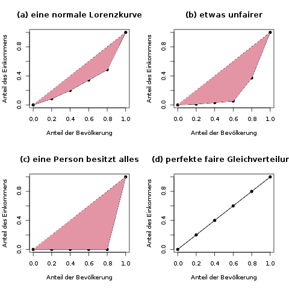
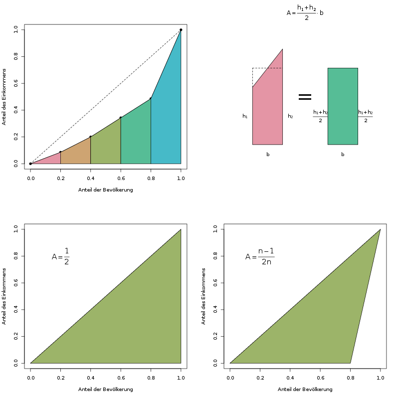
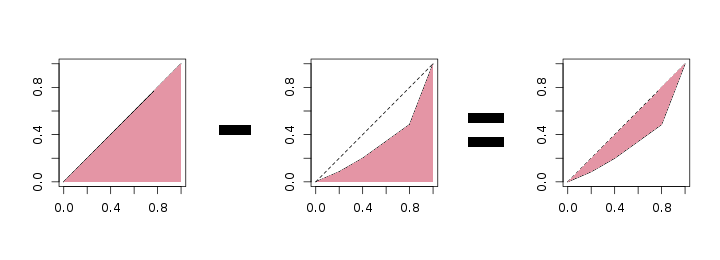

### Gini-Koeffizient {#sec-gini}

Der Gini-Koeffizient verpackt die grafische Information der Lorenzkurve (s. Kap. \@ref(sec-lorenzkurve)) in eine einzelne Zahl. Die Grundidee dazu basiert auf der Fläche, die zwischen der tatsächlichen Lorenzkurve und der Winkelhalbierenden (die "Gerade der perfekten Verteilung") aufgespannt wird; wir nennen sie *Konzentrationsfläche.* Wenn diese Fläche nämlich größer wird, ist das ein Zeichen dafür, dass die Verteilung ungerechter wird. Je größer diese Konzentrationsfläche ist, desto größer ist der dazugehörige Gini-Koeffizient, und desto ungerechter ist die Verteilung des betrachteten Merkmals.

Abbildung \@ref(fig:gini-veranschaulichung) zeigt ein paar Beispiele für die Konzentrationsfläche.

```{r gini-veranschaulichung, fig.cap="Die farbige Konzentrationsfläche, zwischen der gestrichelten Geraden der perfekten Gleichverteilung und der tatsächlichen Lorenzkurve, ist ein Maß dafür, wie gleichmäßig die Merkmalssumme verteilt ist. Je fairer das Merkmal verteilt ist, desto näher kommt die Lorenzkurve an die gestrichelte Gerade, und damit wird die Konzentrationsfläche kleiner."}

```

Damit der Gini-Koeffizient auf einen Bereich von 0 bis 1 normiert wird, teilt man diese Fläche nun durch die "maximal mögliche Fläche". Der Koeffizient ist also ein *Anteil*, nämlich die tatsächliche Konzentrationsfläche geteilt durch die größtmögliche Konzentrationsfläche.

Die Interpretation eines einzelnen Gini-Koeffizienten (z.B. vom Wert 0,68) ist schwierig. Es gibt keine klaren Regeln, ab welchem Wert eine Verteilung "konzentriert", oder "unfair" ist. Sinnvoller ist es, zum Beispiel für mehrere Länder jeweils einen Koeffizienten zur Einkommensverteilung zu berechnen, und diese dann zu vergleichen oder zu sortieren.

Es gibt nun wirklich eine Vielzahl von Formeln, um diesen Koeffizienten zu berechnen. Im Endeffekt kommt natürlich für jede Formel dasselbe raus - es handelt sich nur um verschiedene Schreibweisen, die zum selben Ergebnis führen. Ein einfacher Ablauf für die Bestimmung des Gini-Koeffizienten ist der folgende:

- Fläche *unter* der Lorenzkurve bestimmen.
- Die Konzentrationsfläche ist \(\frac{1}{2}\) minus der Fläche unter der Lorenzkurve
- Der Gini-Koeffizient ist nun die Konzentrationsfläche geteilt durch die maximal mögliche Konzentrationsfläche

Beispielaufgabe

| Einheit \(i\)                           | Einheit 1 | Einheit 2 | Einheit 3 | Einheit 4 | Einheit 5 |
| --------------------------------------- | --------- | --------- | --------- | --------- | --------- |
| Einkommen                               | 3         | 4         | 5         | 5         | 18        |
| Aufsummiertes Einkommen                 | 3         | 7         | 12        | 17        | **35**    |
| Anteil an der Gesamtsumme (\(y\)-Achse) | 0.086     | 0.2       | 0.343     | 0.486     | 1         |
| Prozent der Ärmsten (\(x\)-Achse)       | 20%       | 40%       | 60%       | 80%       | 100%      |

Wir verwenden dieselben Daten der Aufgabe zur Lorenzkurve aus Kapitel \@ref(sec-lorenzkurve), und berechnen hierfür Schritt für Schritt den Gini-Koeffizienten. Visualisiert sind diese Schritte in Abbildung \@ref(fig:gini-schritte).

```{r gini-schritte, fig.cap='Die Schritte zur Berechnung des Gini-Koeffizienten. Oben links: Die Flächen dieser Trapeze werden einzeln ausgerechnet und aufsummiert. Oben rechts: So berechnet man die Fläche eines Trapezes. Unten links: Die "maximal mögliche Fläche" beim einfachen Gini-Koeffizienten. Unten rechts: Die "maximal mögliche Fläche" beim normierten Gini-Koeffizienten.'}

```

**Die Fläche unter der Lorenzkurve**

Die Fläche unter der Lorenzkurve teilt man am besten in \(i\) Trapeze auf, deren Flächeninhalte \(A_i\) man einzeln berechnet und dann aufsummiert. Die Formel für die Trapezfläche bedient sich eines Tricks, indem sie das Trapez mit den Höhen \(h_1\) und \(h_2\) als ein Rechteck mit demselben Flächeninhalt ansieht (siehe Abbildung \@ref(fig:gini-schritte)). Die Höhe des Rechtecks ist der Mittelwert aus den beiden Höhen des Trapezes.

Bestimmen wir also diese Fläche. Jede Spalte in der folgenden Tabelle stellt ein Trapez dar, dessen Fläche \(A_i\) wir berechnen wollen. Das \(i\) ist hierbei 1, 2, 3, 4, oder 5, je nachdem welches Trapez wir uns ansehen. Zum Verständnis kann man sich z.B. die zweite Spalte alleine ansehen, die die Fläche \(A_2\) des zweiten Trapezes berechnet. Die hier benutzten Zahlenwerte für \(h_1\) und \(h_2\) haben wir in der Tabelle oben schon berechnet. Die Grundfläche \(b\) ist bei uns 1/5 = 0.2, da wir in unserem Beispiel fünf Personen betrachten. Allgemein ausgedrückt: Bei \(n\) Personen ist die Grundfläche \(\frac{1}{n}\) breit.


|                                    | Trapez 1 | Trapez 2 | Trapez 3 | Trapez 4 | Trapez 5 |
| ---------------------------------- | -------- | -------- | -------- | -------- | -------- |
| \(h_1\)                            | 0        | 0.086    | 0.2      | 0.343    | 0.486    |
| \(h_2\)                            | 0.086    | 0.2      | 0.343    | 0.486    | 1        |
| \(\frac{h_1+h_2}{2}\)              | 0.043    | 0.143    | 0.271    | 0.414    | 0.743    |
| \(b\)                              | 0.2      | 0.2      | 0.2      | 0.2      | 0.2      |
| \(A_i = \frac{h_1+h_2}{2} \cdot b\)| 0.0086   | 0.0286   | 0.0542   | 0.0828   | 0.1486   |

Die Gesamtfläche unter der Lorenzkurve ist nun die Summe der Teilflächen, also die Summe der letzten Zeile in der obigen Tabelle. Wir kommen hier auf eine Fläche von 0.3228.

**Die Konzentrationsfläche**

```{r konzentrationsflaeche, fig.cap="Die Konzentrationsfläche ist die Fläche zwischen der Diagonalen und der Lorenzkurve"}

```

Um die Konzentrationsfläche - also die Flächen, von der wir in der obersten Abbildung gesprochen haben - zu erhalten, ziehen wir einfach die Fläche unter der Lorenzkurve von \(\frac{1}{2}\) ab (s. Abb. \@ref(fig:konzentrationsflaeche)). Warum? Weil die Fläche unter der Gleichverteilungsgeraden ein halbes Quadrat ist, also die Fläche \(\frac{1}{2}\) ist. Die Fläche zwischen zwei Kurven ist nun genau die Fläche unter der oberen *minus* der Fläche unter der unteren Kurve (nochmal lesen!). Unsere Konzentrationsfläche ist also \(\frac{1}{2} - 0.3228 = 0.1772\).

**Der einfache Gini-Koeffizient**

Um letztendlich den Gini-Koeffizienten zu bekommen, teilen wir die Konzentrationsfläche durch die "maximal mögliche Konzentrationsfläche". Beim einfachen Gini-Koeffizienten ist diese Fläche einfach \(\frac{1}{2}\), also die Fläche unter der Geraden der Gleichverteilung. Der Gini-Koeffizient ist hier also einfach die Konzentrationsfläche geteilt durch \(\frac{1}{2}\), das ist dasselbe wie die Konzentrationsfläche mal zwei. Unser Gini-Koeffizient ist hier \(2\cdot 0.1772 = 0.3544\).

**Alternative Berechnung per Formel**

Der einfache Gini-Koeffizient lässt sich auch über eine kompakte Formel berechnen. Diese ist zwar kürzer, aber nicht so intuitiv. Sie lautet

\[ G = \frac{2 \sum_{i=1}^n i x_{(i)}}{n \sum_{i=1}^n x_{(i)}} - \frac{n+1}{n}, \]

wobei mit \(x_{(i)}\) das \(i\)-te Element der *sortierten* Daten gemeint ist - man muss die Werte also wieder zuerst aufsteigend sortieren.

Für unsere Beispieldaten von oben (die Werte \(x_1=3\), \(x_2=4\), \(x_3=5\), \(x_4=5\), und \(x_5=18\)) berechnen wir diese Formel am besten, indem wir zuerst die beiden Summen des ersten Bruchs als Zwischenergebnis ausrechnen:

\(\sum_{i=1}^n i x_{(i)} = 1\cdot 3 + 2 \cdot 4 + 3 \cdot 5 + 4 \cdot 5 + 5 \cdot 18 = 136\)
\(\sum_{i=1}^n x_{(i)} = 3 + 4 + 5 + 5 + 18 = 35\)

Diese Werte setzen wir (zusammen mit den übrigen Werten für \(n\)) in die Formel ein:

\[G=\frac{2\cdot 136}{5\cdot 35}-\frac{5+1}{5}=0.3543\]

Dieser Wert ist natürlich (bis auf einen Rundungsfehler) derselbe wie oben mit den Trapezen bestimmt.

**Der normierte Gini-Koeffizient**

Beim normierten Gini-Koeffizienten wird dem Phänomen Beachtung geschenkt, dass die "schlimmste" Lorenzkurve, also die maximal mögliche Konzentrationsfläche nicht das gesamte Dreieck (vgl. Abbildung \@ref(fig:gini-veranschaulichung)) sein kann, sondern bei vollständiger Konzentration ein kleineres Dreieck ist. Für 5 Personen sieht die schlimmstmögliche Lorenzkurve so aus wie Abbildung \@ref(fig:gini-veranschaulichung) (c). Der einfache Gini-Koeffizient für diese schlimmstmögliche Lorenzkurve bei 5 betrachteten Einheiten ist aber nicht 1, sondern 0.8 (das kann man zur Übung selbst nachrechnen).

Der normierte Gini-Koeffizient wird nun so verändert, dass er tatsächlich Werte zwischen 0 und 1 annehmen kann. Es wird also die Konzentrationsfläche nicht durch \(\frac{1}{2}\) geteilt, sondern durch diese maximale Fläche, nämlich \(\frac{n-1}{2n}\). Diese Fläche ergibt sich, indem man von der ursprünglichen Fläche von \(\frac{1}{2}\) das jetzt fehlende Dreieck mit dem Flächeninhalt \(\frac{1}{2}\cdot 1\cdot \frac{1}{n}\) abzieht. Beim Ausrechnen ist es allerdings einfacher, nicht durch \(\frac{n-1}{2n}\) zu teilen, sondern mit dem Kehrwert \(\frac{2n}{n-1}\) zu multiplizieren.

Unser normierter Gini-Koeffizient ist \(\frac{2\cdot 5}{5-1} \cdot 0.1772 = 0.443\).

Wenn man übrigens sehr viele Beobachtungen hat, z.B. ganze Länder mit Millionen von Personen, macht dieser kleine Unterschied zwischen einfachem und normiertem Gini-Koeffizienten fast nichts aus. Das normieren ist aber wichtig bei z.B. 4 oder 5 Beobachtungen (wie es in Klausuren oft vorkommt).

**Alternative Berechnung per Formel**

Auch für den normierten Gini-Koeffizient existiert eine kompakte Formel. Wenn man zuerst den einfachen Gini-Koeffizienten \(G\) bestimmt hat, dann multipliziert man ihn nur mit \(\frac{n}{n-1}\), und erhält so den normierten Gini-Koeffizienten \(G^*\):

\[ G^* = \frac{n}{n-1} \cdot G \]

Für unser Beispiel ist der korrigierte Gini-Koeffizient

\[ G^* = \frac{5}{5-1} \cdot 0.3543 = 0.443, \]

und ist somit natürlich auch gleich dem oben bestimmten Wert dafür.