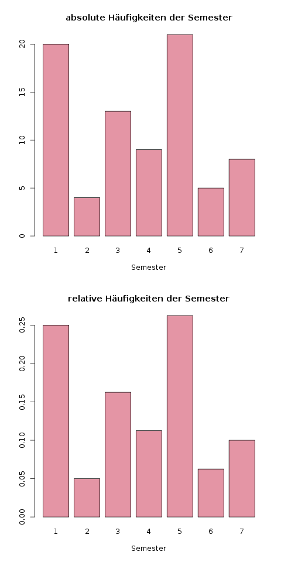

### Balkendiagramme {#sec-balkendiagramme}

Balkendiagramme sind die einfachste Variante, um [diskrete](#merkmals-und-skalentypen) Daten zu visualisieren. In einem Balkendiagramm wird für jede mögliche Ausprägung des untersuchten Merkmals ein Balken gezeichnet. Dessen Höhe ist proportional zur jeweiligen Häufigkeit des Merkmals. Es ist für die Grafik selbst egal, ob hier relative oder absolute Häufigkeiten verwendet werden, es ändert sich nur die Skala auf der \(y\)-Achse.

Kurz am Rande: Das Balkendiagramm heißt genaugenommen *Säulendiagramm*, da die Daten als vertikale Säule dargestellt werden. Ein *Balkendiagramm* hingegen hätte man, wenn die komplette Grafik um 90 Grad nach rechts gedreht wird. Das Erstellen dieses Diagramms geht aber genauso wie beim Säulendiagramm, und ich finde den Begriff "Balkendiagramm" einfach schöner :-)

```{exercise, echo=TRUE}

Wir benutzen die Daten aus Kapitel \@ref(sec-haeufigkeitstabellen) zu Häufigkeitstabellen:

| Semester \(i\) | \(h_i\) | \(f_i\) | \(F_i\) |
| -------------- | ------- | ------- | ------- |
| 1              | 20      | 0.25    | 0.25    |
| 2              | 4       | 0.05    | 0.3     |
| 3              | 13      | 0.1625  | 0.4625  |
| 4              | 9       | 0.1125  | 0.575   |
| 5              | 21      | 0.2625  | 0.8375  |
| 6              | 5       | 0.0625  | 0.9     |
| 7              | 8       | 0.1     | 1       |

Damit zeichnen wir nun ein Balkendiagramm für die absolute (die Spalte \(h_i\)) und relative (die Spalte \(f_i\)) Häufigkeit für jedes Semester. Abbildung \@ref(fig:balkendiagramm) zeigt dieses Diagramm.
```

(ref:balkendiagramm-caption) Hier sieht man, dass sich nur die Skalierung der \(y\)-Achse ändert; die (relativen) Höhen der Balken bleiben gleich.

```{r balkendiagramm, fig.cap="(ref:balkendiagramm-caption)"}

```
