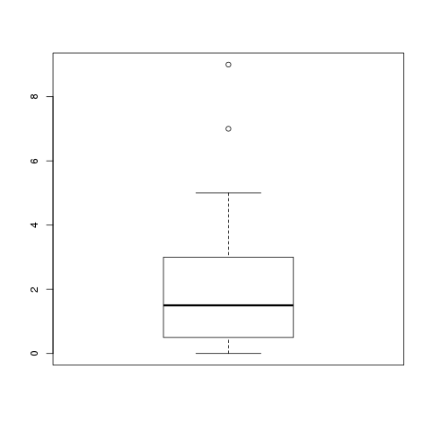

### Boxplots

Ein Boxplot ist eine grafische Zusammenfassung der folgenden fünf Punkte:

- Minimum (= 0%-Quantil)
- 25%-Quantil
- Median (= 50%-Quantil)
- 75%-Quantil
- Maximum (= 100%-Quantil)

Da man das Minimum, den Median und das Maximum als 0%-, 50%- bzw. 100%-Quantil ausdrücken kann, zeigt der Boxplot eigentlich nur fünf häufig verwendete, interessante Quantile. Dabei ist die Box und ihre sogenannten "Whiskers", die Striche außerhalb der Boxen, wie folgt aufgebaut:

Die Box spannt sich vom 25%-Quantil bis zum 75%-Quantil auf, in ihr ist der Median durch einen Querstrich markiert. Außerhalb der Boxen spannen sich nach oben und unten die Whiskers zum Minimum bzw. Maximum der Datenreihe.

Es gibt eine Ausnahme, in der die Whiskers *meistens* nicht bis zum Minimum bzw. Maximum gezeichnet werden. "Meistens", weil dieses Vorgehen nirgends festgelegt ist, und nur eine Art Quasi-Standard ist. Falls die Whiskers länger sind als das 1.5-fache der Box (d.h. der 1.5-fache [Interquartilsabstand](#sec-spannweite-iqr)), werden sie nicht bis zum letzten Punkt gezeichnet, sondern nur bis zum letzten Punkt der weniger als das 1.5-fache des Interquartilsabstands von der Box entfernt ist. Alle Datenpunkte, die dann ausserhalb der Whiskers liegen, werden als Ausreißer separat eingezeichnet.

Am Boxplot kann man auch zwei Streuungsmaße (vgl. Kap. \@ref(#sec-streuungsparameter)) ablesen: Die Spannweite ist nämlich der Abstand zwischen den beiden Whiskers (bzw. zwischen den äußersten Ausreißern). Der Interquartilsabstand, der ja als \(x_{0.75} - x_{0.25}\) definiert wurde, ist genau die Breite der Box.

```{exercise, echo=TRUE}
Um einen Boxplot von Hand zu zeichnen, benötigen wir nur die sogenannte *Fünf-Punkte-Zusammenfassung* einer Datenreihe. Diese wollen wir jetzt anhand von Beispieldaten berechnen.

Nehmen wir an, wir bekommen einen Datensatz mit \(n=20\) befragten Autofahrern. Die Personen haben uns gesagt, wie oft sie in ihrem Leben schon geblitzt wurden. Wir bekamen von den Personen die folgenden Antworten:

1 4 3 3 7 1 0 9 2 3 1 1 2 0 5 0 0 1 0 2

Wir brauchen also als allererstes für die Box das 25%- und das 75%-Quantil sowie den Median. Dazu sortieren wir die Liste zuerst:

0 0 0 0 0 1 1 1 1 1 2 2 2 3 3 3 4 5 7 9

Der Median ist für 20 Elemente definiert als \(\frac{1}{2} (x_{(10)} + x_{(11)})\), also 1.5. Die Quantile sind \(x_{0.25} = \frac{1}{2} (x_{(np)} + x_{(np+1)}) = \frac{1}{2} (x_{(5)} + x_{(6)}) = 0.5\), und \(x_{0.75} = 3\). Die Box erstreckt sich also von 0.5 zu 3, mit dem Median-strich bei 1.5.

Für die Whisker müssen wir nachsehen: Das Minimum der Daten ist 0. Der Whisker streckt sich bis zum Minimum, falls es nicht weiter als \(1.5\cdot IQR\) von der Box (also von \(x_{0.25}\)) entfernt ist. \(IQR\) steht hier für *interquartile range*, also den Interquartilsabstand, oder \(x_{0.75}-x_{0.25}\). Der ist bei uns 2.5. Und das Minimum ist nicht weiter als \(1.5\cdot 2.5\) von 0.5 entfernt: Daher geht der untere Whisker bis zum Minimum 0.

Das Maximum der Daten liegt bei 9. Das ist 9-3=6 von der Box entfernt. Geteilt durch die \(IQR\) ergibt das \(6/2.5 = 2.4\). Das bedeutet, dass das Maximum die 2.4-fache IQR als Abstand zur Box hat, und das ist mehr als das 1.5-fache. Der Whisker geht daher *bis zum größten Datenpunkt, der kleiner als \(1.5\cdot IQR\) von der Box entfernt ist*. Das wäre bei uns der Punkt, der (von unten) am nähesten an \(3 + 1.5\cdot 2.5\), also 6.75 liegt. Das ist 5; und genau so weit geht unser oberer Whisker. Alle Werte, die darüber liegen (die sogenannten *Ausreißer*), werden noch als einzelne Punkte eingezeichnet.

Der dazugehörige Boxplot ist in Abbildung \@ref(fig:boxplot-beispiel) dargestellt.
```

```{r boxplot-beispiel, fig.cap='Ein Boxplot. Man sieht die Daten hier aufgeteilt in vier Viertel: Das untere Viertel der Daten geht (inklusive) von 0 bis 0.5, das zweite Viertel von 0.5 bis 1.5, das dritte Viertel von 1.5 bis 3, und das letzte Viertel von 3 bis 9.'}

```