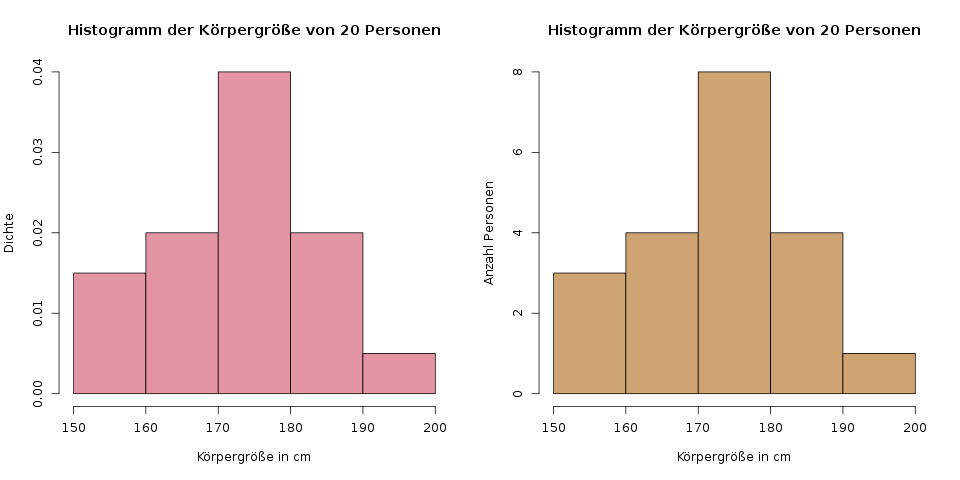
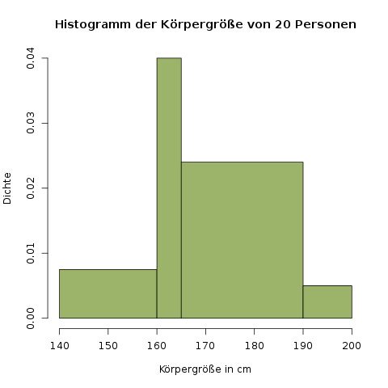

### Histogramme {#sec-histogramme}

Histogramme sehen zunächst ähnlich aus wie Balkendiagramme, werden aber für stetige statt diskrete Daten verwendet. Um ein Histogramm zu zeichnen, muss man seine Daten zuerst klassieren, d.h. Gruppen bilden und sie ihnen zuordnen.

**Einfacher: Histogramme für gleich breite Gruppen**

Am einfachsten sind Histogramme zu zeichnen, wenn diese Gruppen gleich breit sind. Mißt man zum Beispiel die Körpergröße von 20 Personen, könnte man diese Gruppen in 10cm-Abständen bilden, also von 150-159cm, von 160-169cm, und so weiter.

Wir bauen nun ein Histogramm für die folgenden zwanzig Körpergrößen:

172 164 160 162 173 180 158 185 171 181

162 184 177 175 177 174 158 151 192 177

Zuerst müssen wir die Gruppen festlegen, in die wir die Daten zuordnen wollen. Wir zeichnen zuerst ein Histogramm für fünf gleich breite Gruppen:

| Gruppe | Intervall  |
| ------ | ---------- |
| 1      | [150, 160) |
| 2      | [160, 170) |
| 3      | [170, 180) |
| 4      | [180, 190) |
| 5      | [190, 200) |

Die eckigen und runden Klammern beschreiben die jeweiligen Grenzen des Intervalls. In der zweiten Spalte ist z.B. die 160 enthalten, da davor eine eckige Klammer steht, aber die 170 ist nicht enthalten, da dort eine runde Klammer ist. Wenn also jemand genau 170cm groß ist, fällt er in die dritte Gruppe. Falls jemand 169.8cm groß ist, fällt er in die zweite Gruppe.

Jetzt zählen wir, wie viele Personen in jede Gruppe fallen. Es gibt z.B. drei Personen in der Gruppe von 150 (einschließlich) bis 160 (ausschließlich). Mit diesen Daten könnte man nun schon ein Histogramm mit *absoluten Häufigkeiten* zeichen. Das möchten wir aber nicht, da diese Art dann bei komplizierteren Histogrammen mit variablen Gruppenbreiten nicht mehr funktioniert (wer mir nicht glaubt, kann es gerne versuchen, das ist eine schöne Übung). Wir berechnen als Höhe der einzelnen Balken stattdessen die *Dichte*, und zwar wie folgt:

\[ h_i = \frac{n_i}{N \cdot b_i} \]

Hier ist \(h_i\) die Höhe des \(i\)-ten Histogrammbalkens, \(n_i\) ist die Anzahl der Personen in dieser Gruppe \(i\), \(N\) ist die Gesamtzahl an Personen (bei uns \(N=20\)), und \(b_i\) ist die Breite der \(i\)-ten Klasse (bei uns sind alle Klassen gleich breit, also \(b_i=10\) für alle Klassen). In der ersten Klasse ist die Höhe zum Beispiel \(h_1 = \frac{3}{20 \cdot 10} = 0.015\).

Am einfachsten erstellt man all diese Daten in einer Tabelle:

| Gruppe | Intervall  | Anz. Pers. in d. Gruppe, \(n_i\) | Höhe, \(h_i\) |
| ------ | ---------- | -------------------------------- | ------------- |
| 1      | [150, 160) | 3                                | 0.015         |
| 2      | [160, 170) | 4                                | 0.02          |
| 3      | [170, 180) | 8                                | 0.04          |
| 4      | [180, 190) | 4                                | 0.02          |
| 5      | [190, 200) | 1                                | 0.005         |

Damit kann man nun ein Histogramm zeichen (s. Abb. \@ref(fig:histogramm-fix)).

```{r histogramm-fix, fig.cap='Links: Das Histogramm der relativen Dichte. Rechts: Das Histogramm der absoluten Anzahl an Personen. Es unterscheidet sich nur die y-Achse.'}

```

Das linke Histogramm haben wir gerade berechnet. Das rechte unterscheidet sich nur darin, dass auf der \(y\)-Achse absolute Zahlen verwendet wurden - es wurden also statt den Höhen \(h_i\) die Anzahl an Personen, \(n_i\) gezeichnet. Man sieht hier also direkt, dass in der mittleren Klasse 8 Personen liegen. Aber wie gesagt, für variable Klassenbreiten kann man das dann nicht mehr machen.

Der Anteil an Beobachtungen in jeder Gruppe entspricht nun der *Fläche* dieser Balken. In der ersten Gruppe ist ein Anteil von \(10\cdot 0.015 = 0.15\), also 15% der Daten, was bei 20 Personen genau 3 Personen entspricht. Diese Art der Interpretation wird wichtig, wenn wir uns Histogramme mit variablen Gruppenbreiten ansehen:

**Komplizierter: Histogramme für variable Gruppenbreiten**

Diese Art von Histogramm sieht man in der Realität so gut wie nie - zumindest ich bin noch nie einem begegnet. Ich habe aber in einer Klausur mal ein solches Histogramm zeichnen müssen, daher zeige ich hier auch, wie man diese Art erstellt.

Das einzige, was hier noch dazukommt, sind die Klassenbreiten \(b_i\), die ja nun verschieden breit sind. Schauen wir uns ein Histogramm für die folgenden Klassen an:

| Gruppe | Intervall  |
| ------ | ---------- |
| 1      | [140, 160) |
| 2      | [160, 165) |
| 3      | [165, 190) |
| 4      | [190, 200) |

Mit derselben Formel von oben, in die wir nun aber unterschiedliche Klassenbreiten eintragen, erhalten wir nun diese Werte:

| Gruppe | Intervall  | Klassenbreite \(b_i\) | Anzahl an Personen in dieser Gruppe, \(n_i\) | Histogrammhöhe, \(h_i\) |
| ------ | ---------- | --------------------- | -------------------------------------------- | ----------------------- |
| 1      | [140, 160) | 20                    | 3                                            | 0.0075
| 2      | [160, 165) | 5                     | 4                                            | 0.04
| 3      | [165, 190) | 25                    | 12                                           | 0.024
| 4      | [190, 200) | 10                    | 1                                            | 0.005


Das zugehörige Histogramm ist in Abbildung \@ref(fig:histogramm-variabel) dargestellt.

```{r histogramm-variabel, fig.cap='Ein Histogramm für verschieden breite Klassen.'}

```

Wie schon gesagt, diese Darstellung macht wenig Sinn, könnte aber in einer Klausur abgefragt werden, um zu prüfen ob man das Prinzip verstanden hat.