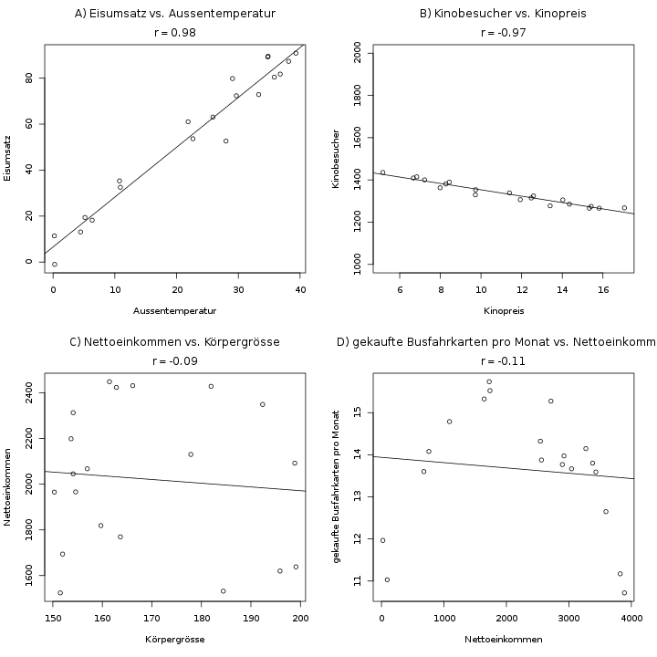

#### Korrelation r nach Pearson {#sec-pearson-korrelation}

Die Korrelation ist eine Möglichkeit, den Zusammenhang zwischen zwei Variablen zu beschreiben. Der Pearson-Korrelationskoeffizient \(r\) ist einer von vielen Möglichkeiten dazu, und meiner Meinung nach die einfachste, am ehesten intuitive.

Mit der Korrelation mißt man den *linearen* (dazu später mehr) Zusammenhang zwischen zwei Variablen. Der Wert kann zwischen -1 und 1 liegen, und wird wie folgt interpretiert:

- \(r \approx 0\): Wenn zwei Variablen eine Korrelation von ungefähr Null haben, lässt sich kein Zusammenhang erkennen. Die Variablen sind unkorreliert. Eine Korrelation von 0 erwartet man z.B. zwischen der Hausnummer und der Körpergrösse einer Person.
- \(r > 0\): Wenn \(r\) größer als Null ist, spricht man von einer positiven Korrelation. Größere Werte von \(X\) gehen dann einher mit größeren Werten von \(Y\). Das ist zum Beispiel bei der Körpergrösse und der Schuhgrösse einer Person der Fall: Grössere Menschen haben meistens auch grössere Schuhe.
- \(r < 0\): Wenn \(r\) negativ ist, dann hängen höhere Werte von \(X\) mit niedrigeren Werten für \(Y\) (und umgekehrt) zusammen. Betrachtet man etwa die Anzahl der Skiurlauber und die Aussentemperatur, sieht man, dass bei niedrigeren Temperaturen mehr Urlauber kommen.

Sehen wir uns in Abbildung \@ref(fig:korrelation-bsp) ein paar grafische Beispiele an.

(ref:korrelation-bsp-caption) Hier sieht man vier Beispiele für Datensätze mit zwei Variablen. Gezeigt sind die X- und Y-Werte, sowie der jeweilige Korrelationskoeffizient \(r\), und eine Regressionslinie.

```{r korrelation-bsp, fig.cap="(ref:korrelation-bsp-caption)"}

```

A) Hier sieht man eine starke positive Korrelation. Die hohe Korrelation deutet darauf hin, dass ein Zusammenhang zwischen Außentemperatur und Umsatz einer Eisdiele besteht.
B) Ein Beispiel für eine negative Korrelation. Höhere Preise für Kinokarten gehen mit weniger Besuchern einher. Hier fällt auch auf, dass die Steigung der Geraden keine Rolle spielt. Der Korrelationskoeffizient bemerkt nur, wie "perfekt" der lineare Zusammenhang ist, aber nicht, wie stark er ist.
C) Sieht man sich Daten für Körpergrösse und Nettoeinkommen an, erkennt man keinen Zusammenhang. Hier ist sogar eine leicht negative Korrelation zu erkennen, die man aber wohl als zufällig betrachten kann.
D) Ein Beispiel für die Grenzen der Korrelation: Sehr arme Menschen können sich keine Busfahrkarten leisten, und sehr reiche Menschen fahren eher Auto. Der Zusammenhang ist hier nicht linear, sondern folgt eher einer Parabel. Man sieht eine Abhängigkeit zwischen dem Einkommen und der gekauften Busfahrkarten, aber die lineare Korrelation erkennt ihn nicht.

Um den Korrelationskoeffizienten \(r\) für zwei Variablen zu berechnen, gibt es zwei Formeln, wo bei beiden natürlich das Gleiche rauskommt. Manchmal ist allerdings die eine oder andere Formel einfacher in den Taschenrechner einzutippen.

Für die Formeln sollte man mit dem Summenzeichen umgehen können, das in Kapitel \@ref(sec-summenzeichen) erklärt wird.

**Formel 1:** \[ r = \frac{\sum_{i=1}^n (x_i - \bar{x}) (y_i - \bar{y})}{ \sqrt{\sum_{i=1}^n (x_i - \bar{x})^2} \cdot \sqrt{\sum_{i=1}^n (y_i - \bar{y})^2} } \]

**Formel 2:** \[ r= \frac{\sum_{i=1}^n x_i y_i - n \bar{x} \bar{y}}{\sqrt{\sum_{i=1}^n x_i^2 - n\bar{x}^2} \cdot \sqrt{\sum_{i=1}^n y_i^2 - n\bar{y}^2} } \]

Die zweite Formel ist einfacher und schneller im Taschenrechner zu berechnen. Wenn allerdings sehr große Zahlen für \(x\) oder \(y\) vorkommen, werden die Summen der Quadrate (die Terme \(\sum_{i=1}^n x_i^2\)) zu gross, und der Speicher des Taschenrechners spielt nicht mehr mit.

```{exercise, echo=TRUE}

Schauen wir uns die Berechnung von \(r\) mit beiden Formeln anhand eines Beispiels an:

| Person \(i\) | \(x_i\): Zigaretten pro Tag | \(y_i\): Todesalter |
| ------------ | --------------------------- | ------------------- |
| 1            | 4                           | 70                  |
| 2            | 21                          | 63                  |
| 3            | 2                           | 82                  |
| 4            | 11                          | 65                  |
| 5            | 14                          | 61                  |
| 6            | 2                           | 74                  |
| 7            | 6                           | 84                  |

Überlege dir vorher, ob du eine positive oder negative Korrelation erwartest. Du kannst auch ein Streudiagramm der Daten zeichnen, um im Vorfeld etwas mehr Klarheit zu bekommen.
```

```{solution, echo=TRUE}
Für beide Formeln müssen wir zuerst die Mittelwerte \(\bar{x}\) und \(\bar{y}\) berechnen:

\[ \bar{x} = \frac{1}{7} \cdot (4+21+2+11+14+2+6) = 8.57\]

\[ \bar{y} = \frac{1}{7} \cdot (70+63+82+65+61+74+84) = 71.29\]

#### Formel 1 {-}

Am einfachsten ist es, die Formel in drei Schritten zu berechnen, und die Zwischenergebnisse aufzuschreiben, und am Ende den gesamten Bruch auszurechen. Beginnen wir mit dem Zähler:

\[ \begin{aligned} \sum_{i=1}^n (x_i-\bar{x})(y_i-\bar{y}) = & (4-8.57)\cdot (70-71.29)+\\ & (21-8.57)\cdot (63-71.29)+\\ & (2-8.57)\cdot (82-71.29)+\\ & (11-8.57)\cdot (65-71.29)+\\ & (14-8.57)\cdot (61-71.29)+\\ & (2-8.57)\cdot (74-71.29)+\\ & (6-8.57)\cdot (84-71.29) \\ & = -289.14 \end{aligned} \]

Nun die beiden Teile im Nenner:

\(\sqrt{\sum_{i=1}^n (x_i - \bar{x})^2} = \sqrt{(4-8.57)^2 + (21-8.57)^2 + \ldots +(6-8.57)^2} = 17.43\)

\(\sqrt{\sum_{i=1}^n (y_i - \bar{y})^2} = \sqrt{(70-71.29)^2 + \ldots +(84-71.29)^2 } = 22.35\)

Zusammen in die Formel von oben eingesetzt ergibt sich die Korrelation:

\[ r= \frac{-289.14}{17.43 \cdot 22.35} = -0.74 \]

#### Formel 2 {-}

Mit diesem Weg hat man mehr Zwischenergebnisse als mit Formel 1, und kann sich im Taschenrechner nicht so leicht vertippen. Man berechnet nacheinander die folgenden fünf Werte:

\(\bar{x} = 8.57\)
\(\bar{y} = 71.29\)
\(\sum_{i=1}^n x_iy_i = 4\cdot 70 + 21\cdot 63 + 2\cdot 82 + 11\cdot 65 + 14\cdot 61 + 2\cdot 74 + 6\cdot 84 = 3988\)
\(\sum_{i=1}^n x_i^2 = 4^2+21^2+2^2+11^2+14^2+2^2+6^2 =818\)
\(\sum_{i=1}^n y_i^2 = 36071\)

Diese Werte setzt man nun in die Formel ein:

\[ r = \frac{3988 - 7\cdot 8.57 \cdot 71.29}{\sqrt{818 - 7\cdot 8.57^2} \cdot \sqrt{36071 - 7\cdot 71.29^2}} = -0.74 \]

Wie man sieht, ist die zweite Variante angenehmer zu rechnen, könnte aber problematisch werden, wenn z.B. Zahlen über 10000 quadriert und summiert werden.
```

##### Herleitung über die empirische Kovarianz

Dieser Abschnitt wird ein bisschen mathematisch, kann also gerne übersprungen werden, wenn man nicht an der Intuition hinter der Formel interessiert ist.

Die Korrelation ist eigentlich eine standardisierte Version der *Kovarianz* zweier Variablen. Die Kovarianz ist definiert als

\[ \text{Cov}(x, y) = \frac{1}{n-1} \sum_{i=1}^n (x_i-\bar{x})(y_i-\bar{y})\]

Der Betrag der Kovarianz bewegt sich zwischen \(0\) (bei unkorrelierten Variablen) und \(s_x \cdot s_y\) (bei perfekt korrelierten Variablen). Dabei ist \(s_x\) die Standardabweichung (s. Kap. \@ref(sec-var-sd)) von \(X\), und \(s_y\) die von \(Y\). Das Vorzeichen der Kovarianz lässt nun schon erkennen, in welche Richtung der Zusammenhang zweier Variablen geht, genauso wie bei der Korrelation. Aber ihr Wert ist abhängig von der Varianz von \(x\) und \(y\). Daher wird die Kovarianz standardisiert, indem man durch die Standardabweichungen von \(x\) und \(y\) teilt - dadurch erhält man die Korrelation, deren Wertebereich nun von -1 bis 1 geht:

\[ r = \frac{\text{Cov}(x, y)}{s_x \cdot s_y} \]

Die Faktoren \(\frac{1}{n-1}\) stehen im Zähler und im Nenner, und kürzen sich heraus, wodurch die Formel 1 oben entsteht.

