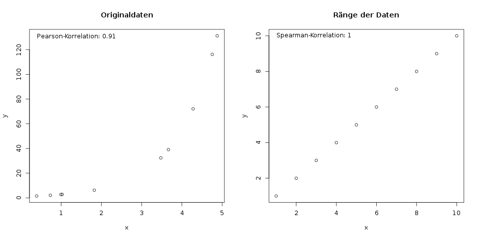

#### Spearman-Korrelation / Rangkorrelation

Mit der Spearman-Korrelation misst man ebenso wie mit der Pearson-Korrelation (s. Kap. \@ref(sec-pearson-korrelation)) den Zusammenhang zwischen zwei Variablen. Er nimmt ebenso Werte von -1 (perfekte negative Korrelation) bis +1 (perfekte positive Korrelation) an, und ist nahe bei 0, falls gar keine Korrelation vorliegt.

Der Spearman-Korrelationskoeffizient \(r_\text{Sp}\) wird auch Rangkorrelationskoeffizient genannt, weil nur er einen kleinen, aber entscheidenden Unterschied zum klassischen Pearson-Korrelationskoeffizienten \(r\) hat:

Die Korrelation wird nicht zwischen den Datenpunkten selbst, sondern *zwischen ihren Rängen* berechnet. Ein Beispiel veranschaulicht das schnell:

Beispiel: Alter vs. Performance beim 100m-Lauf

Wir möchten den Zusammenhang zwischen dem Alter einer Person und ihrer Performance beim 100-Meter-Sprint analysieren. Dazu messen wir von 6 Personen das Alter in Jahren, und die Zeit für 100 Meter in Sekunden:

| Person \(i\) | Alter \(x_i\) | Zeit in Sekunden \(y_i\) |
| ------------ | ------------- | ------------------------ |
| A            | 59            | 14.61                    |
| B            | 35            | 11.80                    |
| C            | 43            | 14.34                    |
| D            | 23            | 13.03                    |
| E            | 42            | 14.18                    |
| F            | 27            | 11.02                    |

Wir können nun die klassische Pearson-Korrelation zwischen den Variablen "Alter" und "Zeit" berechnen:

\[r = \frac{\sum_{i=1}^n (x_i - \bar{x}) (y_i - \bar{y})}{ \sqrt{\sum_{i=1}^n (x_i - \bar{x})^2} \cdot \sqrt{\sum_{i=1}^n (y_i - \bar{y})^2} } \]

Wer zur Übung nachrechnen will, das Ergebnis ist \(r = 0.73\). Um für dieselben Daten nun die Spearman-Korrelation zu berechnen, betrachten wir für beide Merkmale nicht die tatsächlichen Werte "Alter" und "Zeit in Sekunden", sondern deren *Ränge*. Wir arbeiten also mit den Platzierungen auf der Siegertreppe statt mit der tatsächlichen Zeit, und ebenso mit dem "Platz" oder dem Rang des Alters.

In der Tabelle entstehen dafür zwei neue Spalten für die beiden Ränge. Die Ränge werden hier *aufsteigend* vergeben, was bedeutet dass die kleinste Zahl den Rang 1 erhält, usw.:

| Person \(i\) | Alter \(x_i\) | Rang des Alters \(\text{rang}(x_i)\) | Zeit in Sekunden \(y_i\) | Platzierung \(\text{rang}(y_i)\) |
| ------------ | ------------- | ------------------------------------ | ------------------------ | -------------------------------- |
| A            | 59            | 6                                    | 14.61                    | 6                                |
| B            | 35            | 3                                    | 11.80                    | 2                                |
| C            | 43            | 5                                    | 14.34                    | 5                                |
| D            | 23            | 1                                    | 13.03                    | 3                                |
| E            | 42            | 4                                    | 14.18                    | 4                                |
| F            | 27            | 2                                    | 11.02                    | 1                                |

Den Spearman-Korrelationskoeffizient erhält man nun, wenn man die Formel der Korrelation nicht auf die Variablen "Alter" und "Zeit" anwendet, sondern auf deren Ränge (s. Abb. \@ref(fig:zweivariablen-spearman-bsp)).

(ref:zweivariablen-spearman-bsp-caption) Links ist das Alter und die Zeit für 100 Meter in einem Scatterplot dargestellt. Aus diesen Daten wird die Pearson-Korrelation \(r\) berechnet. Rechts sind die dazugehörigen Ränge (jeweils von 1 bis 6) dargestellt. Mit diesen Rängen berechnet man den Spearman-Korrelationskoeffizienten \(r_\text{Sp}\).

```{r zweivariablen-spearman-bsp, fig.cap="(ref:zweivariablen-spearman-bsp-caption)"}
knitr::include_graphics("img/zweivariablen-spearman-bsp.png")
```

Die Formel für die Spearman-Korrelation ist genau dieselbe wie für die Pearson-Korrelation, nur werden die Daten \(x_i\) und \(y_i\) mit ihren jeweiligen Rängen ersetzt:

\[r_\text{Sp} = \frac{\sum_{i=1}^n (\text{rang}(x_i) - \overline{\text{rang}(x)}) (\text{rang}(y_i) - \overline{\text{rang}(y)})}{ \sqrt{\sum_{i=1}^n (\text{rang}(x_i) - \overline{\text{rang}(x)})^2} \cdot \sqrt{\sum_{i=1}^n (\text{rang}(y_i) - \overline{\text{rang}(y)})^2} } \]

Es ist wichtig zu verstehen dass dieser Koeffizient genauso berechnet wird wie die Pearson-Korrelation, und der einzige Unterschied ist, dass die Ränge statt der Originaldaten verwendet werden. Die Formel und das Vorgehen sind aber genau dasselbe wie im Kapitel \@ref(sec-pearson-korrelation) zur Pearson-Korrelation beschrieben.

Zur Übung: Berechne nun die Spearman-Korrelation dieser Daten. Verwende dazu die Ränge \(\text{rang}(x_i)\) und \(\text{rang}(y_i)\) aus der obigen Tabelle. Für die Berechnung kannst du je nach Vorliebe Formel 1 oder Formel 2 aus Kapitel \@ref(sec-pearson-korrelation) zur Pearson-Korrelation verwenden. Der resultierende Wert soll \(r_\text{Sp} = 0.83\) ergeben.

Zur Interpretation kann man nun sagen, dass mit steigendem Rang des Alters auch der Rang des Platzes ansteigt. Vorsicht. Ein "steigender" Rang heißt hier, dass die Zahl des Platzes höher wird, die Person also langsamer läuft und später ins Ziel kommt! Das heißt in klaren Worten: Ältere Personen werden tendenziell später im Ziel ankommen.

Eine kurze Bemerkung noch: Die Ränge könnte man auch andersrum vergeben, dass also die älteste Person (oder die langsamste Person) den Rang 1 bekommt. Dann würde sich der Spearman-Koeffizient nur im Vorzeichen ändern, aus \(r_\text{Sp} = 0.83\) würde also \(r_\text{Sp} = -0.83\) werden. Die Interpretation würde dann etwas anders ablaufen, aber zum selben Ziel kommen: Die negative Korrelation bedeutet, dass mit steigendem Rang des Alters (d.h. jüngere Personen) der Rang der Platzierung *sinkt* (d.h. die Person schneller im Ziel ankommt). Hier also in klaren Worten: Je jünger eine Person wird, desto schneller kommt sie im Ziel an. Und daher genau dasselbe wie vorher.

**Was ist der Effekt davon, die Ränge statt der Originaldaten zu nehmen?**

Da bei der Spearman-Korrelation die Ränge verwendet werden, sind dort die tatsächlichen Abstände zwischen z.B. Platz 1 und Platz 2 egal. Die Spearman-Korrelation ist immer dann 1, wenn der niedrigste Wert für \(x\) gepaart ist mit dem niedrigsten Wert von \(y\), usw.

(ref:zweivariablen-spearman-r1-caption) Links ist ein Scatterplot für Beispieldaten \(x\) und \(y\). Der niedrigste \(x\)-Wert gehört zum niedrigsten \(y\)-Wert, usw., jedoch ist der Zusammenhang nicht linear, sondern folgt einer Kurve. Rechts sieht man nun die Ränge der Daten gegeneinander geplottet. Der hieraus resultierende Spearman-Korrelationskoeffizient ist genau 1.

```{r zweivariablen-spearman-r1, fig.cap="(ref:zweivariablen-spearman-r1-caption)"}

```

Mathematisch sagt man: Die Spearman-Korrelation misst den *monotonen* Zusammenhang, während die Pearson-Korrelation den *linearen* Zusammenhang misst.

**Was passiert bei gleichen Rängen, also "Unentschieden"?**

Es kann passieren, dass z.B. zwei oder mehr Werte für \(x\) denselben Wert annehmen. In diesem Fall wird den entsprechenden Werten der Durchschnittsrang zugewiesen. Hierzu drei Beispiele, hätten die Personen aus dem obigen 100-Meter-Sprint stattdessen ein anderes Alter gehabt:

| Alter \(x_i\) | Rang \(\text{rang}(x_i)\) |
| ------------- | ------------------------- |
| 23            | 1                         |
| 27            | 2.5                       |
| 27            | 2.5                       |
| 35            | 4                         |
| 43            | 5                         |
| 59            | 6                         |

In der obigen Tabelle haben zwei Personen dasselbe Alter, deren Ränge 2 und 3 wären. Daher bekommen beide Personen den Durchschnittsrang 2.5.

| Alter \(x_i\) | Rang \(\text{rang}(x_i)\) |
| ------------- | ------------------------- |
| 23            | 1                         |
| 27            | 2                         |
| 35            | 4                         |
| 35            | 4                         |
| 35            | 4                         |
| 59            | 6                         |

Hier haben drei Personen dasselbe Alter. Deren Ränge wären 3, 4, und 5. Der resultierende Durchschnittsrang für alle drei Personen ist also 4.

**Eine kürzere Formel für die Spearman-Korrelation**

Das oben angegebene Vorgehen zur Berechnung von \(r_\text{Sp}\) ist zwar (hoffentlich) einleuchtend und nachvollziehbar, aber die Formel ist doch sehr aufwändig auszurechnen. Es gibt zum Glück eine kürzere Formel, mit der die Spearman-Korrelation schneller ausgerechnet werden kann.

\[ r_\text{Sp} = 1 - \frac{6 \cdot \sum_{i=1}^n d_i^2}{n\cdot (n^2 -1)} \]

**Vorsicht**: Diese Formel darf man nur dann anwenden, wenn es keine Bindungen in den Daten gibt. Es müssen also alle \(x_i\) verschieden voneinander sein, und außerdem alle \(y_i\) voneinander verschieden sein. Andernfalls kommt mit dieser Formel ein anderes Ergebnis heraus.

Hier ist \(d_i\) die Rangdifferenz, d.h. der Unterschied zwischen den beiden Rängen für eine Beobachtung. Wenn also im oberen Beispiel jemand der jüngste ist (also sein Rang des Alters 1 ist), und das drittschnellste Ergebnis gelaufen ist (also der Rang der Platzierung 3 ist), ist die Rangdifferenz \(d_i = 1 - 3 = -2\). Diese Differenz bestimmen wir nun für jeden Läufer:

| Person \(i\) | Alter \(x_i\) | Rang des Alters \(\text{rang}(x_i)\) | Zeit in Sekunden \(y_i\) | Platzierung \(\text{rang}(y_i)\) | Rangdifferenz \(d_i = \text{rang}(x_i) - \text{rang}(y_i)\) |
| ------------ | ------------- | ------------------------------------ | ------------------------ | -------------------------------- | ----------------------------------------------------------- |
| A            | 59            | 6                                    | 14.61                    | 6                                | 0                                                           |
| B            | 35            | 3                                    | 11.80                    | 2                                | 1                                                           |
| C            | 43            | 5                                    | 14.34                    | 5                                | 0                                                           |
| D            | 23            | 1                                    | 13.03                    | 3                                | -2                                                          |
| E            | 42            | 4                                    | 14.18                    | 4                                | 0                                                           |
| F            | 27            | 2                                    | 11.02                    | 1                                | 1                                                           |

Somit können wir die quadrierten (nicht vergessen!) Rangdiffernzen aufsummieren:

\[ \sum_{i=1}^n d_i^2 = 0^2 + 1^2 + 0^2 + (-2)^2 + 0^2 + 1^2 = 6 \]

Dieses Ergebnis setzen wir in die obige Formel nun ein:

\[ \begin{aligned} r_\text{Sp} &= 1- \frac{6 \cdot \sum_{i=1}^n d_i^2}{n\cdot (n^2 -1)}\\ &= 1- \frac{6 \cdot 6}{6 \cdot (6^2 - 1)}\\ &= 0.828\end{aligned} \]

Es kommt auf diesem Weg natürlich derselbe Wert für die Spearman-Korrelation heraus, \(r_\text{Sp} = 0.83\)