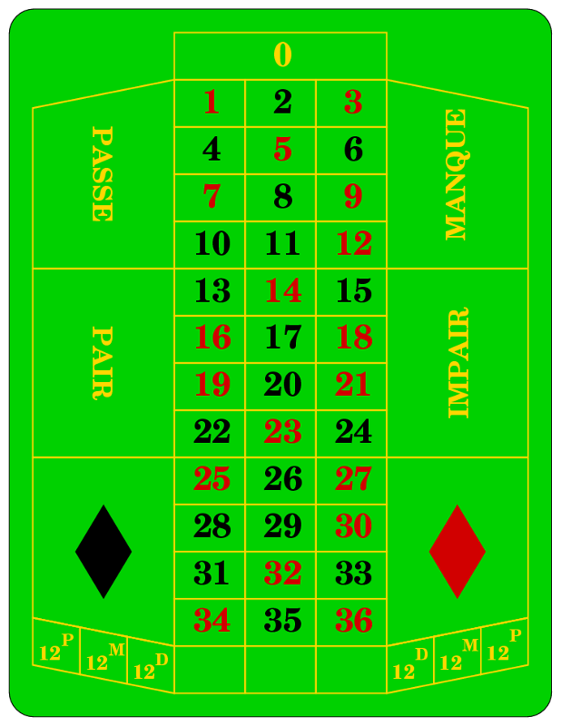

## Was ist eine Wahrscheinlichkeit? {#sec-laplace}

Eine Wahrscheinlichkeit ist ein Maß für die möglichen Ergebnisse eines Zufallsexperiments. Bei einem Zufallsexperiment wissen wir, welche möglichen Ereignisse eintreten können (z.B. "morgen regnet es" und "morgen scheint die Sonne"), aber wir wissen noch nicht, welches Ereignis auftritt. Mit Wahrscheinlichkeiten können wir aber jedem Ereignis eine Art *Gewicht* geben, und z.B. beschreiben, dass morgen ziemlich sicher die Sonne scheint (mit einer Wahrscheinlichkeit von 90%), und es ziemlich sicher nicht regnet (nämlich nur mit 10%).

Wahrscheinlichkeiten können ausgedrückt werden durch

- Prozentzahlen wie z.B. 50%,
- Brüche, wie z.B. \(\frac{1}{2}\), oder
- Dezimalzahlen wie 0.5

Alle drei Darstellungen bedeuten dasselbe, und sind daher auch richtig. Welche man verwendet, bleibt einem selbst überlassen.

#### Verschiedene Definitionen der Wahrscheinlichkeit {-}

Eine immer wieder gesehene Klausuraufgabe frägt nach den verschiedenen Auffassungen bzw. Definitionen der Wahrscheinlichkeit. Für die gibt es nämlich keine eindeutige Beschreibung, sondern mehrere. Vier davon sehen wir uns hier an:

#### Laplace-Wahrscheinlichkeit {-}

Diese Definition der Wahrscheinlichkeit setzt voraus, dass alle elementaren Ergebnisse die gleiche Wahrscheinlichkeit haben. Es ist also möglich bei Zufallsexperimenten wie einem Münzwurf (Kopf und Zahl je mit Wahrscheinlichkeit 0.5), oder einem Rouletterad (die Zahlen 0 bis 36 mit jeweils einer Wahrscheinlichkeit von 1/37).

Die Laplace-Wahrscheinlichkeit für ein Ereignis \(E\) ist definiert als

\[ \mathbb{P}(E) = \frac{\text{Anzahl der "}\mathrm{g\ddot{u}nstigen}\text{" Ergebnisse}}{\text{Anzahl aller } \mathrm{m\ddot{o}glichen}\text{ Ergebnisse}} \]

```{exercise, echo=TRUE}
Dazu eine Beispielaufgabe: Wie groß ist die Wahrscheinlichkeit, bei einem Roulettespiel eine schwarze Zahl zu erhalten? (Vergiss die "0" nicht!)
```

```{r roulette, fig.cap="Das französische Roulettespiel"}

```

```{solution, echo=TRUE}
Das Ereignis \(E =\) "schwarze Zahl" hat 18 Ergebnisse. Insgesamt gibt es 37 mögliche Ergebnisse. Die Laplace-Wahrscheinlichkeit ist also \(\mathbb{P}(E) = \frac{18}{37} = 48.6\%\).
```

#### Objektive oder frequentistische Wahrscheinlichkeit {-}

Wenn man ein Experiment beliebig oft wiederholen kann (man lässt zum Beispiel ein Reiskorn auf ein Schachbrett fallen, und will wissen, mit welcher Wahrscheinlichkeit man im oberen linken Feld landet), kann man die relative Häufigkeit berechnen, indem man einfach die Anzahl der Treffer durch die Anzahl der gesamten Versuche teilt. Der *Grenzwert* dieses Bruchs, also der Wert der herauskommt wenn die Anzahl der Versuche unendlich groß wird, ist nun die gesuchte Wahrscheinlichkeit.

Dieses Konzept beschreibt die objektive, oder frequentistische Definition der Wahrscheinlichkeit.

#### Subjektive Wahrscheinlichkeit {-}

Manchmal kann man Experimente nicht beliebig oft wiederholen. Die Aussage "Die Klausur bestehe ich zu 80%" basiert z.B. auf einer subjektiven Wahrscheinlichkeitsauffassung, da sie *geschätzt* und nicht *berechnet* wurde.

Diese Wahrscheinlichkeit kann man auch als *Grad persönlicher Überzeugung* auffassen, so wie es der Bayes'sche Wahrscheinlichkeitsbegriff tut.

#### Axiomatische Definition (nach Kolmogorov) {-}

Axiome sind Aussagen, die nicht bewiesen werden, sondern ohne Beweis vorausgesetzt werden. Mathematische Gebiete beruhen oft auf einigen wenigen Axiomen, mithilfe derer dann alles andere bewiesen wird.

Die drei Axiome, die die Wahrscheinlichkeitstheorie begründen sind die folgenden:

1. Die Wahrscheinlichkeit für jedes erdenkliche Ergebnis liegt zwischen 0 und 1 (jeweils einschließlich). Es gibt also keine Wahrscheinlichkeit von -0.5, und keine Wahrscheinlichkeit von 2.4.
2. Ein Zufallsexperiment *muß* ein Ergebnis haben. Die Wahrscheinlichkeit, dass irgendein Ergebnis herauskommt, ist also 1.
3. Die Wahrscheinlichkeit, dass irgendeines von zwei Ergebnissen eintritt, ist die Summe der Wahrscheinlichkeiten der beiden einzelnen Ergebnisse. Dies gilt nur, falls sich die beiden Ergebnisse gegenseitig ausschließen.  
Es ist also nicht gültig für \(E_1 = \text{Der }\mathrm{W\ddot{u}rfel}\text{ zeigt eine gerade Zahl}\) und \(E_2 = \text{Der }\mathrm{W\ddot{u}rfel}\text{ zeigt die 4}\), da falls \(E_2\) eintritt, automatisch auch \(E_1\) stimmt.  
Falls aber \(E_1 = \text{Der }\mathrm{W\ddot{u}rfel}\text{ zeigt eine gerade Zahl}\) und \(E_2 = \text{Der }\mathrm{W\ddot{u}rfel}\text{ zeigt die 1}\), so kann man die Wahrscheinlichkeit für \(E_1\) oder \(E_2\) als ihre Summe berechnen:  
\[ \mathbb{P}(E_1 \text{ oder } E_2) = \mathbb{P}(E_1) + \mathbb{P}(E_2) = \frac{3}{6} + \frac{1}{6} = \frac{4}{6} \]

Diese drei Axiome wurden natürlich in mathematischen Formeln verpackt. Man versteht diese Formeln am besten, wenn man sie mit der obigen Textinterpretation vergleicht. So sehen die dazugehörigen Formeln aus:

1. \(0 \leq \mathbb{P}(E) \leq 1\) für alle möglichen Ereignisse \(E\).
2. \(\mathbb{P}(\Omega) = 1\), wobei \(\Omega\) für das sichere Ereignis steht.
3. Falls \(E_1 \cap E_2 = \emptyset\), dann ist \(\mathbb{P}(E_1 \cup E_2) = \mathbb{P}(E_1) + \mathbb{P}(E_2)\).

