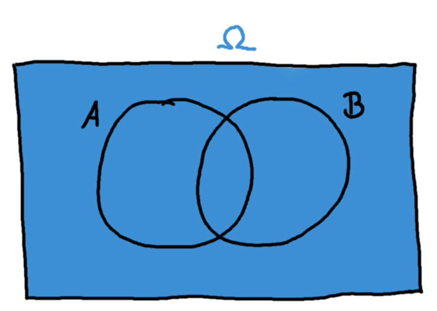

## Mengenlehre und Venn-Diagramme {#sec-venn}

Man verwendet Venn-Diagramme, um zwei oder mehrere Mengen und deren Beziehungen zueinander darzustellen. Man kann es auch gut dazu verwenden, um Regeln der Wahrscheinlichkeitsrechnung sehr einfach zu visualisieren, weshalb wir sie uns hier anschauen werden.

Abbildung \@ref(fig:venn1) zeigt ein Venn-Diagramm für zwei Mengen \(A\) und \(B\).

```{r venn1, fig.cap="Ein simples Venn-Diagramm"}

```

Wir halten uns dabei durchgehend an ein beispielhaftes Zufallsexperiment:

Wir werfen einen Würfel, und notieren uns die Augenzahl. Die möglichen Ergebnisse sind also \(\{ 1, 2, 3, 4, 5, 6\}\) (die Menge aller möglichen Ereignisse wird mit \(\Omega\) bezeichnet). Wir definieren außerdem zwei Ereignisse \(A\) und \(B\):

\[ A: \text{Es wurde eine gerade Zahl }\mathrm{gew\ddot{u}rfelt} \]

\[ B: \text{Es wurde eine Zahl von 1 bis 3 }\mathrm{gew\ddot{u}rfelt} \]

Das Ereignis \(A\) beinhaltet also die Zahlen 2, 4, und 6, und das Ereignis \(B\) umfasst die 1, 2, und 3. Hier fällt auf, dass die 2 in beiden Ereignissen vorkommt. Abbildung \@ref(fig:venn-beispiel) zeigt die Aufteilung der Ergebnisse in diesem Beispiel.

```{r venn-beispiel, fig.cap="Ein Venn-Diagramm für zwei Würfel-Ereignisse"}

```

Man sieht hier ein großes Rechteck, das das ganze "Universum" \(\Omega\), also alle möglichen Ereignisse darstellt. Innerhalb aller möglichen Eregnisse befinden sich die Mengen \(A\) und \(B\), die jeweils nur einen Teil aller möglichen Ereignisse beschreiben. Im Kreis von \(B\) liegen zum Beispiel die 1, 2, und 3. Die 2 liegt zudem *auch* im Kreis von \(A\). Die 5 kommt weder in \(A\), noch in \(B\) vor, liegt also im Bereich von \(\Omega\), also außerhalb beider Kreise.

Die Menge \(B\) lässt sich nun durch einen blauen Kreis darstellen (s. Abb. \@ref(fig:venn-B)).

```{r venn-B, fig.cap="Die Menge B"}

```


Wenn ich dich den Würfel rollen lasse, und sage, bei einem Ergebnis aus \(B\) hast du gewonnen, dann hoffst du also auf eine 1, 2, oder 3 als Ergebnis. Vergleiche dieses Bild nochmal mit Abbildung \@ref(fig:venn-beispiel), in dem die Zahlen eingetragen sind, falls du gerade nicht folgen konntest.

Die Menge \(\Omega\) ist, wie schon gesagt, die Menge aller möglichen Ereignisse:

```{r venn-omega, fig.cap="Die Menge Omega"}

```

Angenommen, du spielst nun dasselbe Spiel, aber ich sage dir dass du bei einem Ergebnis aus \(\Omega\) gewonnen hast, welche Zahlen sind also günstig für dich?

Die Menge \(\Omega\) umfasst alle möglichen Ergebnisse, also die Zahlen 1, 2, 3, 4, 5, und 6. Du kannst also den Würfel rollen, und wegsehen, weil du auf jeden Fall gewinnst!

**Der "nicht"-Operator**

Wenn man am Gegenteil eines Ereignisses interessiert ist, setzt man einen Querbalken darüber. Abbildung \@ref(fig:venn-A-neben-nicht-A) zeigt das am Beispiel des Ereignisses \(A\).

```{r venn-A-neben-nicht-A, fig.cap='Der "nicht"-Operator'}

```

Links ist das Ereignis \(A\) abgebildet (welche Zahlen auf dem Würfel beinhaltet das?), und rechts sein Gegenteil, nämlich \(\bar{A}\). Bevor du weiterliest, überlege dir kurz, welche Zahlen das Ereignis \(\bar{A}\) beinhaltet.

Wenn \(A = \{2, 4, 6\}\), dann muss \(\bar{A}\) sein Gegenteil, also \(\bar{A}=\{1, 3, 5\}\) sein. Beachte, dass das nicht dasselbe wie \(B\) ist; wenn das noch nicht ganz klar ist, schau dir die Bilder von \(B\) sowie \(\bar{A}\) nochmal an!

**Der "oder"-Operator (Vereinigungsmengen)**

Möchte man die einzelnen Elemente zweier Mengen \(A\) und \(B\) in einen Topf werfen, also *vereinigen*, verwendet man dazu das Symbol \(\cup\). Die Menge aller Elemente, die in \(A\) *oder* \(B\) enthalten sind, ist also \(A \cup B\).

Versuche, die Menge \(A \cup B\) in einem Venn-Diagramm zu zeichnen. Überlege dir auch, welche Elemente sie beinhaltet (und welche nicht).

Die Menge \(A \cup B\) enthält die Zahlen 1, 2, 3, 4, und 6. Es sind also alle Zahlen außer der 5 in dieser Vereinigungsmenge enthalten. Abbildung \@ref(fig:venn-A-oder-B) zeigt das dazugehörige Venn-Diagramm.

```{r venn-A-oder-B, fig.cap='Der "oder"-Operator'}

```

Die Zahl 2 kommt zwar in beiden Mengen, \(A\) und \(B\) vor, ist aber in der Vereinigungsmenge nur einmal enthalten: \(A \cup B = \{ 1,2,3,4,6 \}\).

**Der "und"-Operator (Schnittmengen)**

Mit dem "und"-Operator \(\cap\) bezeichnet man die *Schnittmenge* zweier Mengen \(A\) und \(B\). Man erhält als Ergebnis nur die Elemente, die sowohl in \(A\) *als auch* in \(B\) enthalten sind (s. Abb. \@ref(fig:venn-A-und-B))

```{r venn-A-und-B, fig.cap='Der "und"-Operator'}

```

Für unser Beispiel mit den Würfeln bedeutet das: In \(A \cap B\) sind die Zahlen enthalten, die sowohl gerade als auch kleiner oder gleich 3 sind - also nur die 2: \(A \cap B = \{2\}\).

**Kombinationen von Operatoren**

Mit diesen drei Operatoren, der Vereinigungs- und Schnittmenge sowie der Negation (also dem Querbalken), kann man nun zusammen jede mögliche Kombination der beiden Mengen \(A\) und \(B\) erstellen. Zum Beispiel kann man sich alle Elemente ansehen, die zwar in \(A\), aber nicht in \(B\) enthalten sind (s. Abb. \@ref(fig:venn-A-und-nicht-B)).

```{r venn-A-und-nicht-B, fig.cap='A und nicht-B'}

```

Diese Menge \(A \cap \bar{B}\) enthält die Zahlen 4 und 6, da das die geraden Zahlen aus \(A\) sind, die nicht in der Menge \(B\) vorkommen.

Eine weitere Möglichkeit, diese Menge darzustellen, ist mit dem Differenzoperator \(\setminus\). Es bedeutet also \(A \setminus B\) "A ohne B", also dasselbe wie \(A \cap \bar{B}\).

```{exercise, echo=TRUE}


a) Zeichne die Menge \(B \cup \bar{A}\) in einem Venn-Diagramm und bestimme, um welche Zahlen auf dem Würfel es sich in unserem Beispiel handelt.
b) Zeichne die Menge \(\bar{A} \cap \bar{B}\) und bestimme ebenso die resultierende Menge im Beispiel.

```

```{solution, echo=TRUE}


a) Hier handelt es sich um alle Zahlen, die in \(B\) enthalten sind, oder nicht in \(A\). In \(B\) sind die Zahlen 1, 2, und 3, und in \(\bar{A}\) sind die Zahlen 1, 3, und 5 enthalten. Die Vereinigungsmenge daraus ist also \(B \cup \bar{A} = \{1, 2, 3, 5\}\). Abbildung \@ref(fig:venn-B-oder-nicht-A) zeigt dieses Venn-Diagramm.
b) Die Menge \(\bar{A} \cap \bar{B}\) bezeichnet alle Elemente, die weder in \(A\), noch in \(B\) enthalten sind. Das ist nur die Zahl 5 (s. Abb. \@ref(fig:venn-nicht-A-und-nicht-B)).

Die Menge \(\bar{A} \cap \bar{B}\) lässt sich übrigens äquivalent als \(\overline{A \cup B}\) ausdrücken. Das ist eine der Rechenregeln für Mengenoperationen, auf die wir hier aber nicht näher eingehen.
```

```{r venn-B-oder-nicht-A, fig.cap='B oder nicht-A'}

```

```{r venn-nicht-A-und-nicht-B, fig.cap='nicht-A und nicht-B'}

```

**Wahrscheinlichkeiten mit Venn-Diagrammen**

Man kann nun Laplace-Wahrscheinlichkeiten (s. Kap. \@ref(sec-laplace)) mit Venn-Diagrammen illustrieren. Möchte ich in dem oben verwendeten Beispiel die Wahrscheinlichkeit für das Ereignis \(B \cup \bar{A}\) bestimmen, können wir durch ein Venn-Diagramm schnell bestimmen, dass das Ereignis \(B \cup \bar{A}\) die Zahlen 1, 2, 3 und 5 auf dem Würfel umfasst. Das sind 4 verschiedene Ergebnisse von 6 möglichen Ergebnissen, also ist

\[ \mathbb{P}(B \cup \bar{A}) = \frac{4}{6} = \frac{2}{3} \]

Beachte aber, dass das einfache Abzählen (also die Idee "4 von 6 möglichen Ergebnissen, das heißt eine Wahrscheinlichkeit von \(\frac{4}{6}\)") nur bei Laplace-Experimenten funktioniert, d.h. nur bei Experimenten, wo jedes mögliche Ergebnis mit derselben Wahrscheinlichkeit auftritt.