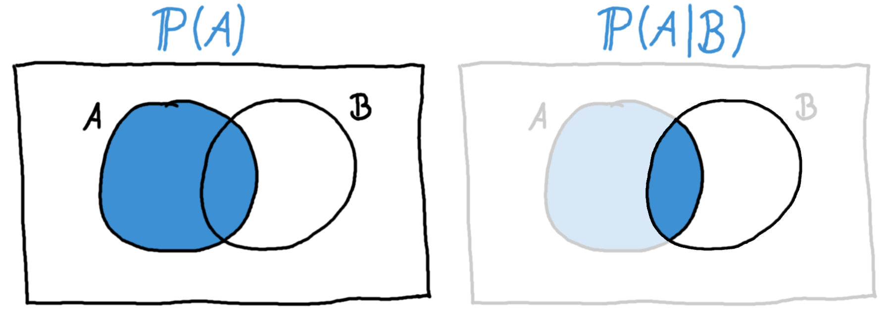

## Bedingte Wahrscheinlichkeiten {#sec-bedingte-wsk}

Mit Hilfe von bedingten Wahrscheinlichkeiten kann man die Wahrscheinlichkeit für ein Ereignis genauer bestimmen, wenn zusätzliche Information vorhanden ist. Diese zusätzliche Information ist ein anderes Ereignis, das schon eingetreten ist, und wodurch wir nun eine genauere Einschätzung der Wahrscheinlichkeit haben.

Dazu ein Beispiel: Möchten wir an einem Junitag die Wahrscheinlichkeit \(\mathbb{P}(A)\) bestimmen, dass morgen ein sonniger Tag wird, können wir zum Beispiel das Wetter an allen Junitagen der letzten zehn Jahre anschauen, und abzählen, an wievielen dieser Tage die Sonne schien. Wir können aber eine genauere Aussage über diese Wahrscheinlichkeit machen, wenn wir zusätzlich wissen dass es heute stark regnet. Wenn wir das Ereignis "Heute regnet es" mit dem Buchstaben \(B\) bezeichnen, können wir die Wahrscheinlichkeit dass es morgen sonnig wird, *gegeben heute regnet es stark*, ausdrücken durch

\[ \mathbb{P}(A|B). \]

Man spricht diese Schreibweise aus als "Die Wahrscheinlichkeit von \(A\), gegeben \(B\)".

**Veranschaulichung an Venn-Diagrammen**

Die Tatsache, dass man durch die Kenntnis des Eintretens von Ereignis \(B\) eine genauere Aussage über die Wahrscheinlichkeit des Eintretens von \(A\) machen kann, kann man mit Hilfe eines Venn-Diagramms (s. Kap. \@ref(sec-venn)) veranschaulichen. Wenn wir wissen, dass \(B\) eingetreten ist, reduziert sich der gesamte Ergebnisraum \(\Omega\) auf \(B\) (s. Abb. \@ref(fig:venn-bedingteWsk)).

(ref:venn-bedingteWsk-caption) Die bedingte Wahrscheinlichkeit am Beispiel eines Venn-Diagramms. Links: Die Wahrscheinlichkeit für \(A\) ohne zusätzliche Information ist der ausgefüllte Kreis. Rechts: Wissen wir, dass \(B\) eingetreten ist, können wir die Wahrscheinlichkeit für \(A\) gegeben \(B\) berechnen. Die ausgefüllte Fläche in der Mitte ist hier \(A \cap B\).

```{r venn-bedingteWsk, fig.cap="(ref:venn-bedingteWsk-caption)"}

```

Die Idee hinter bedingten Wahrscheinlichkeiten ist einfach, aber deren Berechnung kann zu Beginn oft kompliziert sein. Mit etwas Übung ist dieses Thema aber auch leicht zu bewältigen.

**Etwas Übung**

Sehen wir uns für eine Beispielrechnung die Studenten einer Statistikvorlesung an. Wir beobachten, wieviele der Studenten auf die Klausur lernen bzw. nicht lernen, und wieviele der Studenten die Klausur bestehen. Uns interessiert am Ende die Wahrscheinlichkeit, die Klausur zu bestehen, gegeben man hat auf sie gelernt.

Wir haben insgesamt \(n=50\) Studenten beobachtet. Von ihnen haben 25 auf die Klausur gelernt, und die übrigen 25 haben nicht gelernt. 30 der Studenten haben die Klausur bestanden. Von den 25 Studenten, die nicht auf die Klausur gelernt haben, haben 10 Studenten bestanden, und die übrigen 15 sind durchgefallen.

Wir erstellen aus diesen Angaben zuerst eine Kreuztabelle der Merkmale \(L\)="Auf die Klausur gelernt" und \(B\)="Klausur bestanden".

|                             | \(B\) = bestanden | \(\bar{B}\) = nicht bestanden | Summe |
| --------------------------- | ----------------- | ----------------------------- | ----- |
| \(L\) = gelernt             | 20                | 5                             | 25    |
| \(\bar{L}\) = nicht gelernt | 10                | 15                            | 25    |
| Summe                       | 30                | 20                            | 50    |

Angenommen, wir nehmen aus dieser Gruppe Studenten nun eine zufällige Person heraus, können wir für sie die Wahrscheinlichkeit \(\mathbb{P}(B)\) bestimmen, dass sie die Klausur bestanden hat. Von 50 Studenten haben 30 die Klausur bestanden:

\[ \mathbb{P}(B) = \frac{30}{50} = 0.6 \]

Wenn wir aber nun zusätzlich wissen, dass diese Person gelernt hat, befinden wir uns nur in der ersten Zeile der obigen Kreuztabelle (vergleiche auch Kapitel \@ref(sec-kreuztabellen), die bedingten Häufigkeiten im Kapitel zu Kreuztabellen). Von insgesamt 25 Studenten, die auf die Klausur gelernt haben, haben sie 20 Studenten bestanden. Es ist also

\[ \mathbb{P}(B|L) = \frac{20}{25} = 0.8, \]

und somit ist die Wahrscheinlichkeit, dass der Student bestanden hat, *gegeben er hat auf die Klausur gelernt*, 80%.

Mathematisch drückt man die obige Formel wie folgt aus:

\[ \mathbb{P}(B|L) = \frac{\mathbb{P}(B \cap L)}{\mathbb{P}(L)} \]

Das ist somit die allgemeine Formel für die bedingte Wahrscheinlichkeit. Meistens werden in einer Formelsammlung natürlich statt \(B\) und \(L\) die Buchstaben \(A\) und \(B\) verwendet, aber das ist nur eine Sache der Notation, und macht sonst keinen Unterschied.

```{exercise, echo=TRUE}

Wir werfen einen normalen Würfel, und betrachten die Ereignisse \(A\) = "Es kommt eine gerade Zahl", und \(B\) = "Es kommt eine Zahl kleiner oder gleich 3".

a) Bestimme die Wahrscheinlichkeit für \(A\).
b) Bestimme die Wahrscheinlichkeit für \(A\), gegeben \(B\) ist bereits eingetreten.

```

```{solution, echo=TRUE}

a) Durch einfaches Abzählen finden wir die [Laplace-Wahrscheinlichkeit](#sec-laplace). Im Zähler steht die Anzahl der "gewünschten" Ergebnisse, das ist die 2, 4, und 6, also insgesamt 3 Ergebnisse. Im Nenner steht die Anzahl aller möglichen Ergebnisse, das ist bei einem Würfel 6:

\[\mathbb{P}(A) = \frac{3}{6} = 0.5\]

b) Hier möchten wir \(\mathbb{P}(A|B)\) bestimmen. Das tun wir mit der Formel über \(\mathbb{P}(A|B) = \frac{\mathbb{P}(A \cap B)}{\mathbb{P}(B)}\).
Wir müssen jetzt also wieder durch Abzählen der Ereignisse die Laplace-Wahrscheinlichkeit für \(\mathbb{P}(A \cap B)\) sowie \(\mathbb{P}(B)\) bestimmen:

Für das Ereignis \(A \cap B\) brauchen wir im Zähler die Anzahl der Ergebnisse, die gerade und kleiner gleich 3 sind. Da kommt nur die Zahl 2 in Frage, d.h. nur ein mögliches Ergebnis - im Zähler steht also 1. Im Nenner steht die 6, da es bei einem Würfel 6 mögliche Ergebnisse gibt:

\[ \mathbb{P}(A \cap B) = \frac{1}{6} \]

Für das Ereignis \(B\) gibt es drei mögliche Ergebnisse, nämlich die 1, 2, und 3. Daher steht hier im Zähler die 3:

\[ \mathbb{P}(B) = \frac{3}{6} = \frac{1}{2} \]

Diese Werte können wir nun einsetzen und erhalten für die gesuchte Wahrscheinlichkeit:

\[ \mathbb{P}(A|B) = \frac{\mathbb{P}(A \cap B)}{\mathbb{P}(B)} = \frac{1/6}{1/2} = \frac{1}{3} \]

Das bedeutet: *Gegeben* jemand hat uns schon verraten, dass das Ergebnis des Würfels eine Zahl kleiner gleich 3 ist, dann ist die Wahrscheinlichkeit dass die Zahl gerade ist, ein Drittel.

Das kann man sich auch leicht erklären: Nachdem unser Informant gesagt hat, dass der Würfel eine Zahl kleiner gleich 3 zeigt, wissen wir dass es nur noch drei mögliche Ergebnisse des Würfels gibt, nämlich die 1, 2, oder 3. Und nur eine davon ist gerade. Das heißt, eins von drei Ergebnissen ist für uns günstig, daher die letztendliche Wahrscheinlichkeit von \(\frac{1}{3}\).

```