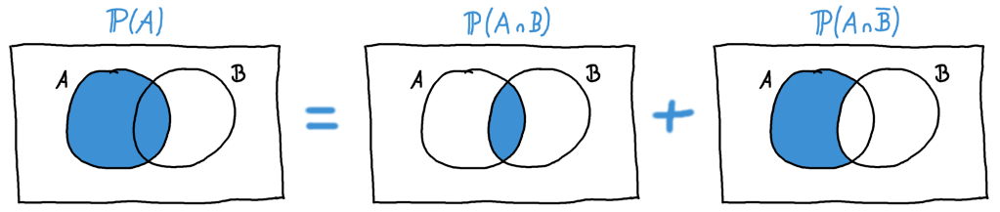

## Satz der totalen Wahrscheinlichkeit {#sec-totale-wsk}

Mit dem Satz der totalen Wahrscheinlichkeit kann man die Wahrscheinlichkeit für ein Ereignis \(A\) berechnen, wenn man nur bedingte oder gemeinsame Wahrscheinlichkeiten abhängig von einem zweiten Ereignis \(B\) gegeben hat.

Als Beispiel sei hier die Parkinson-Krankheit genannt. Da mehr Männer als Frauen an Parkinson erkranken, sind hauptsächlich geschlechtsspezifische Zahlen veröffentlicht. Möchte man aber die Wahrscheinlichkeit der Erkrankung für eine zufällige Person unabhängig vom Geschlecht bestimmen, braucht man dafür den Satz der totalen Wahrscheinlichkeit. Mit Hilfe der Erkrankungsrate pro Geschlecht, dem Verhältnis von Frauen und Männern in der Gesamtbevölkerung, und der entsprechenden Formel erhält man dann die Gesamtwahrscheinlichkeit einer Parkinsonerkrankung.

In einem Venn-Diagramm kann man das Aufteilen einer totalen Wahrscheinlichkeit wie in Abbildung \@ref(fig:venn-totaleWsk-gesamt) illustrieren.

```{r venn-totaleWsk-gesamt, fig.cap="Der Satz der totalen Wahrscheinlichkeit"}

```

Es ist also

\[\mathbb{P}(A) = \mathbb{P}(A \cap B) + \mathbb{P}(A \cap \bar{B}). \]

In unserem Beispiel der Parkinson-Krankheit hieße das: Die Wahrscheinlichkeit für eine beliebige Person, an Parkinson zu erkranken, setzt sich zusammen als die Summe der Wahrscheinlichkeit, ein Mann zu sein *und* an Parkinson zu erkranken, plus die Wahrscheinlichkeit, eine Frau zu sein *und* an Parkinson zu erkanken.

Meist sind nicht die gemeinsamen Wahrscheinlichkeiten \(\mathbb{P}(A \cap B)\), sondern die [bedingten Wahrscheinlichkeiten](#sec-bedingte-wsk) \(\mathbb{P}(A | B)\) gegeben. Man kann die gemeinsamen Wahrscheinlichkeiten aber erhalten, indem man die Formel der bedingten Wahrscheinlichkeiten etwas umstellt:

\[ \mathbb{P}(A \cap B) = \mathbb{P}(A | B) \cdot \mathbb{P}(B) \]

Wir erhalten also die verbreitetste Version der Formel für die totale Wahrscheinlichkeit:

\[\mathbb{P}(A) =\mathbb{P}(A | B) \cdot \mathbb{P}(B) +\mathbb{P}(A | \bar{B}) \cdot \mathbb{P}(\bar{B}). \]

Je nachdem, ob in einer Aufgabe die bedingten oder die gemeinsamen Wahrscheinlichkeiten gegeben sind, nimmt man die eine oder andere dieser beiden Formeln. In den allermeisten Fällen arbeitet man aber mit bedingten Wahrscheinlichkeiten.

```{exercise, echo=TRUE}
Mit dieser Formel können wir nun für eine zufällige Person beliebigen Geschlechts die totale Wahrscheinlichkeit berechnen, an Parkinson zu erkranken. Wir benötigen dazu die folgenden Notationen:

- \(A\): Die Person erkrankt an Parkinson
- \(B\): Die Person ist männlich.
- \(\bar{B}\): Das Gegenteil von \(B\), also: Die Person ist weiblich.

Aus einer Onlinepublikation über die Prävalenz von Parkinson erhalten wir die folgenden Wahrscheinlichkeiten:

- Die Wahrscheinlichkeit für einen Mann, an Parkinson zu erkranken, liegt bei 0,309%. In unserer Formel bedeutet das: \(\mathbb{P}(A|B) = 0.00309\).
- Die Wahrscheinlichkeit für eine Frau, an Parkinson zu erkranken, liegt bei 0,241%. Analog dazu: \(\mathbb{P}(A|\bar{B}) = 0.00241\).
- Es gibt minimal mehr Männer in der Gesamtbevölkerung, nämlich 51,1%. Also: \(\mathbb{P}(B) = 0.511\).

```

```{solution, echo=TRUE}
Mit diesen Werten können wir nun die Gesamtwahrscheinlichkeit für eine beliebige Person berechnen:

\[\begin{array}{rclcl} \mathbb{P}(A) & = & \mathbb{P}(A | B) \cdot \mathbb{P}(B) +\mathbb{P}(A | \bar{B}) \cdot \mathbb{P}(\bar{B}) = \\ & & 0.00309 \cdot 0.511 + 0.00241 \cdot 0.489 = \\ & & 0.00275748 \end{array}\]

Wir enden also bei einer Wahrscheinlichkeit von 0,276% für eine Person beliebigen Geschlechts, an Parkinson zu erkranken. Wichtig ist hier, dass das nicht genau der Mittelwert zwischen \(\mathbb{P}(A|B) = 0.00309\) und \(\mathbb{P}(A|\bar{B}) = 0.00241\) ist, sondern dass diese Werte mit dem Geschlechterverhältnis gewichtet werden, das zwar nahe an 50/50 liegt, aber eben nicht genau gleich ist.
```


**Mehr als zwei Gruppen in \(B\)**

Man kann die totale Wahrscheinlichkeit auch bestimmen, wenn es sich um mehr als zwei Gruppen handelt. Dann arbeitet man nicht mit den beiden Ereignissen \(B\) und \(\bar{B}\), sondern z.B. mit drei Ereignissen \(B_1\), \(B_2\), und \(B_3\). Wichtig ist hier, dass diese Gruppen *disjunkt* sind, d.h. dass sie sich nicht überschneiden. Die Folge dieser Voraussetzung ist, dass sich ihre Wahrscheinlichkeiten zu 1 summieren, dass also jedes mögliche Ereignis in eines, und genau eines der drei Unterereignisse fällt:

\[ \mathbb{P}(B_1) +\mathbb{P}(B_2) +\mathbb{P}(B_3) = 1 \]

Für drei Untergruppen (und analog auch für beliebig viele Untergruppen) des Ereignisses \(B\) bestimmt man die totale Wahrscheinlichkeit wie folgt:

\[ \begin{array}{rclcl} \mathbb{P}(A) & = & \mathbb{P}(A|B_1)\cdot \mathbb{P}(B_1) + \\ & &\mathbb{P}(A|B_2)\cdot \mathbb{P}(B_2) + \\ & &\mathbb{P}(A|B_3)\cdot \mathbb{P}(B_3) \end{array} \]