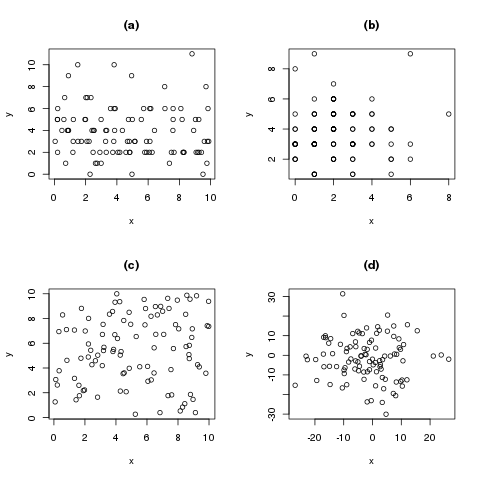
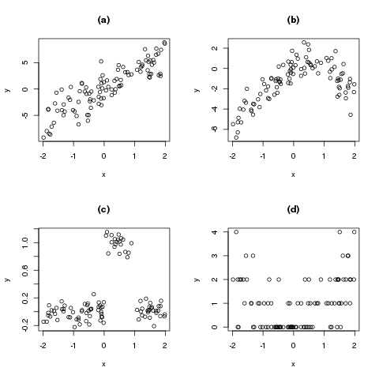

## Unabhängigkeit zweier Zufallsvariablen

Das Konzept der Abhängigkeit lässt sich vereinfacht wie folgt beschreiben: Wenn man in einer Stichprobe für jede befragte Person zwei Merkmale erhebt (nennen wir sie \(X\) und \(Y\)), und man anhand des tatsächlichen Wertes von \(X\) eine genauere Vorhersage für \(Y\) machen kann (und umgekehrt), dann spricht man von einer Abhängigkeit zwischen \(X\) und \(Y\).

Eine Abhängigkeit existiert ohne Richtung. Alle drei folgenden Aussagen bedeuten also das Gleiche:

- \(X\) ist von \(Y\) abhängig.
- \(Y\) ist von \(X\) abhängig.
- \(X\) und \(Y\) sind abhängig.

Ein Beispiel für zwei abhängige Variablen ist \(X\)=Körpergrösse und \(Y\)=Körpergewicht von befragten Personen. Wenn ich die Größe einer Person kenne, kann ich ihr Gewicht besser einschätzen. Zwei unabhängige Variablen wären etwa \(X\)=Körpergewicht und \(Y\)=Hausnummer einer Person, denn die Hausnummer einer Person gibt mir keine Information über ihr Gewicht (und andersrum).

Es ist also bei zwei unabhängigen Variablen die Ausprägung von einem Wert für \(X\) keine Hilfe, um den Wert von \(Y\) vorherzusagen. Mathematisch ausgedrückt: Die Verteilung von \(Y\), gegeben ich kenne \(X\), ist gleich der Verteilung von \(Y\). Und noch kürzer, in einer Formel verpackt, schreiben wir das äquivalent als

\[ \mathbb{P}(Y|X) = \mathbb{P}(Y). \]

Es ist wichtig, im Kopf zu behalten dass eine Abhängigkeit nicht bedeutet, dass die eine Variable die andere *beeinflusst*. Um das am obigen Beispiel zu erläutern: Die Körpergrösse und das Körpergewicht sind voneinander abhängig. Wenn ich also eine Person habe, die 80kg schwer ist, und eine Person die 50kg schwer ist, dann gehe ich davon aus, dass die 80kg schwere Person etwas größer ist als die 50kg schwere. Das ist die Idee hinter dem Begriff **Abhängigkeit**. Es heißt aber nicht, dass ich jetzt 30kg zunehmen kann und erwarten darf, dass ich deswegen in die Höhe wachse. Dies unterstellt eine nicht vorhandene **Kausalität**. Der Unterschied zwischen den beiden Begriffen ist in Kapitel \@ref(sec-korrelation-kausalitaet) detaillierter erklärt.

In Abbildung \@ref(fig:zufallsvariablen-unabhaengige-ZV) sind vier Beispiele für Streudiagramme von unabhängigen Zufallsvariablen abgebildet.

(ref:zufallsvariablen-unabhaengige-ZV-caption) (a) Eine Zählvariable \(Y\) und eine gleichverteilte stetige Variable \(X\). (b) Zwei Zählvariablen. (c) Zwei stetig gleichverteilte Variablen. (d) Zwei normalverteilte Variablen.

```{r zufallsvariablen-unabhaengige-ZV, fig.cap="(ref:zufallsvariablen-unabhaengige-ZV-caption)"}

```

Abbildung \@ref(fig:zufallsvariablen-abhaengige-ZV) zeigt vier beispielhafte Streudiagramme für abhängige Zufallsvariablen, und macht deutlich dass diese Abhängigkeiten nicht immer linear (wie in Abbildung \@ref(fig:zufallsvariablen-abhaengige-ZV) (a) dargestellt) sein müssen.

(ref:zufallsvariablen-abhaengige-ZV-caption) (a) Das klassische Beispiel: \(X\) und \(Y\) sind linear abhängig. (b) Hier ist eine quadratische Abhängigkeit zwischen \(X\) und \(Y\) erkennbar. (c) Ein ungewöhnliches Beispiel, aber dennoch eine Abhängigkeit: Falls uns der Wert von \(X\) gegeben wird, lässt uns das eine genauere Aussage für \(Y\) treffen. (d) Eine beispielhafte (quadratische) Abhängigkeit zwischen einer Zählvariable \(Y\) und einer gleichverteilten Variable \(X\).

```{r zufallsvariablen-abhaengige-ZV, fig.cap="(ref:zufallsvariablen-abhaengige-ZV-caption)"}

```

In Abbildung \@ref(fig:zufallsvariablen-abhaengige-ZV) (c) wird sehr schön klar, dass die absolute Verteilung von \(Y\) anders ist als die Verteilung von \(Y\), gegeben ich kenne \(X\). Denn es ist zum Beispiel \(Y|X=0.5 \sim N(1, 0.1)\), aber \(Y | X=-1 \sim N(0, 0.1)\). Das bedeutet: Die Verteilung von \(Y\), gegeben X ist 0.5, ist eine Normalverteilung mit Mittelwert 1 (und Standardabweichung 0.1). Falls \(X\) aber zum Beispiel -1 ist, ist die bedingte Verteilung von \(Y\) normalverteilt mit Mittelwert 0 (und Standardabweichung 0.1).

Die **mathematische Definition** der Unabhängigkeit lautet wie folgt:

Zwei Variablen \(X\) und \(Y\) heißen *stochastisch unabhängig*, falls für alle \(x\) und alle \(y\) gilt:

\[ f(x,y) = f_X(x) \cdot f_Y(y). \]

Das bedeutet, dass wir bei unabhängigen Variablen die gemeinsame Dichte \(f(x,y)\) berechnen können, indem wir einfach die einzelnen Dichten \(f_X(x)\) und \(f_Y(y)\) multiplizieren. Dazu ein Beispiel:

Angenommen wir werfen eine Münze \(X\) (Ergebnis: 0=Kopf oder 1=Zahl) und anschließend einen Würfel \(Y\) (Ergebnis: 1, 2, 3, 4, 5, oder 6). Diese beiden Zufallsvariablen sind voneinander unabhängig, da es den Würfel nicht interessiert, was das Ergebnis der Münze war. Wir können nun zum Beispiel die Wahrscheinlichkeit berechnen, dass die Münze "Kopf" (wir kodieren "Kopf" mit einer 0) zeigt:

\[ \mathbb{P}(X=\text{Kopf}) = f_X(0) = \frac{1}{2} \]

Außerdem können wir die Wahrscheinlichkeit notieren, dass der Würfel eine "1" zeigt:

\[ \mathbb{P}(Y=1) = f_Y(1) = \frac{1}{6} \]

#### Rechenregeln für Dichten von unabhängigen Zufallsvariablen {-}

Im Falle von unabhängigen Experimenten (so wie der Münze und dem Würfel oben) können wir nun **gemeinsame Wahrscheinlichkeiten** ganz einfach berechen: Möchten wir etwa wissen, wie hoch die Wahrscheinlichkeit ist, dass wir zuerst "Kopf" werfen, und danach eine "3" würfeln (das heisst, wir möchten \(f(0,3)\) berechnen), können wir die beiden einzelnen Dichten einfach multiplizieren:

\[ f(0, 3) = f_X(0) \cdot f_Y(3) = \frac{1}{2} \cdot \frac{1}{6} = \frac{1}{12} \]

Wenn man sich mit mehr als einem Zufallsexperiment beschäftigt, ist es übrigens hilfreich, die Dichten mit einem Index zu versehen. Ansonsten wüssten wir nämlich nicht, was mit der Dichte \(f(1)\) gemeint ist, der Würfel oder die Münze. Wenn wir stattdessen \(f_X(1)\) schreiben, ist klar, dass die Dichte der Zufallsvariablen \(X\), also der Münze, gemeint ist, und der Wert der Dichte daher \(\frac{1}{2}\) (und nicht \(\frac{1}{6}\)) ist.

**Bedingte Dichten** für unabhängige Zufallsvariablen machen wenig Sinn. Da uns \(X\) keine Information für die Ausprägung von \(Y\) liefert, ist die bedingte Dichte von \(Y\) gegeben \(X\) genau gleich der (nicht bedingten) Dichte von \(Y\):

\[ f(y|x) = f(y) \]

Die Frage, ob zwei Variablen voneinander abhängig oder unabhängig sind, hat wichtige Auswirkungen darauf, was man mit den beiden Variablen rechnen kann. Man braucht zum Beispiel **voneinander abhängige Variablen**, um eine Regression zu rechnen, denn wenn zwei Variablen voneinander unabhängig sind, also sich nicht gegenseitig beeinflussen, macht es auch keinen Sinn, eine der beiden Variablen mit Hilfe der anderen vorherzusagen. Für andere Berechnungen sind hingegen **voneinander unabhängige Zufallsvariablen** die Voraussetzung. Möchte man zum Beispiel den Erwartungswert des Produkts zweier Zufallsvariablen berechnen, gilt die einfache Formel nur im Fall der Unabhängigkeit.