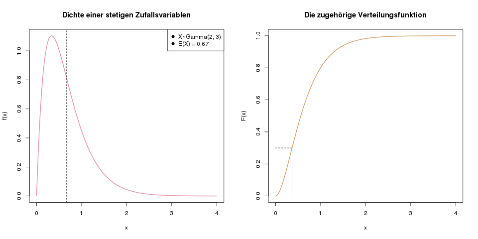
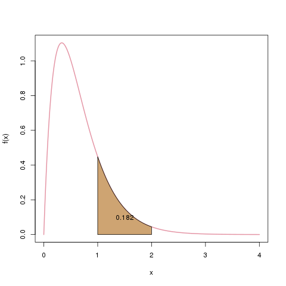
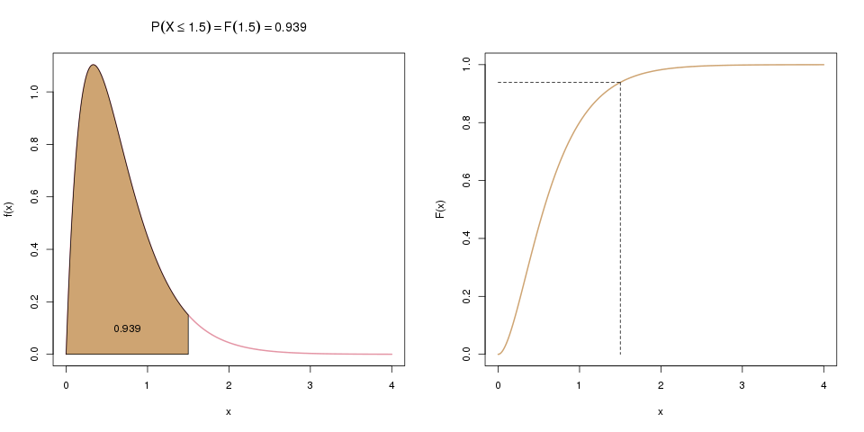
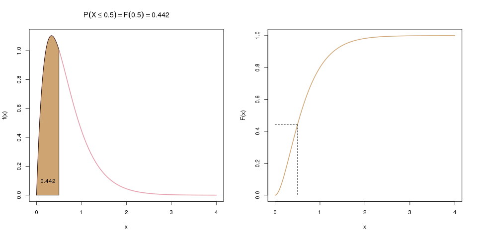
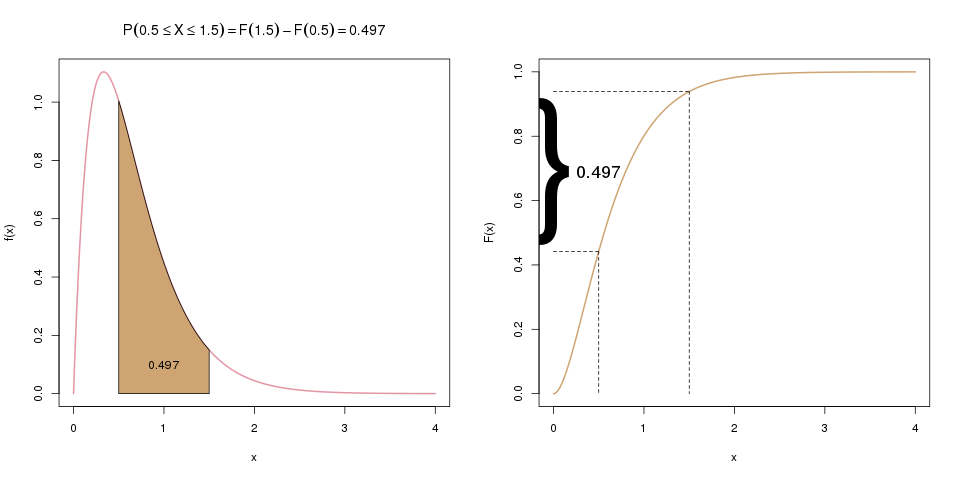
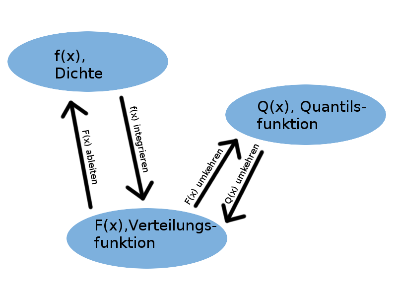
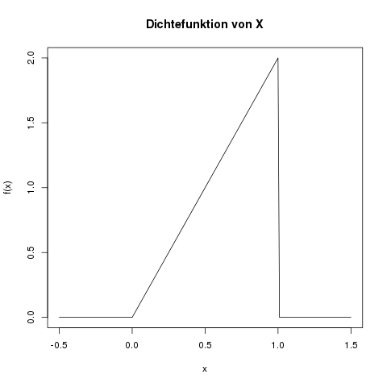
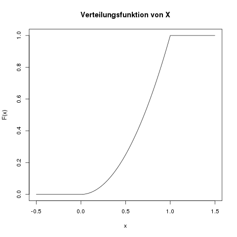
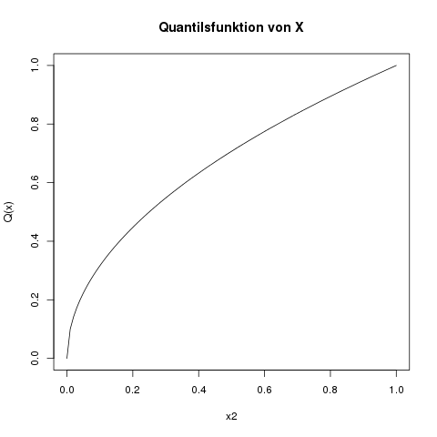
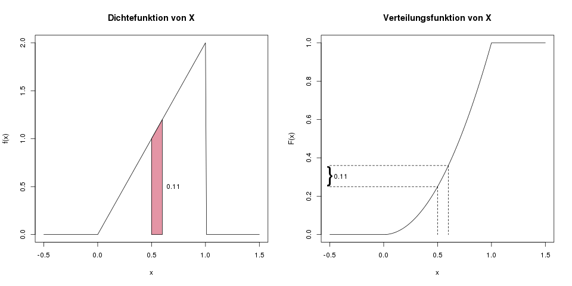

## Darstellung und Eigenschaften von stetigen Zufallsvariablen {#sec-duevsz}

In diesem Kapitel schauen wir uns stetige Zufallsvariablen im Allgemeinen an. Spezielle Verteilungen wie die Exponentialverteilung oder Normalverteilung findet man im Kapitel \@ref(sec-verteilungen).

(ref:zufallsvariablen-stetig-dichte-verteilung-caption) Links sieht man ein Beispiel einer Dichte für eine stetige Zufallsvariable. Die gestrichelte Linie markiert den Erwartungswert von X. Rechts ist die Verteilungsfunktion derselben Zufallsvariablen abgebildet. Die gestrichelte Linie hier markiert das 30%-Quantil, das wir genau wie bei [diskreten Zufallsvariablen](#sec-duevdz) bestimmen.

```{r zufallsvariablen-stetig-dichte-verteilung, fig.cap="(ref:zufallsvariablen-stetig-dichte-verteilung-caption)"}

```

### Dichte {#sec-duevsz-dichte}

Jede Dichtefunktion einer stetigen Zufallsvariablen hat zwei Eigenschaften:

1. Die Funktion hat nirgends einen negativen Wert, ist also auf den gesamten reellen Zahlen entweder 0 oder größer als 0. Mathematisch ausgedrückt: \(f(x) \geq 0\) für alle \(x \in \mathbb{R}\).
2. Die Fläche unter der gesamten Dichtefunktion (ihr Integral) ergibt 1. Das ist analog zur Dichte bei diskreten Zufallsvariablen, wo die Summe aller ihrer einzelnen Wahrscheinlichkeiten 1 ergibt.

Der große Unterschied zwischen diskreten und stetigen Zufallsvariablen ist, dass die Dichte hier, bei stetigen Zufallsvariablen, nicht die Wahrscheinlichkeit für einen beliebigen Punkt repräsentiert. Im stetigen Fall ist es nun so, dass die Wahrscheinlichkeit für ein bestimmtes, festes Ergebnis immer Null ist. Im Beispielbild oben ist etwa \(\mathbb{P}(X=0.237) = 0\).

Im stetigen Fall kann man **Wahrscheinlichkeiten nur für Intervalle** bestimmen. Man kann also z.B. sagen, dass \(X\) mit 18.2% einen Wert zwischen 1 und 2 annehmen wird: \(\mathbb{P}(X \in [1,2]) = 0.182\). Diese "Wahrscheinlichkeitsmasse" von 0.182 ist die **Fläche unter der Dichte**, von 1 bis 2.

(ref:zufallsvariablen-stetig-integral-caption) Die Wahrscheinlichkeit, dass das Ergebnis unserer Zufallsvariablen zwischen 1 und 2 liegt, notieren wir mit \(\mathbb{P}(X \in [1,2])\). Wir bestimmen es als die Fläche unter der Dichte, beschränkt auf den Bereich \([1,2]\), hier als braune Fläche dargestellt.

```{r zufallsvariablen-stetig-integral, fig.cap="(ref:zufallsvariablen-stetig-integral-caption)"}

```

Wie lässt sich diese Fläche nun berechnen? Es handelt sich nicht mehr um Rechtecke oder Trapeze (wie etwa beim [Gini-Koeffizienten](#sec-gini)), sondern um eine glatte Funktion. Daher müssen wir mit dem Integral arbeiten. Die Verteilungsfunktion \(F(x)\) ist im stetigen Fall nun genau das Integral der Dichtefunktion \(f(x)\).

### Verteilungsfunktion {#sec-duevsz-verteilungsfunktion}

Die Verteilungsfunktion \(F(x)\) ist im stetigen Fall genauso definiert wie im diskreten Fall:

\[ F(x) = \mathbb{P}(X \leq x) \]

Sie wird jetzt nicht über die Summe der Dichte berechnet, sondern weil wir ja unendlich mögliche Werte für \(x\) haben, über das **Integral der Dichte** berechnet.

(ref:zufallsvariablen-dichte-zu-integral-1-caption) Links sieht man die Dichtefunktion. Die Wahrscheinlichkeit, dass \(X\) kleiner oder gleich 1.5 ist, entspricht der Fläche unter der Dichte bis zum Wert 1.5 auf der x-Achse. Rechts ist die Verteilungsfunktion \(F(x)\) abgebildet, die genau diese Fläche darstellt.

```{r zufallsvariablen-dichte-zu-integral-1, fig.cap="(ref:zufallsvariablen-dichte-zu-integral-1-caption)"}

```

Es gilt also:

\[ F(x) = \int_{-\infty}^x f(t) dt \]

Wer sich nun wundert, warum wir auf einmal \(f(t)\) statt \(f(x)\) schreiben: Weil wir das \(x\) schon für die Verteilungsfunktion \(F\) verwenden, müssen wir uns bei der Dichte kurzfristig einen neuen Buchstaben überlegen. Ähnlich wie beim Summenzeichen \(\sum\), bei der man meistens die Indexvariable \(i\) einführt, wird hier temporär das Argument \(t\) statt \(x\) verwendet. Der Funktion \(f\) ist es ja egal, wie ihr Argument heißt, sie verarbeitet es einfach und spuckt ihr Ergebnis aus, nämlich die Dichte an dieser Stelle, sei es nun beispielhaft \(x=2.5\) oder \(t=2.5\).

Möchten wir also die Wahrscheinlichkeit wissen, dass \(x\) kleiner oder gleich 1.5 ist, berechnen wir \(\int_{-\infty}^{1.5} f(t) dt\). Das Integral startet immer bei \(-\infty\), egal wo die Dichte tatsächlich beginnt. Die Schreibweise ist einfach allgemeingültiger, für alle möglichen Dichten. Das macht in unserem Fall auch nichts aus, weil \(f(t)\) hier im negativen Bereich 0 ist, also keine Fläche hat.

Oft interessiert uns aber auch die **Wahrscheinlichkeit, dass \(X\) zwischen zwei Werten**, z.B. zwischen 0.5 und 1.5 liegt. Die Verteilungsfunktion liefert uns aber nur die Wahrscheinlichkeit, dass \(X\) kleiner/gleich einem Wert ist. Hier können wir aber einen Trick anwenden: Wenn wir zuerst \(F(1.5)\) berechnen, und davon dann \(F(0.5)\) abziehen, haben wir genau die gesuchte Wahrscheinlichkeit, \(\mathbb{P}(0.5 \leq X \leq 1.5)\). Die Abbildungen \@ref(fig:zufallsvariablen-dichte-zu-integral-2) und \@ref(fig:zufallsvariablen-dichte-zu-integral-3) ergänzen das erste Bild von oben und visualisieren diese Idee.

(ref:zufallsvariablen-dichte-zu-integral-2-caption) Im ersten Schritt (weiter oben) berechneten wir \(\mathbb{P}(X \leq 1.5)\). Hier, im zweiten Schritt, berechnen wir nun \(\mathbb{P}(X \leq 0.5)\), was hier links als braune Fläche dargestellt wird, und rechts als entsprechender Wert der Verteilungsfunktion.

```{r zufallsvariablen-dichte-zu-integral-2, fig.cap="(ref:zufallsvariablen-dichte-zu-integral-2-caption)"}

```

(ref:zufallsvariablen-dichte-zu-integral-3-caption) Im letzten Schritt ziehen wir \(F(0.5)\) von \(F(1.5)\) ab. Übrig bleibt die gesuchte Wahrscheinlichkeit \(\mathbb{P}(0.5 \leq X \leq 1.5)\), die im linken Bild als Fläche dargestellt ist, und im rechten als Differenz der beiden Werte auf der y-Achse.

```{r zufallsvariablen-dichte-zu-integral-3, fig.cap="(ref:zufallsvariablen-dichte-zu-integral-3-caption)"}

```

#### Formel oder Verteilungstabelle? {#sec-verteilungstabelle}

Die Dichte von allen relevanten Zufallsvariablen ist immer als Formel darstellbar. Es ist zum Beispiel für eine normalverteilte Variable \(X\) die Dichte \(f(x) = \frac{1}{\sqrt{2\pi}\sigma} \exp(-\frac{(x-\mu)^2}{2\sigma^2})\). Bei der Verteilungsfunktion ist das allerdings nicht immer der Fall. Für die Exponentialverteilung existiert eine Formel für die Verteilungsfunktion, da es ein einfach zu berechnendes Integral ist. Für die Normalverteilung allerdings lässt sich die Verteilungsfunktion nicht einfach hinschreiben. In diesem Fall gibt es **Verteilungstabellen**, die z.B. in 0.01er-Schritten den Wert von \(F(x)\) tabelliert haben. Muss man also von Hand (und das passiert eigentlich nur noch in Klausuren) die Verteilungsfunktion einer Zufallsvariablen bestimmen, kommt es auf die Verteilung an, ob man eine Formel an einem bestimmten Wert \(x\) auswertet, oder in einer Verteilungstabelle für einen bestimmten Wert \(x\) nachsieht.

### Quantilsfunktion

Die Quantilsfunktion \(Q(x)\) (manche nennen sie auch einfach nur \(F^{-1}(x)\)) bei stetigen Zufallsvariablen ist nichts anderes als die **Umkehrfunktion** der Verteilungsfunktion. Die Umkehrfunktion von einer beliebigen Funktion \(y=F(x)\) wird mit \(x=F^{-1}(y)\) bezeichnet. Das bedeutet aber nicht \(\frac{1}{F(x)}\), sondern dass sie von einem Funktionswert \(y\) zurück auf den ursprünglichen Wert \(x\) führt.

Die Umkehrfunktion von \(y=2x+3\) ist zum Beispiel \(x=\frac{1}{2}(y-3)\). Man bildet sie, indem man in der ursprünglichen Formel nach \(x\) auflöst:

\[ \begin{aligned} y &= 2x+3\\ y-3 &= 2x \\ \frac{1}{2}(y-3) &= x \end{aligned} \]

Genauso macht man das bei der Quantilsfunktion: Man löst die Formel der Verteilungsfunktion nach \(x\) auf. Voraussetzung dafür ist natürlich, dass die Verteilungsfunktion als Formel darstellbar ist. Wenn nicht, muss man (wie oben erklärt) wieder auf Tabellen zurückgreifen. Klassischer Fall dafür ist die Normalverteilung, deren Quantile beim Testen wichtig sind.

### Umwandeln von der Dichte zur Verteilungsfunktion/Quantilsfunktion und wieder zurück

Eine Zufallsvariable ist schon eindeutig beschrieben, wenn man nur eine der drei Funktionen (Dichte, Verteilungsfunktion, oder Quantilsfunktion) hat. Man kann nämlich eindeutig zwischen den dreien hin- und herrechnen (s. Abb \@ref(fig:f-F-Q))


```{r f-F-Q, fig.cap="(ref:zufallsvariablen-dichte-zu-integral-3-caption)"}

```

- Die Dichte ist die Ableitung der Verteilungsfunktion: \[ f(x) = \frac{d}{dx} F(x) \]
- Die Verteilungsfunktion ist die Fläche unter der Dichte, d.h. das Integral der Dichte: \[ F(x) = \int_{-\infty}^x f(t) dt \]
- Die Quantilsfunktion ist die Umkehrfunktion der Verteilungsfunktion: \[ Q(x) = F^{-1}(x) \]
- Die Verteilungsfunktion ist die Umkehrfunktion der Quantilsfunktion: \[ F(x) = Q^{-1}(x) \]

### Erwartungswert {#sec-duevsz-erwartungswert}

Hinter dem Erwartungswert einer stetigen Zufallsvariable steckt genau dieselbe Idee wie im diskreten Fall (s. Kap. \@ref(#sec-duevdz-erwartungswert)). Hier wird lediglich statt der Summe ein Integral verwendet. Im diskreten Fall haben wir über alle möglichen Ausprägungen \(x_i\) multipliziert mit der zugehörigen Dichte \(f(x_i)\) summiert, und hier werden wir stattdessen über alle Ausprägungen \(x\) multipliziert mit der Dichte \(f(x)\) integrieren:

\[ \mathbb{E}(X) = \int_{-\infty}^\infty x \cdot f(x) \; dx \]

### Varianz und Standardabweichung {#sec-duevsz-varianz}

Auch die Varianz ist im stetigen Fall ähnlich aufgebaut wie bei diskreten Zufallsvariablen (s. Kap. \@ref(#sec-duevdz-varianz)):

\[ \mathbb{V}(X) = \int_{-\infty}^\infty (x-\mu)^2 f(x) dx, \]

wobei \(\mu = \mathbb{E}(X) = \int_{-\infty}^\infty x f(x) dx\). Man muss zur Berechnung der Varianz also vorher den Erwartungswert bestimmt haben.

Meistens ist es einfacher, statt diesem komplizierten Integral den **Verschiebungssatz** (s. Kap. \@ref(sec-verschiebungssatz)) anzuwenden. Die Varianz ist äquivalent bestimmbar als

\[ \mathbb{V}(X) = \mathbb{E}(X^2) - \mathbb{E}(X)^2. \]

Dabei ist der zweite Teil, \(\mathbb{E}(X)^2\), einfach das Quadrat des Erwartungswertes, aber der erste Teil, \(\mathbb{E}(X^2)\), etwas ganz anderes, nämlich der Erwartungswert von \(X^2\). Das ist eine Transformation der Zufallsvariablen \(X\), deren Erwartungswert wir mit der Transformationsregel (s. Kap. \@ref(sec-transformationsregel)) bestimmen können:

\[ \mathbb{E}(X^2) = \int_{-\infty}^\infty x^2 f(x) \, dx \]

Dieses Integral ist leichter zu berechnen als das vorherige, und wenn man den Erwartungswert eh schon bestimmt hat, ist man mit dieser Methode meist schneller am Ziel. In der folgenden Beispielaufgabe bestimmen wir u.a. die Varianz, und verwenden beide Methoden, um den Unterschied zu sehen.

**Beispielaufgabe**

Als Beispiel schauen wir uns eine Zufallsvariable \(X\) und ihre Dichte \(f(x)\) an:

\[ f(x) = \begin{cases} 2x &\mbox{falls } 0 \leq x \leq 1 \\ 0 & \mbox{sonst} \end{cases} \]

Für diese Dichte werden wir nun

- die Funktion skizzieren
- nachweisen, dass es sich tatsächlich um eine Dichte handelt
- ihren [Träger](#sec-duszv-traeger) bestimmen
- den Erwartungswert berechnen
- die Varianz berechnen
- ihre Verteilungsfunktion bestimmen
- ihre Quantilsfunktion bestimmen
- die Wahrscheinlichkeit, dass \(X\) zwischen 0.5 und 0.6 liegt, bestimmen

**Skizze der Funktion**

Die Dichte \(f(x)\) ist nur im Bereich von 0 bis 1 ungleich Null (s. Abb. \@ref(fig:zufallsvariablen-stetige-dichte)).

```{r zufallsvariablen-stetige-dichte, fig.cap="Skizze der Dichtefunktion"}

```

**Ist es tatsächlich eine Dichte?**

Um nachzuweisen dass eine Funktion \(f(x)\) eine "echte" Dichte ist, müssen wir zwei Eigenschaften überprüfen:

1. Die Funktion darf auf den kompletten reellen Zahlen nicht negativ sein: \(f(x) \geq 0\) für alle \(x \in \mathbb{R}\).
2. Das Integral der Dichte, über die gesamten reellen Zahlen, muss 1 ergeben: \(\int_{-\infty}^\infty f(x) dx = 1\).

Die erste Eigenschaft ist schnell nachgewiesen: Im Bereich von 0 bis 1 ist \(2x > 0\), und im übrigen Bereich ist die Funktion 0, das ist also okay. Man sieht das auch auf der Skizze oben.

Um die zweite Eigenschaft nachzuweisen müssen wir also die Dichte integrieren. Zuerst teilen wir das Integral von \(-\infty\) bis \(\infty\) in drei Teile auf:

\[ \begin{aligned} \int_{-\infty}^\infty f(x) dx &= \int_{-\infty}^0 0 \, dx \\ &+ \int_0^1 2x \, dx \\ &+ \int_1^\infty 0 \, dx \end{aligned} \]

Der erste und dritte Teil fällt sofort weg: Die Fläche unter der Funktion, die konstant Null ist, ist natürlich auch Null. Wir integrieren also nur den Teil von 0 bis 1:

\[ \begin{aligned} \int_{-\infty}^\infty f(x) dx &= \int_0^1 2x \, dx \\ &= \left[ 2 \cdot \frac{1}{2} x^2 \right]^1_0 \\ &= 2\cdot \frac{1}{2} \cdot 1^2 - 2 \cdot \frac{1}{2} 0^2 = 1-0 = 1 \end{aligned} \]

Das Integral ist also insgesamt 1, und damit ist \(f(x)\) eine echte Dichte.

**Was ist der Träger der Zufallsvariablen?**

Der **Träger** einer Zufallsvariablen ist einfach die Menge aller möglichen Ergebnisse von \(X\). Übersetzt bedeutet das: Der Bereich, in dem der Funktionswert \(f(x)\) (also der Wert auf der \(y\)-Achse) größer als 0 ist. In unserem Fall also das Intervall von 0 bis 1 (strikt gesagt ohne der Null). Somit ist der Träger \(\mathcal{T} = (0,1]\).

**Was ist ihr Erwartungswert \(\mathbb{E}(X)\)?**

Für den Erwartungswert wenden wir die Formel von oben an. Wir teilen das Integral wieder in drei Teile auf, wobei die Teile von \(-\infty\) bis \(0\) sowie von \(1\) bis \(\infty\) wieder wegfallen (da die Dichte dort 0 ist, und somit das Integral 0 wird):

Vorsicht: Im Integral steht hier nicht nur \(f(x)\), sonst wäre die Lösung des Integrals ja 1, sondern \(x \cdot f(x)\).


\[ \begin{aligned} \mathbb{E}(X) = \int_{-\infty}^\infty x f(x) \, dx &= \int_{-\infty}^0 x \cdot 0 \, dx + \int_0^1 x \cdot 2x \, dx + \int_1^\infty x \cdot 0 \, dx \\ &= \int_0^1 x \cdot 2x \, dx \\ &= \int_0^1 2x^2 \, dx \\ &= \left[ 2\cdot \frac{1}{3} x^3 \right]^1_0 \\ &= 2 \cdot \frac{1}{3} 1^3 - 2 \cdot \frac{1}{3} 0^3 \\ &= \frac{2}{3} \end{aligned} \]

Somit ist \(\mathbb{E}(X) = \frac{2}{3}\).

**Was ist ihre Varianz \(\mathbb{V}(X)\)?**

Die Varianz können wir mit zwei Methoden bestimmen. Zuerst verwenden wir die Methode mit Verschiebungssatz (s. Kap. \@ref(sec-verschiebungssatz)):

\[ \mathbb{V}(X) = \mathbb{E}(X^2) - \mathbb{E}(X)^2 \]

Da \(\mathbb{E}(X)=\frac{2}{3}\), ist der zweite Term hier schon bekannt: \(\mathbb{E}(X)^2 = (\frac{2}{3})^2 = \frac{4}{9}\).

Für den ersten Teil wenden wir die Transformationsregel (s. Kap. \@ref(sec-transformationsregel) an. Das Integral ist wieder nur im Bereich von 0 bis 1 ungleich Null, also interessiert uns nur dieser Bereich. Es ist ein häufiger Fehler, die Grenzen des Integrals bei \(-\infty\) und \(\infty\) zu lassen, was die Lösung dann unmöglich macht, hier also aufpassen!

\[ \begin{aligned} \mathbb{E}(X^2) &= \int_{-\infty}^\infty x^2 f(x) \, dx \\ &= \int_0^1 x^2 \cdot 2x \, dx \\ &= \int_0^1 2x^3 \, dx \\ &= \left[ 2 \frac{1}{4} x^4 \right]^1_0 = \frac{1}{2} \end{aligned} \]

Und damit können wir die Varianz bestimmen:

\[ \mathbb{V}(X) = \mathbb{E}(X^2) - \mathbb{E}(X)^2 = \frac{1}{2} - \frac{4}{9} = \frac{9}{18} - \frac{8}{18} = \frac{1}{18} \]

Damit sind wir fertig: \(\mathbb{V}(X) = \frac{1}{18}\).

Nur um zu sehen, wie kompliziert es ohne dieser Regel ist, berechnen wir die Varianz hier nocheinmal mit der ursprünglichen Formel (ich ersetze hier \(\mathbb{E}(X)\) mit \(\mu\), damit die Notation übersichtlicher wird). Wer noch Schwierigkeiten beim Integrieren hat, kann natürlich auf dem Papier mitrechnen:

\[ \begin{aligned} \mathbb{V}(X) = \int_{-\infty}^\infty (x-\mu)^2 f(x) \, dx &= \int_0^1 (x^2 - 2\mu x + \mu^2) \cdot 2x \, dx \\ &= \int_0^1 2x^3-4\mu x^2 + 2\mu^2 x \, dx \\ &= \left[ 2 \cdot \frac{1}{4} x^4 - 4 \mu \cdot \frac{1}{3} x^3 + 2\mu^2 \cdot \frac{1}{2} x^2 \right]_0^1 \\ &= (2 \cdot \frac{1}{4} 1^4 - 4\mu \cdot \frac{1}{3}1^3 + 2\mu^2 \cdot \frac{1}{2} 1^2) - (0-0+0) \\ &= \frac{2}{4} - \frac{4}{3}\mu + \frac{2}{2}\mu^2 \\ &= \frac{1}{2} - \frac{4}{3} \cdot \frac{2}{3} + \left( \frac{2}{3} \right)^2 \\ &= \frac{1}{2} - \frac{8}{9} + \frac{4}{9} \\ &= \frac{9}{18} - \frac{16}{18} + \frac{4}{9} \\ &= \frac{1}{18} \end{aligned} \]

**Was ist ihre Verteilungsfunktion \(F(x)\)?**

Die Verteilungsfunktion an der Stelle \(x\) ist die Fläche der Dichte, links von der Stelle \(x\). Wir integrieren also die Dichte von \(-\infty\) bis \(x\). Da die Variable \(x\) hier die rechte Grenze der Fläche angibt, müssen wir in der Dichtefunktion einen anderen Variablennamen nehmen, wir verwenden einfach \(t\). Das ändert natürlich die Funktion nicht, denn ob da \(f(x)=2x\) oder \(f(A) = 2A\) steht, ist egal.

Da die Dichte stückweise definiert ist, d.h. einmal von \(-\infty\) bis \(0\), dann von \(0\) bis \(1\), und schließlich von \(1\) bis \(\infty\), müssen wir auch die Verteilungsfunktion getrennt in diesen Stücken definieren.

Die Fläche unter der Dichte von \(-\infty\) bis \(0\) ist Null: \(F(x) = 0 \; \text{falls} \; x \leq 0\).

Für den Bereich von 0 bis 1 müssen wir wieder ein Integral lösen:

\[ \begin{aligned} F(x) &= \int_0^x f(t) \, dt \\ &= \int_0^x 2t \, dt \\ &= \left[ 2 \cdot \frac{1}{2} t^2 \right]_0^x \\ &= \frac{2}{2} x^2 - \frac{2}{2} 0^2 \\ &= x^2 \end{aligned} \]

Und schließlich, im Bereich von \(1\) bis \(\infty\) ist \(F(x)\) konstant, weil die Dichte dort 0 ist. Der Wert von \(F(x)\) ist hier konstant 1, da z.B. \(\mathbb{P}(X \leq 123) = 1\).

Abbildung \@ref(fig:zufallsvariablen-stetige-verteilungsfunktion) zeigt diese Verteilungsfunktion.

```{r zufallsvariablen-stetige-verteilungsfunktion, fig.cap="Skizze der Verteilungsfunktion"}

```

**Was ist die Quantilsfunktion \(Q(x)\)?**

Die Quantilsfunktion ist nur von 0 bis 1 definiert, und ist in diesem Bereich die Umkehrfunktion der Verteilungsfunktion \(F(x)\). Um die Umkehrfunktion zu berechnen, ersetzen wir in der Definition der Verteilunsfunktion \(F(x)\) durch \(x\), und \(x\) durch \(Q(x)\):
\[ \begin{aligned} F(x) &= x^2 \\ x &= \left(Q(x)\right)^2 \end{aligned}\]

Das lösen wir jetzt nach \(Q(x)\) auf:

\[ \sqrt{x} = Q(x)\]

Und das ist auch schon die Quantilsfunktion (nicht vergessen, nur im Bereich von 0 bis 1!). Abbildung \@ref(fig:zufallsvariablen-stetige-quantilssfunktion) zeigt diese Funktion.

```{r zufallsvariablen-stetige-quantilssfunktion, fig.cap="Skizze der Quantilsfunktion"}

```


**Was ist die Wahrscheinlichkeit, dass \(X\) zwischen 0.5 und 0.6 liegt?**

Wir möchten also \(\mathbb{P}(0.5 \leq X \leq 0.6)\) bestimmen. Hierfür gibt es wieder eine einfache, und eine aufwändige Methode. In der einfachen Methode arbeiten wir mit der Verteilungsfunktion:

\[ \begin{aligned} \mathbb{P}(0.5 \leq X \leq 0.6) &= \mathbb{P}(X \leq 0.6) - \mathbb{P}(X \leq 0.5) \\ &= F(0.6)-F(0.5) \\ &= 0.6^2 - 0.5^2 \\ &= 0.36-0.25 \\ &= 0.11 \end{aligned} \]

Die Wahrscheinlichkeit liegt also bei 0.11.

In der komplizierteren Variante würden wir die Fläche unter der Dichte im Bereich von 0.5 bis 0.6 bestimmen, wir würden also das folgende Integral lösen:

\[ \int_{0.5}^{0.6} f(x) \, dx = \int_{0.5}^{0.6} 2x \, dx = \left[ x^2 \right]^{0.6}_{0.5} = 0.6^2-0.5^2 = 0.11 \]

Abbildung \@ref(fig:zufallsvariablen-stetige-wahrscheinlichkeit) erklärt dieses Vorgehen.

(ref:zufallsvariablen-stetige-wahrscheinlichkeit-caption) Die grafische Idee hinter der Bestimmung von \(\mathbb{P}(0.5 \leq X \leq 0.6)\). Im linken Bild die Motivation über die Fläche unter der Dichte in diesem Bereich, also die Lösung über das Integral von 0.5 bis 0.6. Im rechten Bild die Motivation über die Verteilungsfunktion, also die Lösung über \(F(0.6)-F(0.5)\).

```{r zufallsvariablen-stetige-wahrscheinlichkeit, fig.cap="(ref:zufallsvariablen-stetige-wahrscheinlichkeit-caption)"}

```
