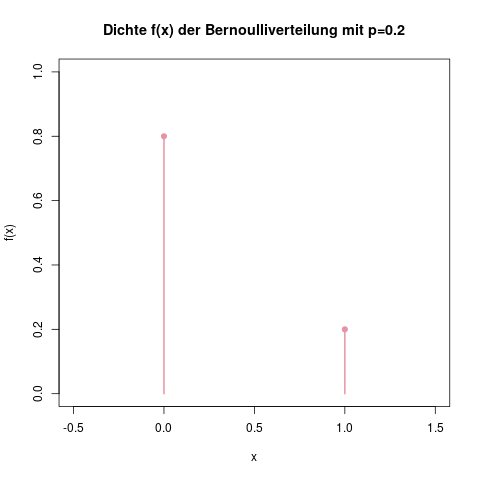
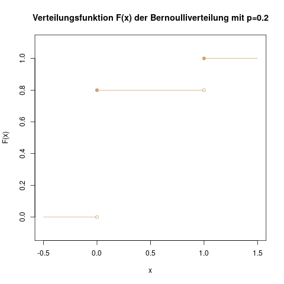

### Bernoulliverteilung: Ein Münzwurf {#sec-bernoulliverteilung}

Mit der Bernoulliverteilung kann man Experimente modellieren, die wie folgt aufgebaut sind: Es handelt sich um ein einziges Experiment mit nur zwei möglichen Resultaten, die wir als 0 (für "Mißerfolg") und 1 (für "Erfolg") kodieren. Ein schönes Beispiel hierfür ist der Schießstand auf einem Jahrmarkt, bei dem man auf weiße Plastiksterne schießt und nur mit einer bestimmten Wahrscheinlichkeit (sagen wir 20%) trifft.

Die Wahrscheinlichkeit, mit der bei einem Experiment der Erfolg eintritt, wird mit dem Parameter \(p\) bezeichnet. Die mathematische Schreibweise für eine bernoulliverteilte Zufallsvariable \(X\) lautet

\[ X \sim \text{Be}(p) \]

Weitere Beispiele für bernoulliverteilte Zufallsvariablen sind die Roulettewette auf die Zahl 0 - hier wäre \(X \sim \text{Be}(\frac{1}{37})\) - oder der erste Spielzug im "Mensch ärgere dich nicht", in dem man eine 6 würfeln muss, um eine Figur ins Spiel bringen zu dürfen; hier ist \(X \sim \text{Be}(\frac{1}{6})\).

#### Träger {-}

Da es bei diesem Experiment nur zwei Ausgänge, nämlich "Erfolg" (kodiert durch eine 1) und "Mißerfolg" (kodiert durch eine 0) gibt, ist der Träger \(\mathcal{T}\) der Bernoulliverteilung die Menge \(\mathcal{T} = \{0,1\}\).

#### Dichte {-}

Die Dichte besteht aus drei Teilen: Der Wahrscheinlichkeit für einen Erfolg, also \(\mathbb{P}(X=1)\) (das ist \(p\)), der Wahrscheinlichkeit für einen Mißerfolg, also \(\mathbb{P}(X=0)\) (das ist die Gegenwahrscheinlichkeit \(1-p\)), und einer 0 für alle anderen Werte von \(X\), d.h. überall anders:

\[ f(x) = \begin{cases} p, & x = 1 \\ 1-p, & x=0 \\ 0, &\text{sonst} \end{cases} \]

Abbildung \@ref(fig:verteilungen-bernoulliverteilung-dichte) zeigt diese Dichte.

(ref:verteilungen-bernoulliverteilung-dichte-caption) Die Dichte für unser Beispiel auf dem Jahrmarktschießstand. Die Wahrscheinlichkeit für eine Niete (also \(X=0\)) ist hier 80%, und die Wahrscheinlichkeit für einen Treffer, \(X=1\), ist 20%. Alle anderen Werte haben den Wert 0. Die Wahrscheinlichkeit, mit einem Schuss zum Beispiel 0.5 oder 3 Treffer zu erhalten, ist natürlich 0.

```{r verteilungen-bernoulliverteilung-dichte, fig.cap="(ref:verteilungen-bernoulliverteilung-dichte-caption)"}

```

#### Verteilungsfunktion {-}

Die Verteilungsfunktion ist \(F(x) = \mathbb{P}(X \leq x)\). In Worten heißt das: Die Wahrscheinlichkeit, dass das Ergebnis des Experiments kleiner oder gleich dem Wert \(x\) ist. Sie ist definiert in drei Abschnitten:

\[ F(x) = \begin{cases} 0, & x < 0 \\ 1-p, & x>=0 \, \text{und} \, x<1 \\ 1, & x \geq 1 \end{cases} \]

Der oberste Abschnitt beschreibt die erste Stufe: Unsere Variable \(X\) kann ja nur die Werte 0 oder 1 annehmen. Die Wahrscheinlichkeit, dass also eine Zahl kleiner als 0 herauskommt, ist natürlich 0. (Ebenso ist die Wahrscheinlichkeit, dass eine Zahl kleiner als z.B. -0.5 rauskommt, also \(F(-0.5)\), auch 0.

Die zweite Stufe ist der Bereich zwischen 0 und 1. Dort ist die Wahrscheinlichkeit, dass \(X \leq x\) ist, genau \(1-p\), und zwar aus dem Grund, dass nur die 0 (also ein Mißerfolg, oder auf unserem Schießstand "kein Treffer") als mögliches Ergebnis kleiner oder gleich diesen Werten vorkommt - und der Mißerfolg hat die Wahrscheinlichkeit \(1-p\).

Die dritte Stufe ist alles über \(x=1\). Da nur die Ergebnisse 0 oder 1 rauskommen können, ist z.B. die Wahrscheinlichkeit dass \(X \leq 5\) ist, gleich 1. Die Funktion \(F(x)\) geht also ins Unendliche konstant mit dem Wert 1 weiter.

(ref:verteilungen-bernoulliverteilung-verteilungsfunktion-caption) Die Verteilungsfunktion für das Beispiel des Jahrmarktschießstands ist eine Treppenfunktion. Hier liest man z.B. ab, dass \(\mathbb{P}(X \leq 0) = 0.8\) ist, und ebenso, dass \(\mathbb{P}(X \leq 0.5) = 0.8\) ist.

```{r verteilungen-bernoulliverteilung-verteilungsfunktion, fig.cap="(ref:verteilungen-bernoulliverteilung-verteilungsfunktion-caption)"}

```

#### Erwartungswert {-}

Der Erwartungswert der Bernoulliverteilung ist einfach: \(\mathbb{E}(X) = p\).

Das kann man sich über die Formel, die den Erwartungswert definiert (s. Kap. \@ref(sec-duevdz-erwartungswert)), sofort herleiten:

\[ \mathbb{E}(X) = \sum_{i=1}^n x_i f(x_i) = 0 \cdot (1-p) + 1 \cdot p = p \]

Hier verwenden wir die beiden möglichen Ausprägungen \(x_1=0\) und \(x_2 = 1\), sowie deren Wahrscheinlichkeiten \(f(x_1) = 1-p\) (für Mißerfolg) und \(f(x_2) = p\) (für Erfolg).

#### Varianz {-}

Die Varianz bei der Bernoulliverteilung ist \(\mathbb{V}(X) = p(1-p)\). Sie ist mit Hilfe ihrer Definition (s. Kap. \@ref(sec-duevdz-var-std)) etwas aufwändiger zu bestimmen, aber auch noch machbar:

\[ \begin{aligned} \mathbb{V}(X) &= \sum_{i=1}^n (x_i - \mu)^2 f(x_i) \\&=(x_1-p)^2 \cdot (1-p) + (x_2 - p)^2 \cdot p\\&=p^2 (1-p) + (1-p)^2 p \\&=(p^2 - p^3) + (1^2-2p+p^2)\cdot p \\&=p^2 - p^3 + p - 2p^2 + p^3 \\&=p - p^2 \\&=p(1-p) \end{aligned} \]

Der Wert \(\mu\) ist hierbei, wie in der Definition beschrieben, eine Kurzschreibweise für den Erwartungswert \(\mathbb{E}(X) = p\).