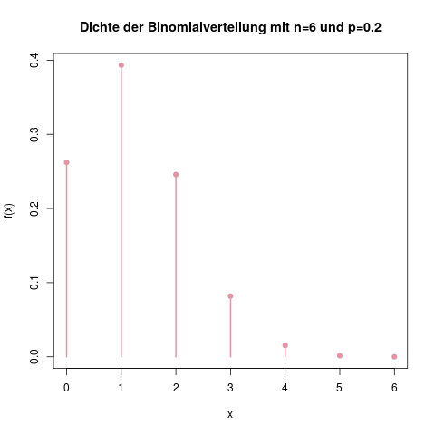
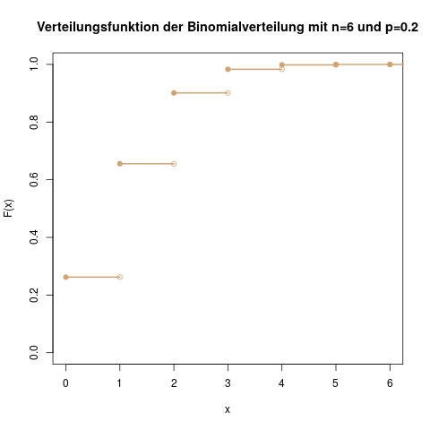

### Binomialverteilung: Zehn Münzwürfe {#sec-binomialverteilung}

Idee

Die Binomialverteilung entsteht, wenn man ein [Bernoulli-Experiment](#sec-bernoulliverteilung) mehrere Male wiederholt, und an der gesamten Anzahl der Erfolge interessiert ist.

In Kapitel \@ref(sec-bernoulliverteilung) zur Bernoulliverteilung haben wir ein Beispiel betrachtet, in dem wir auf einem Schießstand am Jahrmarkt einen einmaligen Schuß mit einer Trefferwahrscheinlichkeit von \(p=0.2\) abgeben. Wenn wir nun sechs Schüsse kaufen, folgt die Gesamtzahl der Treffer einer Binomialverteilung mit \(n=6\) und \(p=0.2\), oder:
\[ X \sim B(6, 0.2) \]

**Träger**

Bei sechs Schüssen auf dem Schießstand können wir zwischen 0 und 6 jede Trefferzahl haben. Man darf hier die Null nicht vergessen, das kann leicht vorkommen. Es ist nämlich durchaus möglich, gar keine Treffer zu landen. Der Träger im allgemeinen Fall sind alle Ganzzahlen von \(0\) bis \(n\), also
\[ \mathcal{T} = \{0, 1, \ldots, n\} \]

**Dichte**

Die Dichte der Binomialverteilung mit den Parametern \(n\) und \(p\) lautet
\[ f(x) = {n \choose x} p^x (1-p)^{n-x} \]

Erinnert euch, dass für diskrete Zufallsvariablen die Bezeichnungen \(f(x)\) und \(\mathbb{P}(X=x)\) dasselbe bedeuten. Die Wahrscheinlichkeit für drei Treffer ist also \(\mathbb{P}(X=3)\), oder kurz \(f(3)\).

Der Wert \({n \choose k}\) ist dabei der Binomialkoeffizient, der in Kapitel \@ref(sec-math) erklärt wird, und auch in der Kombinatorik (s. Kap. \@ref(sec-kombinatorik)) angewendet wird.

Wenn man versteht, wie diese Formel zustandekommt, kann man sie sich sogar selbst herleiten, und muss nicht in einer Formelsammlung nachsehen (wenn nicht, ist das aber auch nicht so schlimm).

(ref:verteilungen-binomialverteilung-dichte-caption) Die Dichte der Binomialverteilung mit n=6 und p=0.2. Man sieht, dass man mit hoher Wahrscheinlichkeit zwischen 0 und 3 Treffer erhalten wird. 5 oder 6 Treffer zu bekommen, ist sehr unwahrscheinlich.

```{r verteilungen-binomialverteilung-dichte, fig.cap="(ref:verteilungen-binomialverteilung-dichte-caption)"}

```

Am Beispiel des Schießstandes: Die Wahrscheinlichkeit, dass wir zwei Treffer erhalten werden, ist laut Formel \(f(2) = {6 \choose 2} (0.2)^2 (0.8)^4\). Interpretiert wird das so:

Die Wahrscheinlichkeit für einen Treffer (kurz: "T") ist 0.2, die für eine Niete (kurz: "N") ist 0.8. Wenn wir nun die Wahrscheinlichkeit für die Ergebnisfolge "TTNNNN" ausrechnen, multiplizieren wir die Wahrscheinlichkeiten, und landen bei \(0.2^2 \cdot 0.8^4\). Dies ist aber nur eine von vielen Möglichkeiten, zwei Treffer zu erhalten. Zum Beispiel liefern die Schussfolgen "TNNNNT", oder "TNTNNN" dasselbe Ergebnis, und haben alle dieselbe Wahrscheinlichkeit: \(0.2^2 \cdot 0.8^4\).

Wieviele solcher Folgen mit zwei Treffern aus sechs Schüssen gibt es nun? Es sind genau \({6 \choose 2} = 15\), wie in Kapitel \@ref(sec-kombinationen) zu Kombinationen erklärt wird.

So erklärt man sich also nacheinander die drei Faktoren der Formel, zuerst \(p^x\) (die Wahrscheinlichkeit für einen Treffer, potenziert mit der Anzahl an Treffern), dann \((1-p)^{n-x}\) (die Wahrscheinlichkeit für eine Niete, potenziert mit der Anzahl an Nieten), und dann \(n \choose k\)

```{exercise, echo=TRUE}

Berechne für das Beispiel Schießstand die Wahrscheinlichkeit, gar keinen Treffer zu erhalten, und überprüfe anhand der Abbildung oben, ob das Ergebnis plausibel ist.

```

```{solution, echo=TRUE}
\(\mathbb{P}(X=0) = {6 \choose 0} 0.2^0 0.8^6 = 0.2621\)
```

**Verteilungsfunktion**

Für die Verteilungsfunktion gibt es hier keine einfache Formel. In manchen Büchern (oder Klausuren) gibt es eine Verteilungstabelle zum einfachen Ablesen. In allen anderen Fällen muss man die einzelnen Wahrscheinlichkeiten also von Hand summieren. Das heisst, wenn man die Wahrscheinlichkeit für höchstens zwei Treffer berechnen möchte, also \(\mathbb{P}(X \leq 2)\), rechnet man sich die Wahrscheinlichkeit für null Treffer, einen Treffer, und zwei Treffer aus, und summiert sie:

\[ \begin{aligned} \mathbb{P}(X \leq 2) &= \sum_{x=0}^2 \mathbb{P}(X = x) \\ &= \mathbb{P}(X = 0) + \mathbb{P}(X = 1) + \mathbb{P}(X = 2) \end{aligned} \]

(ref:verteilungen-binomialverteilung-verteilungsfunktion-caption) Anhand der Verteilungsfunktion kann man auch ablesen, dass die Wahrscheinlichkeit, höchstens 4 Treffer zu erhalten, schon nahezu 1 ist.

```{r verteilungen-binomialverteilung-verteilungsfunktion, fig.cap="(ref:verteilungen-binomialverteilung-verteilungsfunktion-caption)"}

```

```{exercise, echo=TRUE}
Berechne die Wahrscheinlichkeit für höchstens fünf Treffer, d.h. \(\mathbb{P}(X \leq 5)\).
```

```{solution, echo=TRUE}
\(\sum_{i=0}^5\mathbb{P}(X=i) = 0.2621 + 0.3932 + 0.2458 + 0.0819 + 0.0154 + 0.0015 = 0.9999 \)
```

Diese Aufgabe war ziemlich aufwändig, oder? Bei der Binomialverteilung gibt es einen Trick, der die Berechnung der Verteilungsfunktion oft schneller machen kann. Solche Aufgaben kommen oft in Klausuren vor, so dass man diesen Trick am besten verinnerlicht:

Statt alle Wahrscheinlichkeiten von \(x=0\) bis \(x=5\) aufzusummieren, kann man äquivalent die Wahrscheinlichkeiten aller "Gegenereignisse", also in diesem Fall \(f(6)\), von 1 abziehen, und man erhält dieselbe Zahl. Denn wenn die Wahrscheinlichkeit für höchstens fünf Treffer 0.9999 ist, dann ist die Wahrscheinlichkeit für mehr als fünf (also 6) Treffer genau die [Gegenwahrscheinlichkeit](#sec-wsk-rechenregeln), d.h. 1-0.9999 = 0.0001.

Ein weiteres Beispiel (und wer das nachvollziehen kann, hat die Idee vollständig kapiert):

Uns interessiert nun die Wahrscheinlichkeit, zwischen einem und fünf Treffern (inklusive der eins und der fünf) zu erhalten. Die folgenden drei Formulierungen entsprechen den jeweiligen Formeln, und *alle drei Formeln drücken genau dasselbe aus*:

- \(\mathbb{P}(1 \leq X \leq 5)\)  
  Die Wahrscheinlichkeit, eine Trefferzahl zwischen (inklusive) 1 und 5 zu erhalten
- \(\mathbb{P}(X=1) + \mathbb{P}(X=2) + \mathbb{P}(X=3) + \mathbb{P}(X=4) + \mathbb{P}(X=5)\)  
  Die Wahrscheinlichkeit für einen, zwei, drei, vier, oder fünf Treffer
- \(1 - \mathbb{P}(X=0) - \mathbb{P}(X=6)\)  
  Die Wahrscheinlichkeit, alles außer 0 und 6 Treffer zu erhalten

Ausrechnen kann man diesen Wert nun über die zweite oder dritte Formel dieser Liste. Es kommt natürlich dieselbe Zahl raus, wobei der letztere Weg der schnellere ist. Wichtig ist hier aber, dass man die Wahrscheinlichkeit für null Treffer, also \(f(0)\), nicht vergisst. Das passiert im Eifer des Gefechts nämlich gerne.

**Erwartungswert**

Der Erwartungswert der Binomialverteilung ist einfach:
\[ \mathbb{E}(X) = n \cdot p \]

Da der Erwartungswert für ein einzelnes Experiment \(p\) ist (s. Kap. \@ref(sec-bernoulliverteilung)), erwartet man bei \(n\) Wiederholungen genau die \(n\)-fache Anzahl, also \(n\cdot p\) Treffer.

**Varianz**

Die Varianz der Binomialverteilung ist
\[ \mathbb{V}(X) = n \cdot p \cdot (1-p). \]
Die Herleitung ist etwas aufwändiger, weshalb wir sie uns hier ersparen.