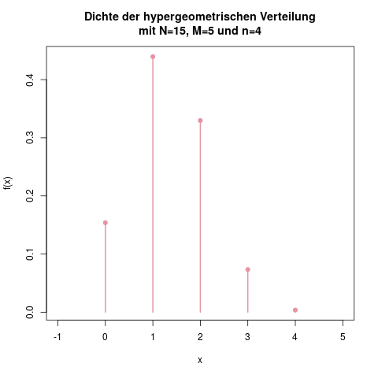

### Hypergeometrische Verteilung

**Idee**

Während die Binomialverteilung (s. Kap. \@ref(sec-binomialverteilung)) für Experimente mit gleichbleibender Wahrscheinlichkeit für "Erfolg" verwendet wird, wendet man die hypergeometrische Verteilung dann an, wenn sich die Grundgesamtheit im Laufe des Experiments verändert. Anders ausgedrückt: Mit der Binomialverteilung beschreibt man Experimente *mit Zurücklegen*, und mit der hypergeometrischen Verteilung Experimente *ohne Zurücklegen*.

Habe ich also einen Beutel mit 10 roten und 5 weißen Kugeln, und nehme viermal hintereinander eine Kugel aus dem Beutel, die ich danach wieder zurücklege, so dass wieder insgesamt 15 Kugeln im Beutel sind, dann kann ich mit der Binomialverteilung die Verteilung der Anzahl der gezogenen weißen Kugeln beschreiben. Das wäre nämlich eine Binomialverteilung mit \(n=4\) und \(p=\frac{5}{15} = \frac{1}{3}\). Hier fällt auf, dass die genaue Anzahl an Kugeln egal ist, und nur ihr Verhältnis zueinander interessiert. Das Experiment wäre also genau dasselbe, wenn nicht 10 rote und 5 weiße, sondern 100 rote und 50 weiße Kugeln in dem Beutel steckten.

Möchte man stattdessen die Kugeln nicht zurücklegen, verwendet man die hypergeometrische Verteilung. Das Experiment, das man mit ihr modellieren kann, sieht also zum Beispiel wie folgt aus: Man hat einen Beutel mit 15 Kugeln, wovon 5 Kugeln weiß sind. Man nimmt nun nacheinander vier Kugeln aus dem Beutel, *ohne sie danach zurückzulegen*. Nun kann ich mit Hilfe der hypergeometrischen Verteilung ausrechnen, mit welcher Wahrscheinlichkeit ich keine, eine, zwei, drei, oder vier weiße Kugeln in meiner Stichprobe erhalte.

**Parameter**

Für die hypergeometrische Verteilung ist es nun im Gegensatz zur Binomialverteilung wichtig, wieviele Kugeln jeder Sorte im Beutel liegen. Daher hat diese Verteilung drei Parameter:

- \(N\), die Anzahl der Elemente insgesamt. Im oberen Beispiel haben wir \(N=15\) Kugeln.
- \(M\), die Anzahl der Elemente, die die gewünschte Eigenschaft besitzen ("Treffer"). Hier ist \(M=5\), die Anzahl der weißen Kugeln.
- \(n\), die Anzahl der Kugeln, die als Stichprobe gezogen wird. Hier ist \(n=4\).

Wenn wir unser Beispiel mit der Zufallsvariablen \(X\) beschreiben, sieht die hypergeometrische Verteilung wie folgt aus:

\[ X \sim \text{HG}(15, 5, 4) \]

**Träger**

Die hypergeometrische Verteilung hat denselben Träger wie die Binomialverteilung: Wenn man \(n=4\) Kugeln zieht, sind 0 bis 4 Erfolge möglich. Allgemein ist also

\[ \mathcal{T} = \{ 0, 1, \ldots, n \} \]

**Dichte**

Die Dichte einer hypergeometrisch verteilten Zufallsvariable \(X\) lautet

\[ f(x) = \frac{{{M \choose x}} {{N-M \choose n-x}}}{{N \choose n}} \]

In unserem Beispiel ist also die Wahrscheinlichkeit, bei 4 gezogenen Kugeln 2 weiße Kugeln darunter zu finden, gleich

\[ f(2) = \frac{{{5 \choose 2}} {{15-5 \choose 4-2}}}{{15 \choose 4}} = 0.3297 \]

(ref:verteilungen-hypergeometrische-verteilung-dichte-caption) Die Dichte \(f(x)\) für die hypergeometrische Verteilung unseres Beispiels.

```{r verteilungen-hypergeometrische-verteilung-dichte, fig.cap="(ref:verteilungen-hypergeometrische-verteilung-dichte-caption)"}

```

Beachte hier, dass die Werte \(N\), \(M\) und \(n\) das Experiment beschreiben, und dann (gegeben einem Experiment) nicht mehr verändert werden. Die Variable \(x\) hingegen kann alle möglichen Ausgänge des Experiments annehmen, hier also alles von 0 bis 4.

**Verteilungsfunktion**

Für die Verteilungsfunktion gibt es hier, wie bei der Binomialverteilung, keine kürzere Formel, sondern man summiert einfach die Dichte über alle möglichen Ausprägungen aus:

\[ F(x) = \mathbb{P}(X \leq x) = \sum_{k=0}^x f(k) \]

(ref:verteilungen-hypergeometrische-verteilung-verteilungsfunktion-caption) Die Verteilungsfunktion \(F(x)\) für dieses Beispielexperiment.

```{r verteilungen-hypergeometrische-verteilung-verteilungsfunktion, fig.cap="(ref:verteilungen-hypergeometrische-verteilung-verteilungsfunktion-caption)"}
knitr::include_graphics("img/verteilungen-hypergeometrische-verteilung-verteilungsfunktion.png")
```

Möchte ich also die Wahrscheinlichkeit wissen, höchstens drei weiße Kugeln in meiner Stichprobe zu erhalten, muss ich die einzelnen Wahrscheinlichkeiten aufsummieren:

\[\begin{aligned} F(3) = \mathbb{P}(X \leq 3) &=\mathbb{P}(X=0) +\mathbb{P}(X=1)+\mathbb{P}(X=2)+\mathbb{P}(X=3) \\&= 0.1538 + 0.4396 + 0.3297 + 0.0733 \\&= 0.996 \end{aligned}\]

Einen Trick gibt es allerdings in den Fällen, in denen man viele einzelne Wahrscheinlichkeiten im Taschenrechner berechnen müsste: Über die Gegenwahrscheinlichkeit lässt sich derselbe Wert viel schneller berechnen:

\[F(3) = \mathbb{P}(X \leq 3) = 1-\mathbb{P}(X=4) = 1-0.004 = 0.996\]

**Erwartungswert**

Der Erwartungswert ist, analog zur Binomialverteilung, einfach \(n\)-mal der anfängliche Anteil an Treffern, also \(M/N\). Es ist daher

\[ \mathbb{E}(X) = n \cdot \frac{M}{N} \]

**Varianz**

Die Varianz berechnet man durch

\[ \mathbb{V}(X) = n \frac{M}{N} \left( 1-\frac{M}{N} \right) \frac{N-n}{N-1} \]

```{exercise, echo=TRUE}

Mit Hilfe der hypergeometrischen Verteilung können wir zum Beispiel die folgenden Fragen beantworten:

- Wie hoch ist die Wahrscheinlichkeit, beim deutschen Lotto (6 aus 49) drei gerade und drei ungerade Zahlen zu ziehen?
- Wie hoch ist dort die Wahrscheinlichkeit für sechs gerade Zahlen?

```

```{solution, echo=TRUE}

In beiden Fragen verwenden wir eine Zufallsvariable mit der Verteilung

\[ X \sim \text{HG}(49, 24, 6). \]

Denn es gibt insgesamt \(N=49\) Kugeln, davon sind \(M=24\) eine gerade Zahl, und wir ziehen \(n=6\) dieser Kugeln. Mit der Dichtefunktion für diese Verteilung können wir nun die Wahrscheinlichkeit für drei (über \(f(3)\)), sechs (über \(f(6)\)), oder beliebig viele Kugeln mit geraden Zahlen bestimmen:

\[\begin{aligned} f(3) &=\frac{{{24 \choose 3}} {{49-24 \choose 6-3}}}{{49 \choose 6}} = 0.3329 \\f(6) &=\frac{{{24 \choose 6}} {{49-24 \choose 6-6}}}{{49 \choose 6}} = 0.0096 \end{aligned}\]

```

