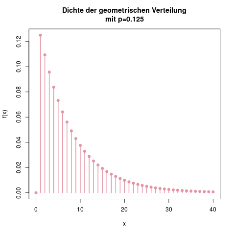
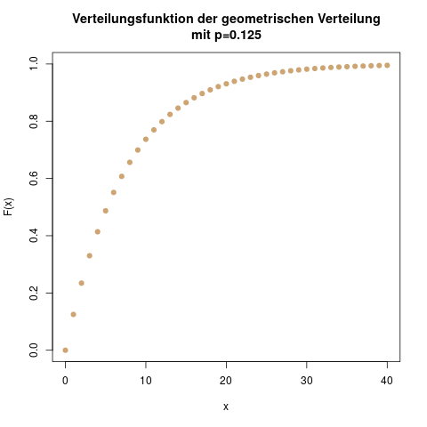

### Geometrische Verteilung: Der betrunkene Pförtner {#sec-geometrische}

**Idee**

Bei der geometrischen Verteilung liegt folgender Gedanke zugrunde: Wir haben ein Bernoulli-Experiment (s. Kap. \@ref(sec-bernoulliverteilung)) mit einer Erfolgswahrscheinlichkeit von \(p\). Nun fragen wir uns, wie oft wir dieses Experiment ausführen müssen, bis der erste Erfolg eintritt.

Das meiner Meinung nach schönste Beispiel zur Veranschaulichung ist das vom betrunkenen Pförtner: Er hat einen Schlüsselbund mit 8 Schlüsseln, und einer davon öffnet das Tor, vor dem er steht. Da er aber betrunken ist, fällt ihm nach jedem Fehlversuch der Schlüsselbund herunter, und er weiß nicht mehr, welchen Schlüssel er schon probiert hat.

Jeder einzelne Versuch ist also ein neues Bernoulli-Experiment mit der Erfolgswahrscheinlichkeit \(p=\frac{1}{8}\). Da er 8 Schlüssel hat, ist ein zufällig gewählter Schlüssel mit einer Wahrscheinlichkeit von \(\frac{1}{8}\) der richtige.

Mit der geometrischen Verteilung können wir dieses Experiment nun beschreiben, und die Wahrscheinlichkeiten dafür bestimmen, dass er zum Beispiel genau einen Versuch, genau vier Versuche, oder höchstens fünf Versuche benötigt.

**Parameter**

Die geometrische Verteilung hat nur einen Parameter, nämlich \(p\), die Erfolgswahrscheinlichkeit bei einem einzelnen Versuch. Im Beispiel des betrunkenen Pförtners ist \(p=\frac{1}{8}\). Benennen wir die Zufallsvariable für das Experiment mit \(X\), wird die geometrische Verteilung dargestellt durch

\[ X \sim \text{G}(p), \]

in unserem Beispiel

\[ X \sim \text{G}(\frac{1}{8}). \]

**Träger**

Es gibt theoretisch keine Obergrenze für die Anzahl der Versuche, die der Pförtner benötigt. Jeder neue Versuch gelingt nur mit einer Wahrscheinlichkeit von \(\frac{1}{p}\), daher kann \(X\) jede natürliche Zahl von 0 bis unendlich annehmen:

\[ \mathcal{T} = \{ 0, 1, 2, \ldots \} \]

**Dichte**

Die Dichte der geometrischen Verteilung lautet

\[ f(x) = (1-p)^{x-1} p \]

Diese Dichte kann man sich leicht veranschaulichen: Um die Wahrscheinlichkeit zu bestimmen, dass der Pförtner beim dritten Versuch den richtigen Schlüssel erwischt, also \(\mathbb{P}(X=3) = f(3)\), muss er nacheinander zwei Fehlversuche (mit Wahrscheinlichkeit \(1-p\) und einen Treffer (mit Wahrscheinlichkeit \(p\)) machen. Die gesamte Wahrscheinlichkeit ist also das Produkt der drei Bernoulli-Experimente, also \((1-p)\cdot (1-p) \cdot p\). Das kann man zu \((1-p)^2 \cdot p\) zusammenfassen. Setzt man nun allgemein ein \(x\) statt der 2 ein, erhält man die Dichte der geometrischen Verteilung, nämlich das Produkt von \(x-1\) Mißerfolgen und einem Erfolg.

(ref:verteilungen-geometrische-verteilung-dichte-caption) Die Dichte der geometrischen Verteilung für das Beispiel des betrunkenen Pförtners. Die \(x\)-Achse ist abgeschnitten, da die Dichte nach rechts ins Unendliche weitergeht. Die Wahrscheinlichkeiten für mehr als ca. 30 Versuche werden verschwindend gering, aber sind theoretisch immer noch im Bereich des Möglichen. Man sieht auch, dass \(f(1)\), die Wahrscheinlichkeit, dass gleich beim ersten Versuch der Treffer erfolgt, genau \(p\) ist.

```{r verteilungen-geometrische-verteilung-dichte, fig.cap="(ref:verteilungen-geometrische-verteilung-dichte-caption)"}

```

**Verteilungsfunktion**

Die Verteilungsfunktion lässt sich mit Hilfe einer Rechenregel für Wahrscheinlichkeiten herleiten. Wir suchen nämlich gemäß der Definition der Verteilungsfunktion den Wert \(\mathbb{P}(X \leq x)\), also die Wahrscheinlichkeit, dass der Pförtner maximal \(x\) Versuche benötigt, um das Tor zu öffnen. Dieser Wert ist nur über eine Summe der Dichten von \(f(0)\) bis \(f(x)\) zu erhalten. Aber die Gegenwahrscheinlichkeit ist einfach:

Die Wahrscheinlichkeit \(\mathbb{P}(X > x)\), dass der Pförtner mehr als \(x\) Versuche benötigt, ist leicht zu berechnen. Es ist nämlich das Produkt von \(x\) Fehlversuchen, also \((1-p)^x\). Und das ist genau das Gegenereignis vom Ereignis "maximal \(x\) Versuche".

Mit der folgenden Regel erhalten wir dann die Verteilungsfunktion:

\[ \mathbb{P}(\bar{A}) = 1-\mathbb{P}(A) \]

Die Verteilungsfunktion der geometrischen Verteilung ist also

\[ F(x) = \mathbb{P}(X \leq x) = 1-\mathbb{P}(X > x) = 1-(1-p)^x \]

(ref:verteilungen-geometrische-verteilung-verteilungsfunktion-caption) Die Verteilungsfunktion der geometrischen Verteilung. Ihr Wert nähert sich im Unendlichen der 1 an, erreicht ihn aber nie exakt.

```{r verteilungen-geometrische-verteilung-verteilungsfunktion, fig.cap="(ref:verteilungen-geometrische-verteilung-verteilungsfunktion-caption)"}

```


**Erwartungswert**

Der Erwartungswert der geometrischen Verteilung ist

\[ \mathbb{E}(X) = \frac{1}{p} \]

Bei 8 Schlüsseln, also \(p=\frac{1}{8}\), braucht der Pförtner also im Durchschnitt 8 Versuche, um das Tor zu öffnen.

**Varianz**

Die Varianz der geometrischen Verteilung berechnet man durch

\[ \mathbb{V}(X) = \frac{1}{p^2} - \frac{1}{p} \]

**Alternative Darstellung**

In manchen Büchern bzw. Skripten begegnet man auch einer alternativen Darstellung der geometrischen Verteilung. Hier ist mit \(X\) nicht wie hier die Anzahl der Versuche bis (inklusive!) zum ersten Treffer gemeint, sondern die Anzahl der Fehlversuche *vor dem ersten Treffer*. Wenn ich also modellieren will, dass der betrunkene Pförtner drei Fehlversuche macht, bis er im vierten Versuch das Tor öffnet, so berechne ich in der hier besprochenen Darstellung \(f(4)\), aber in dieser alternativen Darstellung wäre es stattdessen \(f(3)\). Die Formeln für Dichte, Verteilungsfunktion, und Erwartungswert verändern sich natürlich entsprechend, so dass dieselben Wahrscheinlichkeiten herauskommen.