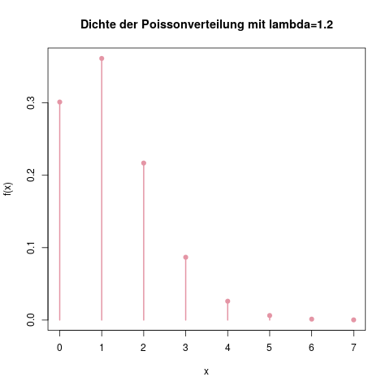
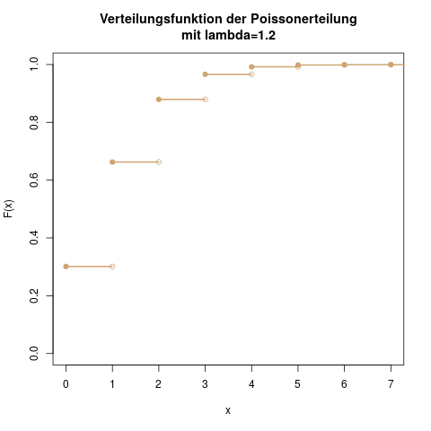

### Poissonverteilung: Anzahl an Toren pro Fußballspiel

#### Idee {-}

Die Poissonverteilung ist eine diskrete Verteilung, mit der man die Anzahl von Ereignissen in einem gegebenen Zeitintervall modellieren kann. Ein schönes Beispiel ist die Anzahl von Toren, die Verein \(A\) innerhalb eines Fußballspiels schießt. Andere Anwendungen sind etwa die Anzahl an Bankkunden, die innerhalb eines Tages am Schalter ankommen, oder die Anzahl an Schadensfällen, die in einem Monat bei einer Versicherung eingehen.

Man zählt in jedem dieser Fälle die Anzahl der Ereignisse, die in einem fest vorgegebenen Zeitintervall eintreten, und möchte die Wahrscheinlichkeiten modellieren, mit der \(x\) Ereignisse in diesem Zeitraum auftreten.

#### Parameter {-}

Die Poissonverteilung hat nur einen Parameter, nämlich \(\lambda\). Er bezeichnet die durchschnittlich zu erwartende Anzahl an Ereignissen (also den Erwartungswert, s. Kap. \@ref(sec-duevdz-erwartungswert)). Eine poissonverteilte Zufallsvariable \(X\) bezeichnet man dann durch

\[ X \sim \text{Po}(\lambda) \]

Man könnte nun zum Beispiel für 100 Fußballspiele vom Verein \(A\) die Anzahl seiner geschossenen Tore notieren, und deren Mittelwert ausrechnen. Wenn der Mittelwert 1.2 Tore sind, dann wäre in diesem Fall \(X \sim \text{Po}(1.2)\).

#### Träger {-}

Bei einem Poisson-Experiment können zwischen null und unendlich viele Ereignisse eintreten. Im Beispiel mit dem Fußballspiel sind theoretisch unbegrenzt viele Tore möglich. Der Träger einer poissonverteilten Zufallsvariable ist also

\[ \mathcal{T}(X) = \{ 0, 1, 2, \ldots \} \]

#### Dichte {-}

Die Wahrscheinlichkeit, dass bei einer poissonverteilten Zufallsvariable mit dem Parameter \(\lambda\) genau \(x\) Ereignisse auftreten, berechnet man über die Dichte zu

\[ f(x) = \frac{\lambda^x}{x!} \exp (-\lambda) \]

Dabei bezeichnet \(x! \) die Fakultät von \(x\) (s. Kap. \@ref(fakultaet)). Falls man die Wahrscheinlichkeit für 0 Ereignisse berechnen möchte, tritt hier \(0! \), die Fakultät von null, auf. Das ist definitionsgemäß gleich eins.

Im Beispiel mit dem Fußballverein berechnet man etwa die Wahrscheinlichkeit, dass Verein \(A\) genau zwei Tore schießt, zu

\[ f(2) = \frac{1.2^2}{2!} \exp (-1.2) = 0.217 \]

(ref:verteilungen-poissonverteilung-dichte-caption) Die Dichte der Poissonverteilung für die Anzahl der von Team \(A\) geschossenen Tore in einem Spiel, mit \(\lambda=1.2\). Die \(x\)-Achse ist hier bei 7 abgeschnitten: Höhere Werte als \(x=7\) sind theoretisch möglich, aber sehr unwahrscheinlich. Man sieht hier auch, dass mit der höchsten Wahrscheinlichkeit ein Tor geschossen wird.

```{r verteilungen-poissonverteilung-dichte, fig.cap="(ref:verteilungen-poissonverteilung-dichte-caption)"}

```

```{exercise, echo=TRUE}
Angenommen, die Anzahl der Tore von Team \(A\) ist tatsächlich poissonverteilt mit \(\lambda=1.2\). Ein Freund wettet um 10€ mit dir, dass das Team im folgenden Spiel genau ein Tor schießt, da das die Anzahl mit der höchsten Wahrscheinlichkeit ist. Solltest du diese Wette annehmen?
```
```{solution, show=TRUE}
Deine Gewinnwahrscheinlichkeit ist die Summe aller einzelnen Wahrscheinlichkeiten \(f(x)\) für \(x\) Tore, außer für \(x=1\). Man kann natürlich nicht \(f(0)+f(2)+f(3)+f(4)+\ldots\) berechnen, sondern geht hier wieder mit der Gegenwahrscheinlichkeit vor. Wir berechen also nicht \(\mathbb{P}(\text{alles ausser ein Tor})\), sondern stattdessen äquivalent \(1-\mathbb{P}(\text{ein Tor})\):

\[ 1 - f(1) = 1 - \frac{1.2^1}{1!} \exp (-1.2) = 1-0.3614 = 0.639 \]

Da wir mit einer Wahrscheinlichkeit von etwa 63,9% gewinnen, sollten wir diese Wette also annehmen. Obwohl das Ereignis mit der höchsten einzelnen Wahrscheinlichkeit ein Tor ist, so ist es doch wahrscheinlicher, dass irgendein anderes Ergebnis eintritt.
```

#### Verteilungsfunktion {-}

Für die Verteilungsfunktion gibt es keine bequeme Formel. Man muss für \(F(x) = \mathbb{P}(X \leq x)\) die einzelnen Werte der Dichtefunktion von 0 bis \(x\) aufsummieren:

\[ F(x) = f(0) + f(1) + \ldots + f(x) = \sum_{k=0}^x f(k) \]

Die Wahrscheinlichkeit dass unser Verein höchstens zwei Tore schießt, berechnet man also durch

\[ \begin{aligned} F(2) &= f(0) + f(1) + f(2) \\&= \frac{1.2^0}{0!} \exp(-1.2) + \frac{1.2^1}{1!} \exp(-1.2) + \frac{1.2^2}{2!} \exp(-1.2) \\&= 0.301 + 0.361 + 0.217 \\&= 0.879 \end{aligned} \]

(ref:verteilungen-poissonverteilung-verteilungsfunktion-caption) Die Verteilungsfunktion für die Anzahl der Tore von Verein \(A\). Man sieht, dass die Wahrscheinlichkeit \(F(4)\) für maximal vier Tore schon sehr nahe an der 1 liegt, dass es also andersherum sehr unwahrscheinlich ist, dass Team \(A\) in einem Spiel mehr als vier Tore schießt.

```{r verteilungen-poissonverteilung-verteilungsfunktion, fig.cap="(ref:verteilungen-poissonverteilung-verteilungsfunktion-caption)"}

```

#### Erwartungswert und Varianz {-}

Der Parameter \(\lambda\) einer poissonverteilten Zufallsvariable ist zugleich Erwartungswert und Varianz dieser Verteilung:

\[ \begin{aligned} \mathbb{E}(X)&=\lambda \\ \mathbb{V}(X)&=\lambda \end{aligned} \]

#### Eigenschaften {-}

Die folgenden Regeln sind hilfreich für kompliziertere Aufgaben mit der Poissonverteilung.

1. Wenn die Anzahl der Tore von Verein \(A\) innerhalb eines 90-minütigen Spiels poissonverteilt mit \(\lambda = 1.2\) ist, dann ist die Anzahl der Tore innerhalb der ersten Halbzeit auch poissonverteilt, aber mit \(\lambda = 0.6\).  
  Allgemein gesagt: Wenn der betrachtete Zeitraum mit einem Faktor \(n\) multipliziert wird, ist die Anzahl der Ereignisse in diesem Zeitraum poissonverteilt mit dem Parameter \(\lambda \cdot n\).
2. Die Wahrscheinlichkeit, dass *mindestens ein Ereignis* eintritt, ist das Gegenteil der Wahrscheinlichkeit dass gar kein Ereignis auftritt, und somit \(1-f(0)\).  
  Verein \(A\) schießt also mit einer Wahrscheinlichkeit von \(1-\frac{1.2^0}{0!} \exp (-1.2) = 0.699\) mindestens ein Tor.
3. Wenn die Anzahl der Tore von Verein \(A\) poissonverteilt mit \(\lambda_A=1.2\), und die Anzahl der Tore seines Gegners, Verein \(B\), poissonverteilt mit \(\lambda_B=0.6\) ist, dann ist die Gesamtzahl der gefallenen Tore im Spiel von \(A\) gegen \(B\) wieder poissonverteilt mit \(\lambda = \lambda_A + \lambda_B = 1.8\).  
  Allgemein gilt: Die Summe zweier unabhängiger poissonverteilten Zufallsvariablen \(A\) und \(B\) mit den Parametern \(\lambda_A\) und \(\lambda_B\) ist poissonverteilt mit dem Parameter \(\lambda = \lambda_A+\lambda_B\).