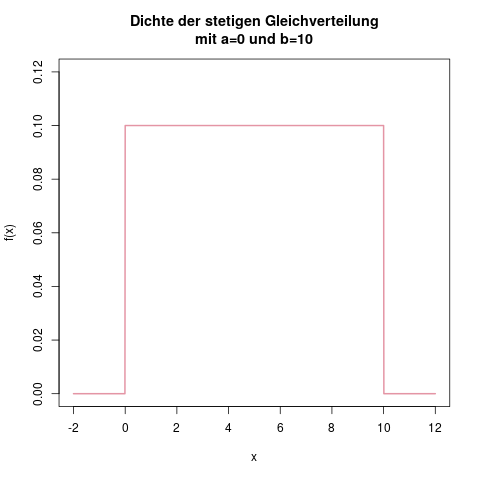
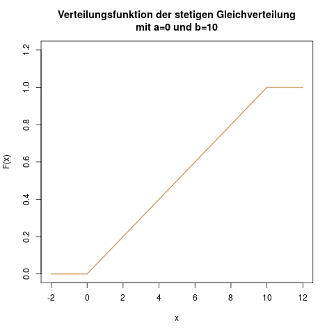

### Stetige Gleichverteilung: Wartezeit auf den Bus

**Idee**

Die stetige Gleichverteilung ist quasi eine Verallgemeinerung der diskreten Gleichverteilung (s. Kap. \@ref(sec-diskrete-gleichverteilung)). Während bei der diskreten Gleichverteilung jede ganze Zahl zwischen \(a\) und \(b\) möglich ist (beim Würfelwurf ist z.B. \(a=1\) und \(b=6\)), so ist bei der *stetigen* Gleichverteilung nun jede reelle Zahl im Intervall von \(a\) bis \(b\) ein mögliches Ergebnis.

Ein einleuchtendes Beispiel für eine stetig gleichverteilte Zufallsvariable ist die Wartezeit auf einen Bus. Wenn ich weiß, dass der Bus alle 10 Minuten abfährt, aber den Fahrplan nicht im Kopf habe, sondern einfach an die Haltestelle laufe, dann folgt meine Wartezeit an der Haltestelle einer stetigen Gleichverteilung zwischen \(a=0\) und \(b=10\) Minuten. Hier ist nun jede reelle Zahl als Wartezeit möglich, z.B. auch 4.325 Minuten. Durch die Modellierung der Wartezeit als stetige Gleichverteilung kann ich nun zum Beispiel die durchschnittliche Wartezeit sowie ihre Varianz berechnen.

**Parameter**

Die stetige Gleichverteilung hat zwei Parameter, \(a\) und \(b\). Das sind die Intervallgrenzen. Es ist also \(a\) das kleinste mögliche Ergebnis der Zufallsvariablen, und \(b\) das größte mögliche. Eine Zufallsvariable \(X\), die stetig gleichverteilt ist, bezeichnet man durch

\[ X \sim \text{U}(a,b) \]

Das U kommt aus dem Englischen "uniform", denn die Gleichverteilung heißt dort *uniform distribution*. Die Wartezeit in Minuten auf den nächsten Bus bezeichnet man etwa durch \(X \sim \text{U}(0,10)\).

**Träger**

Aus der Beschreibung der Parameter geht hervor, dass der Träger der stetigen Gleichverteilung genau das Intervall \([a,b]\) ist. Der Träger ist also \(\mathcal{T} = [a,b]\). An der Bushaltestelle sind so alle Wartezeiten zwischen 0 und 10 Minuten denkbar.

**Dichte**

Die Dichte setzt sich aus zwei Teilen zusammen: Außerhalb des Intervalls von \(a\) bis \(b\) ist sie überall 0, und innerhalb des Trägers \([a,b]\) ein gleichbleibender (konstanter) Wert, der abhängig von der Breite des Intervalls ist.

Der Wert der Dichte innerhalb des Intervalls ist \(f(x) = \frac{1}{b-a}\). Dadurch wird sichergestellt, dass die gesamte Fläche unter der Dichtefunktion 1 ergibt (s. Kap. \@ref(sec-duevsz-dichte)).

Außerhalb des Intervalls \([a,b]\) ist die Dichte überall null. Und damit gelangt man zur zweiteiligen Definition der Dichte:

\[ f(x) = \begin{cases} \frac{1}{b-a} &\mbox{falls } a \leq x \leq b \\ 0 & \mbox{sonst} \end{cases} \]

Der \(y\)-Wert der Dichtefunktion an der Stelle \(x\) ist also, falls \(x\) zwischen \(a\) und \(b\) liegt, gleich \(\frac{1}{b-a}\), und für alle anderen \(x\) gleich null (s. Abb. \@ref(fig:verteilungen-stetige-gleichverteilung-dichte)).

(ref:verteilungen-stetige-gleichverteilung-dichte-caption) Die Dichte der stetigen Gleichverteilung mit \(a=0\) und \(b=10\). Sie ist überall null, und im Bereich von 0 bis 10 gleich \(\frac{1}{10}\).

```{r verteilungen-stetige-gleichverteilung-dichte, fig.cap="(ref:verteilungen-stetige-gleichverteilung-dichte-caption)"}

```

**Verteilungsfunktion**

Die Verteilungsfunktion ist nun dreiteilig definiert: Links von der unteren Grenze \(a\) ist sie überall null, da die Wahrscheinlichkeit, dass \(X\) einen Wert kleiner als \(a\) annimmt, null ist: \(\mathbb{P}(X \leq a) = 0\). Rechts von der oberen Grenze \(b\) ist sie konstant 1, da auf jeden Fall ein Wert kleiner oder gleich \(b\) herauskommt: \(\mathbb{P}(X \leq b) = 1\).

Abbildung \@ref(fig:verteilungen-stetige-gleichverteilung-verteilungsfunktion) zeigt die Verteilungsfunktion aus dem Beispiel der Wartezeit auf den Bus.

(ref:verteilungen-stetige-gleichverteilung-verteilungsfunktion-caption) Die Verteilungsfunktion der stetigen Gleichverteilung, hier mit \(a=0\) und \(b=10\).

```{r verteilungen-stetige-gleichverteilung-verteilungsfunktion, fig.cap="(ref:verteilungen-stetige-gleichverteilung-verteilungsfunktion-caption)"}

```

Innerhalb des Intervalls von \(a\) bis \(b\) ist die Verteilungsfunktion eine gerade Linie von 0 bis 1. In einer Formel drückt man diese Linie durch \(\frac{x-a}{b-a}\) aus. Der Nenner ist hier an jeder Stelle von \(x\) eine Konstante. Der Zähler ist an der Stelle \(x=a\) genau null, und wird dann in Richtung \(b\) immer größer.

Das führt zu einer dreiteiligen Definition der Verteilungsfunktion:

\[ F(x) = \begin{cases} 0 &\mbox{falls } x < a \\ \frac{x-a}{b-a} &\mbox{falls } a \leq x \leq b \\ 1 & \mbox{falls } x>b \end{cases} \]

Bei der Wartezeit auf den Bus, mit \(a=0\) und \(b=10\), können wir also zum Beispiel die folgenden Werte ablesen:

- Die Wahrscheinlichkeit, dass wir weniger als -2 Minuten warten, ist null: \(\mathbb{P}(X \leq -2) = F(-2) = 0\). Wir warten also auf jeden Fall eine positive Zeit (das macht auch Sinn).
- Die Wahrscheinlichkeit, dass wir maximal 3 Minuten warten, berechen wir durch \(\mathbb{P}(X \leq 3) = F(3) = \frac{3 - 0}{10 - 0} = 0.3\). Wir warten also mit einer 30-prozentigen Wahrscheinlichkeit weniger als 3 Minuten.
- Umgekehrt warten wir mit einer 70-prozentigen Wahrscheinlichkeit mehr als 3 Minuten, denn \(\mathbb{P}(X > 3) = 1 - \mathbb{P}(X \leq 3) = 1 - 0.3 = 0.7\).
- Wie in Kapitel \@ref(sec-duevsz-verteilungsfunktion) beschrieben, können wir auch die Wahrscheinlichkeit berechnen, zwischen 3 und 5 Minuten auf den Bus zu warten. Das ist nämlich \(\mathbb{P}(3 < x \leq 5) =\mathbb{P}(x \leq 5) -\mathbb{P}(x \leq 3) = F(5)-F(3) = 0.5 - 0.3 = 0.2\).
- Die Wahrscheinlichkeit, dass wir höchstens 30 Minuten warten, ist 1, denn der Bus kommt alle 10 Minuten (wir modellieren hier keine außergewöhnlichen Verspätungen): \(\mathbb{P}(X \leq 30) = F(30) = 1\).

**Erwartungswert**

Der Erwartungswert bei der Gleichverteilung ist genau die Mitte zwischen \(a\) und \(b\):

\[ \mathbb{E}(X) = \frac{a+b}{2} \]

Auf den Bus, der alle zehn Minuten kommt, warten wir also durchschnittlich \(\frac{0+10}{2} = 5\) Minuten.

**Varianz**

Die Varianz berechnet sich zu

\[ \mathbb{V}(X) = \frac{1}{12}(b-a)^2 \]