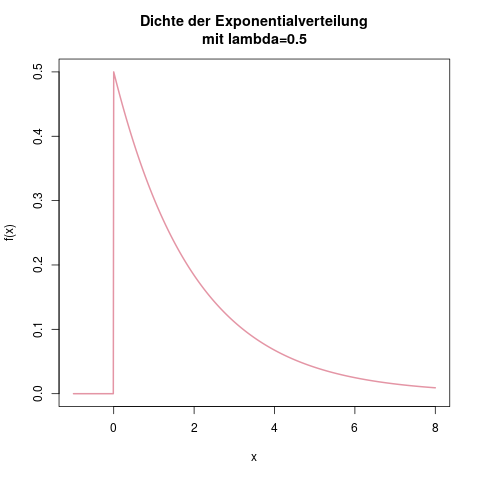
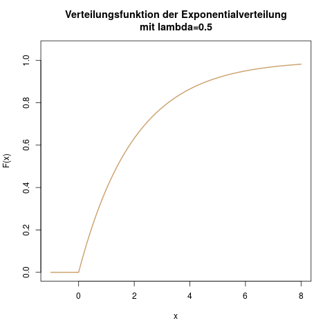

### Exponentialverteilung: Wartezeit bis Glühbirnenausfall

**Idee**

Die Exponentialverteilung wird meistens für Warte- und Ausfallzeiten aller Art verwendet. Klassische Beispiele hierfür sind die Lebenszeit einer Glühbirne (also die Wartezeit bis zum Ausfall), oder die Wartezeit bis zum nächsten Anrufer in einer Kundenhotline. Auch die Dauer eines Telefongesprächs kann mit der Exponentialverteilung modelliert werden.

Die Exponentialverteilung kann man als stetige Version der geometrischen Verteilung (s. Kap. \@ref(sec-geometrische)) ansehen. Die Dichte hat dieselbe Form, es handelt sich in beiden Fällen um eine exponentiell fallende Funktion.

**Parameter**

Die Exponentialverteilung hat nur einen Parameter, nämlich \(\lambda\) (Lambda). Er beschreibt die durchschnittliche Wartezeit bis zum nächsten "Ereignis", wie auch immer man das definiert. Ein größeres Lambda steht dabei für eine *kleinere* durchschnittliche Wartezeit (dazu später mehr).

Man bezeichnet eine exponentialverteilte Zufallsvariable \(X\) mit dem Parameter \(\lambda\) durch

\[ X \sim \text{Exp}(\lambda) \]

Selten, in manchen Büchern bzw. Vorlesungen, findet man auch den Parameter \(\mu\), der dann gleich \(\frac{1}{\lambda}\) ist. Im amerikanischen Raum ist diese Schreibweise der Exponentialverteilung verbreiteter, da muss man also aufpassen, mit welcher Version man gerade arbeitet.

**Träger**

Da es sich bei der Exponentialverteilung häufig um gemessene (Warte-)zeiten handelt, machen natürlich nur Ergebnisse (Sekunden, Minuten, Tage, ...) im positiven Raum Sinn. Der Träger sind daher die positiven reellen Zahlen, oder \(\mathbb{R}^+\):

\[ \mathcal{T} = \mathbb{R}^+ \]

Es sind also von \(0\) bis \(\infty\) alle Wartezeiten denkbar (die sehr langen natürlich mit einer entsprechend winzigen Wahrscheinlichkeit).

**Dichte**

Die Dichte der Exponentialverteilung ist nur für positive \(x\) größer als null, und lautet dann

\[ f(x) = \lambda \cdot \exp (-\lambda x) \]

Wenn man ganz korrekt vorgeht, teilt man die Dichte in den Bereich für positive \(x\) (inkl. den Spezialfall \(x=0\)), und den für negative \(x\) ein, und schreibt ausführlicher:

\[ f(x) = \begin{cases} \lambda \cdot \exp (-\lambda x), & x \geq 0 \\ 0, & x<0\end{cases}\]

Abbildung \@ref(fig:verteilungen-exponentialverteilung-dichte) zeigt eine beispielhafte Dichte.

(ref:verteilungen-exponentialverteilung-dichte-caption) Dichtefunktion der Exponentialverteilung mit \(\lambda=0.5\). Man kann leicht ausrechnen, dass das Maximum der Funktion bei \(x=0\) und \(f(x)=\lambda\) (hier 0.5) liegt.

```{r verteilungen-exponentialverteilung-dichte, fig.cap="(ref:verteilungen-exponentialverteilung-dichte-caption)"}

```

**Verteilungsfunktion**

Die Verteilungsfunktion der Exponentialverteilung lautet im Bereich der positiven \(x\):

\[ \mathbb{P}(X \leq x) = F(x) = 1-\exp (-\lambda x) \]

Auch hier kann man sich mathematisch exakter, aber auf den ersten Blick etwas unübersichtlicher ausdrücken:

\[ F(x) = \begin{cases} 1 - \exp (-\lambda x), & x \geq 0 \\ 0, & x<0\end{cases}\]

(ref:verteilungen-exp-v-caption) Verteilungsfunktion der Exponentialverteilung mit \(\lambda=0.5\).

```{r verteilungen-exponentialverteilung-verteilungsfunktion, fig.cap="(ref:verteilungen-exp-v-caption)"}

```

**Erwartungswert**

Der Erwartungswert bei der Exponentialverteilung ist

\[ \mathbb{E}(X) = \frac{1}{\lambda} \]

Wenn man also mit einer beispielhaften Zufallsvariable \(X\) = "Lebensdauer einer Glühbirne in Tagen" arbeitet, und \(X\) ist exponentialverteilt mit \(\lambda = \frac{1}{365}\), dann schreibt man \(X \sim \text{Exp}(\frac{1}{365})\), und weiss daraus, dass eine Glühbirne in diesem Modell durchschnittlich \(\mathbb{E}(X) = \frac{1}{\lambda} = 365\) Tage hält, bevor sie ausfällt.

Die Exponentialverteilung hat eine sehr angenehme Form der Dichte, so dass sie oft als Paradebeispiel für die Berechnung des Erwartungswertes mit der allgemeinen Formel (s. Kap. \@ref(sec-duevsz-erwartungswert)) verwendet wird. Für die mathematisch interessierten (oder die, die mit solch einer Klausuraufgabe rechnen): Der Trick, der hierfür verwendet wird, ist die *partielle Integration*.

\[ \begin{aligned} \mathbb{E}(X) &= \int_{-\infty}^\infty x \cdot f(x) \; dx \\ &=\int_0^\infty x \cdot \lambda \exp (-\lambda x) \\ &= \lambda \int_0^\infty x \cdot \exp (-\lambda x)\end{aligned} \]

Die erste Zeile folgt hier aus der Definition des Erwartungswerts für stetige Zufallsvariablen (s. Kap. \@ref(sec-duevsz-erwartungswert)). In der zweiten Zeile ändern wir die untere Integrationsschranke von \(-\infty\) zu 0. Da die Dichtefunktion \(f(x)\) im Bereich \([-\infty, 0]\) überall 0 ist, ist auch das Integral in diesem Bereich gleich null. Ganz ausführlich hingeschrieben hätten wir das Integral aufteilen müssen, da die Funktion \(f(x)\) ja zweiteilig definiert ist:

\[ \begin{aligned} \int_{-\infty}^\infty x \cdot f(x) \; dx &= \int_{-\infty}^0 x \cdot f(x) \; dx +\int_0^\infty x \cdot f(x) \; dx \\ &= \int_{-\infty}^0 x \cdot 0 \; dx +\int_0^\infty x \cdot \lambda \exp (-\lambda x ) \; dx \\ &= 0 + \int_0^\infty x \cdot \lambda \exp (-\lambda x ) \; dx \end{aligned} \]

Man darf also auf keinen Fall den Teil \(x\cdot \lambda \exp (-\lambda x)\) im Bereich kleiner null integrieren, da die Dichte dort stattdessen 0 ist! Im letzten Schritt haben wir die Konstante \(\lambda\) vor das Integral gezogen. Wenn man das Integral nur als stetige Version einer Summe ansieht, sieht man leicht, dass das ein einfaches Ausklammern, und somit zulässig ist. (Nicht möglich wäre das natürlich bei allen Termen, die ein \(x\) beinhalten, da das die Variable ist, über die integriert wird).

Jetzt kann man mit der Formel für die partielle Integration weiterarbeiten:

\[ \int^b_a f(x) \cdot g'(x) = \left[f(x) \cdot g(x)\right]^b_a - \int^b_a f'(x) \cdot g(x) \; dx\]

Man kann die partielle Integration nur dann sinnvoll verwenden, wenn die Stammfunktion zu \(g'(x)\) einfach zu berechnen ist, und zusätzlich das Integral auf der rechten Seite, \(\int f'(x) \cdot g(x) \; dx\), einfacher als das ursprüngliche Integral zu berechnen ist. Das wäre der Fall, wenn \(f(x) = x\), also \(f'(x) = 1\) ist. Definieren wir dann \(g'(x) = \exp(-\lambda x)\), können wir deren Stammfunktion \(g(x)\) einfach berechnen, da es eine Exponentialfunktion ist:

\[ g(x) = \int \exp(-\lambda x) \; dx = -\frac{1}{\lambda} \exp(-\lambda x) \]

Das kann man durch etwas Ausprobieren und einem nachprüfendem Ableiten am Ende schnell herausfinden.

Jetzt haben wir alle nötigen Terme bestimmt und können in die Formel der partiellen Integration einsetzen:

\[ \int^b_a f(x) \cdot g'(x) = \left[f(x) \cdot g(x)\right]^b_a - \int^b_a f'(x) \cdot g(x) \; dx\]

In unserem Fall ist:

- \(f(x) = x\)
- \(f'(x) = 1\)
- \(g(x) = -\frac{1}{\lambda} \exp(-\lambda x)\)
- \(g'(x) =\exp(-\lambda x)\)

Es ist also

\[ \begin{aligned} \mathbb{E}(X) &= \lambda \int_0^\infty x \cdot \exp(-\lambda x) \; dx \\ &= \lambda \left( \Big[ \underbrace{x}_{f(x)} \cdot \underbrace{(-\frac{1}{\lambda}) \exp(-\lambda x)}_{g(x)}\Big]_0^\infty - \int_0^\infty \underbrace{1}_{f'(x)} \cdot \underbrace{(-\frac{1}{\lambda}) \exp(-\lambda x)}_{g(x)} \; dx \right) \end{aligned} \]

Die Stammfunktion im linken Teil der großen Klammer ist nun null, denn: \(\exp(-\infty) = 0\) und \(0 \cdot \exp(-\lambda \cdot 0) = 0\). Der Term reduziert sich also zu \([0-0]\). Das ausgeklammerte \(\lambda\) können wir nun vor das übriggebliebene Integral stellen, und den Faktor \(-\frac{1}{\lambda}\) aus dem Inneren des Ingetrals nach vorne ziehen und weitermachen. Die Stammfunktion zu \(\exp (-\lambda x)\) kennen wir zum Glück schon und können sie direkt einsetzen:

\[ \begin{aligned} \mathbb{E}(X) &= [ 0 - 0 ] - \lambda \cdot (-\frac{1}{\lambda}) \cdot \int_0^\infty \exp(-\lambda x) \; dx \\ &= (+1) \cdot \left[ -\frac{1}{\lambda} \exp (-\lambda x) \right]_0^\infty \\ &= \left[ 0 - (-\frac{1}{\lambda}) \right] \\ &= \frac{1}{\lambda} \end{aligned} \]

Puh! Fertig. So beweisen wir also, dass der Erwartungswert bei der Exponentialverteilung gleich \(\frac{1}{\lambda}\) ist.

**Varianz**

Die Varianz einer exponentialverteilten Zufallsvariable ist

\[ \mathbb{V}(X) = \frac{1}{\lambda^2} \]

Die Herleitung funktioniert über die allgemeine Formel der Varianz stetiger Zufallsvariablen (s. Kap. \@ref(sec-duevsz-varianz)). Entweder über den Ansatz

\[ \mathbb{V}(X) = \int_{-\infty}^\infty \left( x - \mathbb{E}(X) \right)^2 \cdot f(x) \; dx \]

oder über den Verschiebungssatz (s. Kap. \@ref(sec-verschiebungssatz))

\[ \mathbb{V}(X) = \mathbb{E}(X^2) - [\mathbb{E}(X)]^2 = \int_{-\infty}^\infty x^2 \cdot f(x) \; dx - \left( \frac{1}{\lambda} \right)^2 \]

In beiden Fällen muss man auf dem Weg ein- oder mehrmals die partielle Integration anwenden. Aus Platzgründen, und um eure Motivation nicht zu sehr zu strapazieren, verzichte ich hier aber auf die Ausführung :-) .