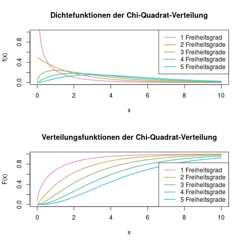

### \(\chi^2\)-Verteilung {#sec-chisq-verteilung}

#### Idee {-}

Die \(\chi^2\)-Verteilung wird eigentlich nur für einige Hypothesentests verwendet, insbesondere für den Unabhängigkeitstest für Kontingenztabellen. In der "freien Wildbahn", also zum Modellieren irgendwelcher erhobenen Daten, trifft man sie quasi nie an. Aus diesem Grund sind viele Details dieser Verteilung (Erwartungswert, Dichte, und Varianz) eher unwichtig - nur die Verteilungsfunktion ist interessant, da mit ihr das 95%-Quantil (die wichtige kritische Schranke für Hypothesentests) bestimmt werden kann.

#### Parameter {-}

Die \(\chi^2\)-Verteilung hat einen Parameter, nämlich die Anzahl der Freiheitsgrade, \(df\). Man notiert eine \(\chi^2\)-verteilte Zufallsvariable \(X\) mit \(df\) Freiheitsgraden als

\[ X \sim \chi^2 (df) \]

Abbildung \@ref(fig:verteilungen-chisq-verteilung-dichte-und-verteilungsfunktion) zeigt einige beispielhafte \(\chi^2\)-Verteilungen

(ref:verteilungen-chisq-v-d-u-v-caption) Dichte- und Verteilungsfunktion der \(\chi^2\)-Verteilung für verschiedene beispielhafte Freiheitsgrade.

```{r verteilungen-chisq-verteilung-dichte-und-verteilungsfunktion, fig.cap="(ref:verteilungen-chisq-v-d-u-v-caption)"}

```

#### Träger {-}

Der Träger der \(\chi^2\)-Verteilung ist \(\mathbb{R}^+\), die positiven reellen Zahlen.

#### Erwartungswert, Varianz und Dichte {-}

Da mit der \(\chi^2\)-Verteilung eigentlich nie Daten modelliert werden, braucht man eigentlich weder die Dichte, noch den Erwartungswert oder die Varianz kennen. Der Vollständigkeit halber sei sie hier trotzdem genannt: Der Erwartungswert für eine \(\chi^2\)-verteilte Zufallsvariable \(X\) mit \(df\) Freiheitsgraden ist \(\mathbb{E}(X) = df\), und ihre Varianz ist \(\mathbb{V}(X)= 2\cdot df\).

#### Verteilungsfunktion {-}

Wie oben schon erwähnt, ist für die \(\chi^2\)-Verteilung eigentlich nur die Verteilungsfunktion, und dort auch meistens nur das 95%-Quantil als Spezialfall, interessant.

Die Formel für die Verteilungsfunktion ist sehr aufwändig zu notieren und auszurechnen, weshalb es auch hier eine Verteilungstabelle gibt (s. Kap. \@ref(sec-tabelle-chisq-verteilung)), an der man die wichtigsten Werte einfach ablesen kann. Auch hier gilt es, einfach ein wenig Übung im Umgang mit der Tabelle zu erhalten, damit man die gewünschten Quantilswerte ohne Zeitverlust und Leichtsinnsfehler richtig und schnell ablesen kann.