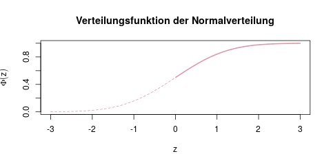
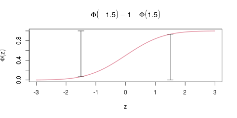

### Tabelle Normalverteilung {#sec-tabelle-normalverteilung}

**Wie man die Verteilungstabelle abliest**

Weil die Standardnormalverteilung so eine zentrale Rolle spielt (und, damit man sie nicht mit der Verteilungsfunktion von unstandardisierten Zufallsvariablen verwechselt), bekommt diese Verteilung meist einen eigenen Buchstaben, das griechische grosse *Phi.* Statt \(F(x)\) schreibt man in den meisten Büchern und Vorlesungen dann \(\Phi(z)\), wobei \(z\) für den standardisierten Wert steht.

Um Platz zu sparen, ist in den meisten Büchern und Klausuren nur die rechte Hälfte der Verteilungsfunktion tabelliert (s. Abb. \@ref(fig:verteilungen-normalverteilung-verteilungstabelle-1)).

(ref:verteilungen-normalverteilung-verteilungstabelle-1-caption) Die Verteilungsfunktion der Normalverteilung. In Tabellen findet man häufig nur die rechte Hälfte dieser Kurve, also ab \(\Phi(0)=0.5\).

```{r verteilungen-normalverteilung-verteilungstabelle-1, fig.cap="(ref:verteilungen-normalverteilung-verteilungstabelle-1-caption)"}

```

Den Wert \(\Phi(z)\) für alle positiven \(z\) kann man nun einfach aus der Tabelle ablesen. Meistens sind die Tabellen so aufgebaut, dass in den Zeilen die ersten beiden Stellen für \(z\) stehen, und in 10 Spalten dann die zweite Nachkommastelle. Aus der Tabelle liest man also z.B. \(\Phi(0.01) = 0.5040\), oder \(\Phi(1.96) = 0.975\).

Um den Wert \(\Phi(z)\) für ein negatives \(z\), zum Beispiel \(\Phi(-1.5)\) zu erhalten, ist dann ein zusätzlicher Rechenschritt nötig, der in Abbildung \@ref(fig:verteilungen-normalverteilung-verteilungstabelle-2) erklärt ist.

(ref:verteilungen-normalverteilung-verteilungstabelle-2-caption) So berechnet man die Verteilungsfunktion an negativen \(x\)-Stellen. Die beiden vertikalen Balken sind genau gleich hoch (nämlich \(\Phi(1.5)=0.93\)).

```{r verteilungen-normalverteilung-verteilungstabelle-2, fig.cap="(ref:verteilungen-normalverteilung-verteilungstabelle-2-caption)"}

```

Da die Verteilungskurve nämlich symmetrisch um den Punkt (0, 0.5) ist, kann man sich dieses Tricks bedienen:

\[\Phi(-z) = 1-\Phi(z) \]

Man berechnet also die Verteilungsfunktion an der Stelle \(-1.5\), indem man den Wert für \(+1.5\) in der Tabelle findet, und ihn von 1 abzieht:

\[\Phi(-1.5) = 1-\Phi(1.5) = 1-0.933 = 0.067 \]

```{exercise, echo=TRUE}

Bestimme mit Hilfe der untenstehenden Tabelle \(\Phi(1)\), \(\Phi(-1)\), und \(\Phi(-1.96)\).

```

```{solution, show=TRUE}

\(\Phi(1)=0.8413\)
\(\Phi(-1) = 1-\Phi(1) = 1-0.8413 = 0.1587\)
\(\Phi(-1.96) = 1-\Phi(1.96) = 1-0.975 = 0.025\)

```

**Sehr große Zahlen**

Für Zahlen, die so groß (oder so klein im Negativen) sind, dass man sie nicht mehr in der Tabelle findet, kann man näherungsweise als Wahrscheinlichkeit "fast Null" oder "fast Eins" nehmen. An der Grafik der Verteilung oben kann man intuitiv verstehen, warum das so ist. Die Funktion nähert sich für sehr große Zahlen der 1 an, und für sehr kleine Zahlen der 0.

Als Formel ausgedrückt, falls man z.B: \(\Phi(15)\) berechnen will:

\[\Phi(15) \approx 1\]

\[\Phi(-15) \approx 0\]

**Quantile ablesen**

Quantile liest man genau andersherum aus der Verteilungstabelle ab, da die Quantilsfunktion ja genau die Umkehrfunktion der Verteilungsfunktion ist.

Wenn man direkt die ersten beiden Zellen der Tabelle betrachtet, ist also das 0.5000-Quantil der Standardnormalverteilung gleich 0.00. Das 0.5040-Quantil ist 0.01, und so weiter. Das 75%-Quantil liegt zwischen 0.67 und 0.68, da \(\Phi(0.67)=0.7486\) ist, und \(\Phi(0.68)=0.7517\).

Für die Quantile unter 50% muss man wieder über einen kurzen Umweg rechnen, da die Tabelle nur positive \(z\), und damit Quantile über 0.5 abbildet.

Für das \(\alpha\)-Quantil gilt: \(q_\alpha = -q_{1-\alpha}\). Das bedeutet: Möchte man das 20%-Quantil bestimmen, sucht man (weil es unter 50% liegt) in der Verteilungstabelle stattdessen das (1-0.2)-Quantil, also das 80%-Quantil, und nimmt den negativen Wert des Ergebnisses. Das 80%-Quantil ist also 0.84, und das 20%-Quantil ist somit -0.84.

```{exercise, echo=TRUE}

Bestimme das 97.5%-Quantil sowie das 2.5%-Quantil der Standardnormalverteilung.

```

```{solution, echo=TRUE}

Die Verteilungsfunktion hat an der Stelle \(z=1.96\) den Wert \(\Phi(1.96)=0.975\). Daher ist das 97.5%-Quantil gleich 1.96.

Das 2.5%-Quantil (nennen wir es \(q_{0.025}\) ist nun \(-q_{1-0.025} = -q_{0.975}\), also -1.96.

```

**Die Tabelle der Standardnormalverteilung**

Tabelle \@ref(tab:table-normalverteilung) zeigt die Verteilungstabelle der Normalverteilung.

In der ersten Spalte findet man die erste Nachkommastelle von \(z\), in der ersten Zeile die zweite Nachkommastelle. So ist z.B. der Wert in der Ecke ganz rechts oben der von \(\Phi(0.09) = 0.5359\). Eine Zeile direkt darunter ist der Wert für \(\Phi(0.19) = 0.5753\).

(ref:tabelle-nv-rowheader) Zweite Nachkommastelle \(\rightarrow\)

(ref:tabelle-nv-colheader) \(\downarrow\) \(z\)-Werte

```{r}
mx = matrix(
    format(round(pnorm(seq(0.0, 2.99, by=0.01)), 4), nsmall=4),
    ncol=10,
    byrow=TRUE
)

colnames(mx) = format(seq(0.00, 0.09, by=0.01), nsmall=2)

mx = cbind(
    format(seq(0.0, 2.9, by=0.1), nsmall=1),
    mx
)
```

(ref:tabelle-nv-caption) Tabelle der Standardnormalverteilung \(N(0, 1)\)

```{r table-normalverteilung}

if(knitr::is_html_output()){
    # This chunk is only evaluated (i.e. ran), if we output to HTML, i.e. gitbook or epub
    kable(mx, caption="(ref:tabelle-nv-caption)") %>%
        column_spec(1, bold=TRUE) %>%
        add_header_above(c("(ref:tabelle-nv-colheader)", "(ref:tabelle-nv-rowheader)"=10)) %>%
        kableExtra::kable_styling(font_size = 12)
} else if(knitr::is_latex_output()){
    kable(mx, format="latex", booktabs=TRUE, caption="(ref:tabelle-nv-caption)") %>%
        add_header_above(c("(ref:tabelle-nv-colheader)", "(ref:tabelle-nv-rowheader)"=10)) %>%
        kableExtra::kable_styling(font_size = 8, latex_options = "hold_position")  # Latex's [h!]
}
```
