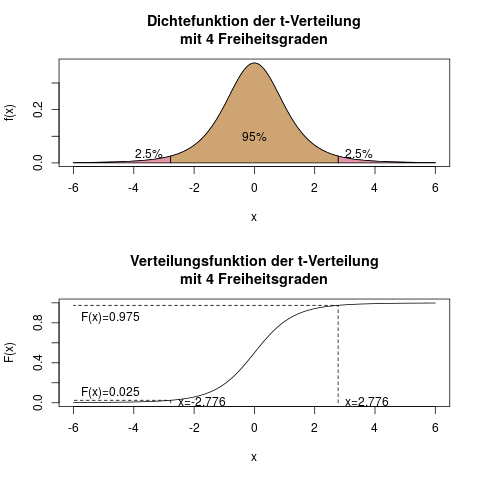

### Tabelle \(t\)-Verteilung {#sec-tabelle-t-verteilung}

Der Unterschied der \(t\)-Verteilung (s. Kap. \@ref(sec-t-verteilung)) zur Standardnormalverteilung ist, dass es viele verschiedene \(t\)-Verteilungen gibt - eine für jeden Freiheitsgrad \(df\).

Daher findet man aus Platzgründen in Büchern und Klausuren nie eine seitenlange Auflistung von je einer vollständigen Verteilungstabelle für jeden Freiheitsgrad, sondern nur die wichtigsten Quantile in einer Spalte.

Die verbreitete Schreibweise ist für ein t-Quantil dann z.B. \(t_{0.975}(4)\). Das ist das 97,5%-Quantil der t-Verteilung mit 4 Freiheitsgraden. Für dieses Quantil sind die folgenden Aussagen alle wahr und gleichbedeutend:

- 2,5% der Fläche der Dichte der \(t\)-Verteilung mit 4 Freiheitsgraden (ab jetzt \(t(4)\)-Verteilung genannt) liegen rechts von 2,776.
- 2,5% der Fläche der Dichte der \(t(4)\)-Verteilung liegen links von -2,776.
- 95% der Fläche der Dichte der \(t(4)\)-Verteilung liegen im Intervall [-2,776; 2,776].
- Eine \(t(4)\)-verteilte Zufallsvariable wird mit 95% Wahrscheinlichkeit im Intervall [-2,776; 2,776] liegen.
- Das 97,5%-Quantil der \(t(4)\)-Verteilung ist 2,776.

Abbildung \@ref(fig:verteilungen-t-verteilung-verteilungstabelle) visualisiert diese 2,776.

(ref:verteilungen-t-verteilung-verteilungstabelle-caption) So interpretiert man die aus der Verteilungstabelle abgelesenen Quantile.

```{r verteilungen-t-verteilung-verteilungstabelle, fig.cap="(ref:verteilungen-t-verteilung-verteilungstabelle-caption)"}

```


Versuche zur Übung, den Wert 2,776 in der unten stehenden Verteilungstabelle wiederzufinden! Du brauchst das 97,5%-Quantil (also das 0.975-Quantil) der t-Verteilung mit 4 Freiheitsgraden!

Wenn man versteht, dass all diese Sätze äquivalent sind, dann kann man gut mit der Verteilungstabelle umgehen. Die Zeit dafür zu investieren, zahlt sich in der Klausur mit Sicherheit aus.

#### Die Tabelle der \(t\)-Verteilung {-}

Tabelle \@ref(tab:table-t-verteilung) zeigt die Verteilungstabelle der \(t\)-Verteilung.

(ref:tabelle-t-caption) Quantile der \(t\)-Verteilung mit verschiedenen Freiheitsgraden

(ref:tabelle-t-rowheader) Quantil der \(t\)-Verteilung

(ref:tabelle-t-colheader) \(\downarrow df\)

(ref:infty) \(\infty\)

```{r}
dfs = c(1:30, 40, 50, Inf)
quantiles = c(0.75, 0.875, 0.9, 0.95, 0.975, 0.99, 0.995, 0.999)
colnames_quantiles = c("0.75", "0.875", "0.90", "0.95", "0.975", "0.99", "0.995", "0.999")

mx = matrix(
    format(round(qt(rep(quantiles, times=length(dfs)), df=rep(dfs, each=length(quantiles))), 3), nsmall=3),
    ncol=length(quantiles),
    byrow=TRUE
)

colnames(mx) = colnames_quantiles

mx = cbind(dfs, mx)
mx[nrow(mx), 1] = "(ref:infty)"
colnames(mx)[1] = "(ref:tabelle-t-colheader)"
```

```{r table-t-verteilung}
if(knitr::is_html_output()){
    # This chunk is only evaluated (i.e. ran), if we output to HTML, i.e. gitbook or epub
    kable(mx, caption="(ref:tabelle-t-caption)") %>%
        column_spec(1, bold=TRUE) %>%
        add_header_above(c("", "(ref:tabelle-t-rowheader)"=length(quantiles)))
} else if(knitr::is_latex_output()){
    kable(mx, format="latex", booktabs=TRUE, caption="(ref:tabelle-t-caption)") %>%
        add_header_above(c("", "(ref:tabelle-t-rowheader)"=length(quantiles))) %>%
        kableExtra::kable_styling(latex_options = "hold_position")  # Latex's [h!]
}
```

