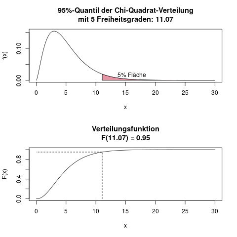

### Tabelle \(\chi^2\)-Verteilung {#sec-tabelle-chisq-verteilung}

Für die \(\chi^2\)-Verteilung gibt es theoretisch, genauso wie bei der \(t\)-Verteilung (s. Kap. \@ref(sec-tabelle-t-verteilung)), auch eine riesige Tabelle für jede mögliche Anzahl an Freiheitsgraden. Daher sind in den Verteilungstabellen nur die wichtigsten paar Quantile aufgeführt. Am häufigsten verwendet wird dabei das 95%-Quantil, da das die kritische Schranke für einen \(\chi^2\)-Test mit Signifikanzniveau \(\alpha=0.05\) ist.

Haben wir also einen \(\chi^2\)-Test mit 5 Freiheitsgraden, und möchten die kritische Schranke für ein Signifikanzniveau von \(\alpha=0.05\) finden, sehen wir in der Zeile für 5 und der Spalte für 0.95 (das ist 1-0.05) nach, und finden den Wert 11.07. Abbildung \@ref(fig:verteilungen-chisq-verteilung-verteilungstabelle) veranschaulicht den Wert, den wir suchen.

(ref:vert-c-v-v-caption) Ablesebeispiel der \(\chi^2\)-Verteilung mit \(df=5\) Freiheitsgraden. Die Dichte (obere Grafik) hat ab der Stelle \(x=11.07\) noch eine Fläche von 5%. Die Verteilungsfunktion (untere Grafik) an der Stelle \(x=11.07\) hat genau den Wert 0.95.

```{r verteilungen-chisq-verteilung-verteilungstabelle, fig.cap="(ref:vert-c-v-v-caption)"}

```


#### Die Tabelle der \(\chi^2\)-Verteilung {-}

Tabelle \@ref(tab:table-chisq-verteilung) zeigt die Verteilungstabelle der \(\chi^2\)-Verteilung.

(ref:tabelle-chisq-caption) Quantile der \(\chi^2\)-Verteilung mit verschiedenen Freiheitsgraden

(ref:tabelle-chisq-rowheader) Quantil der \(\chi^2\)-Verteilung

(ref:tabelle-chisq-colheader) \(\downarrow df\)

```{r}
dfs = c(1:30)
# quantiles = c(0.05, 0.10, 0.20, 0.30, 0.50, 0.70, 0.80, 0.90, 0.95, 0.99, 0.999)
# colnames_quantiles = c("0.05", "0.10", "0.20", "0.30", "0.50", "0.70", "0.80", "0.90", "0.95", "0.99", "0.999")
quantiles = c(0.01, 0.025, 0.05, 0.90, 0.95, 0.975, 0.99)
colnames_quantiles = c("0.01", "0.025", "0.05", "0.90", "0.95", "0.975", "0.99")

mx = matrix(
    format(round(qchisq(rep(quantiles, times=length(dfs)), df=rep(dfs, each=length(quantiles))), 3), nsmall=3),
    ncol=length(quantiles),
    byrow=TRUE
)

colnames(mx) = colnames_quantiles

mx = cbind(dfs, mx)
colnames(mx)[1] = "(ref:tabelle-chisq-colheader)"
```

```{r table-chisq-verteilung}
if(knitr::is_html_output()){
    # This chunk is only evaluated (i.e. ran), if we output to HTML, i.e. gitbook or epub
        kable(mx, caption="(ref:tabelle-chisq-caption)") %>%
        column_spec(1, bold=TRUE) %>%
        add_header_above(c("", "(ref:tabelle-chisq-rowheader)"=length(quantiles)))
} else if(knitr::is_latex_output()){
    kable(mx, format="latex", booktabs=TRUE, caption="(ref:tabelle-chisq-caption)") %>%
        add_header_above(c("", "(ref:tabelle-chisq-rowheader)"=length(quantiles))) %>%
        kableExtra::kable_styling(latex_options = "hold_position")  # Latex's [h!]
}
```


