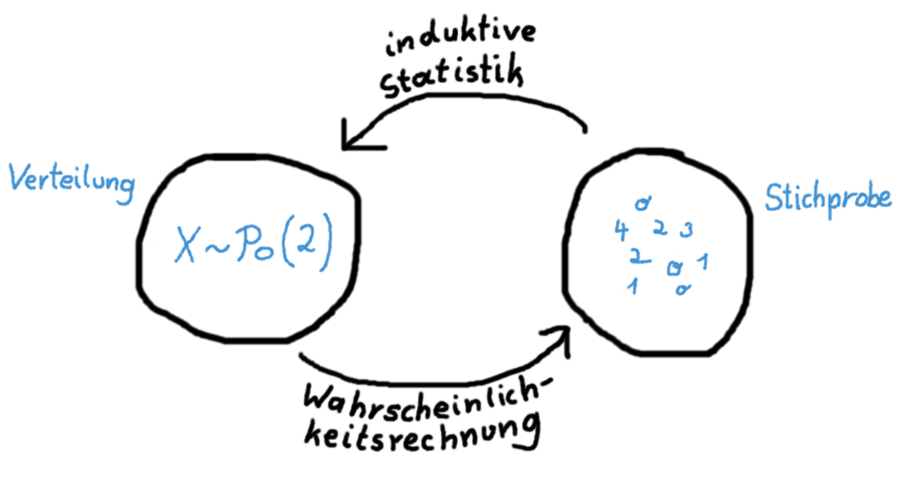

# Inferenzstatistik: Eine Übersicht {-}

Bisher haben wir uns mit der *deskriptiven* (oder *beschreibenden*) Statistik, sowie mit der Wahrscheinlichkeitsrechnung beschäftigt:

- In der **deskriptiven Statistik** haben wir eine Stichprobe, und beschreiben ihre Eigenschaften (z.B. Mittelwerte, Varianzen, oder Quantile in einem Boxplot). Wichtig hier: Wir beschreiben nur *die Stichprobe*. Es werden keine Aussagen über die Grundgesamtheit, aus der die Stichprobe kommt, getroffen.
- In der **Wahrscheinlichkeitsrechnung** haben wir eine gegebene Verteilung inklusive aller ihrer Parameter, und möchten die Wahrscheinlichkeit bestimmen, mit der zukünftige Daten bestimmte Werte annehmen.

In der **Inferenzstatistik** (oft auch *induktive* oder *schließende* Statistik genannt) gehen wir nun genau andersrum wie in der Wahrscheinlichkeitsrechnung vor: Wir haben eine Stichprobe gegeben, und möchten mit ihrer Hilfe auf die Parameter der darunterliegenden Verteilung in der Grundgesamtheit schließen.

Die Inferenzstatistik verbindet also die vorhergehenden beiden Teile. Wir berechnen Kennzahlen der Stichprobe (deskriptiv), und schließen dann mit Hilfe der Wahrscheinlichkeitsrechnung auf Eigenschaften in der Grundgesamtheit.

In der Wahrscheinlichkeitsrechnung haben wir eine Verteilung gegeben und wollen die Wahrscheinlichkeit für gewisse Daten ausrechnen. In der Inferenzstatistik haben wir Daten gegeben und wollen deren Verteilung bestimmen.

```{r induktive-statistik}

```

Sowohl **Hypothesentests** als auch **Regressionsmodelle** kommen aus der Inferenzstatistik. Um in diesem Rahmen Inferenz zu betreiben, muss man zuerst eine den Daten unterliegende Verteilung annehmen. Dazu bedienen sich beide Verfahren *statistischer Modelle*.

Ein statistisches Modell ist eine (idealisierte) Annahme über das System (meistens: eine bestmmte Verteilung), das einen bestimmten Datensatz generiert hat. Unter der Annahme, dass die Stichprobe zufällig aus der Grundgesamtheit entnommen wurde, gilt dasselbe Modell dann für
Stichprobe sowie Grundgesamtheit. Dadurch lässt sich Inferenzstatistik betreiben, und es lassen sich aus der Stichprobe Schlussfolgerungen über die Grundgesamtheit ziehen.

Wie gesagt: zwei große Teilgebiete der Inferenzstatistik sind in den einführenden Statistikveranstaltungen besonders wichtig:

- Zum einen das **Schätzen** der genauen Parameter (wie z.B. den Wert \(\lambda=2\) in der oberen Grafik) bzw. Bereiche, in denen der Parameter höchstwahrscheinlich liegt (sogenannter Konfidenzintervalle)
- Zum anderen das **Testen**, ob gewisse Parameter einen bestimmten, hypothetischen Wert annehmen.

Beim Schätzen haben wir also keine vorherige Meinung, was der Parameter sein könnte, und berechnen einfach einen höchstwahrscheinlichen Wert aus den Daten, und beim Testen haben wir vorher eine Idee über den Parameter (z.B. behaupten wir, dass \(\lambda=3\) ist), und überprüfen die Plausibilität dieser Behauptung (*Hypothese*) in einem Test.