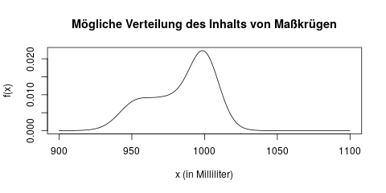
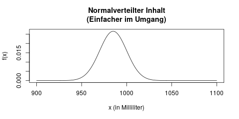

## Was ist ein Parameter? {#sec-wat-parameter}

Die Aufgabe in der schließenden Statistik (oder *Inferenzstatistik*) ist es meistens, eine fundierte Aussage über das Verhalten eines [Merkmals](#sec-ggsm) zu treffen. Die bestmögliche Information, die wir über ein Merkmal halten können, wäre seine *gesamte Verteilung*. Denn wenn wir die Verteilung (oder der Dichtefunktion) genau kennen, können wir alle wichtigen Fragen über dieses Merkmal beantworten, zum Beispiel:

- Was ist der Mittelwert dieses Merkmals? (wie man das mit Hilfe der Dichtefunktion machen würde, ist in Kapitel \@ref(sec-duevsz-erwartungswert) erklärt)
- Wieviel Prozent der Beobachtungen werden größer sein als 100? (Das ist der Wert der Verteilungsfunktion an der Stelle \(x=100\))
- Was ist der Median? (das wäre das 50%-Quantil)
- Welchen Wert des Merkmals werden nur 10% der Beobachtungen unterschreiten? (das wäre das 10%-Quantil)

Nehmen wir ein praktisches Beispiel zur Veranschaulichung: Wir möchten gerne herausfinden, wieviel Bier im Durchschnitt in einem Maßkrug auf dem Oktoberfest eingeschenkt wird. Wir vermuten nämlich, dass häufig zu wenig Bier gezapft wird, und die Krüge im Durchschnittmit weniger als einem Liter befüllt sind. Die Verteilung des Inhals eines Maßkrugs könnte in der Wahrheit zum Beispiel aussehen wie in Abbildung \@ref(fig:parameterschaetzung-derp-dichte).

(ref:parameterschaetzung-derp-dichte-caption) In dieser Verteilung können wir z.B. ablesen, dass viele Krüge "fair", d.h. in der Nähe von 1000ml befüllt sind, aber einige auch nur 950ml enthalten.

```{r parameterschaetzung-derp-dichte, fig.cap="(ref:parameterschaetzung-derp-dichte-caption)"}

```

Es ist allerdings nicht sehr einfach, die gesamte Verteilung eines Merkmals so frei "von vorne" zu bestimmen. Die Verteilung im oberen Bild lässt sich auch schwer beschreiben bzw. zusammenfassen - wir müssten die Grafik, oder eine lange Tabelle erstellen. Erst mit Hilfe dieser Tabelle würden wir dann z.B. Quantile berechnen können.

Stattdessen vereinfacht man sich diese Aufgabe in der Statistik häufig, indem man eine bestimmte Verteilungsfamilie unterstellt, man trifft also eine *Annahme*. Wir können zum Beispiel annehmen, dass der Inhalt eines Maßkrugs [normalverteilt](#sec-normalverteilung) ist. Dann könnten wir davon ausgehen, dass der Inhalt eines Krugs vielleicht wie folgt verteilt ist:

(ref:parameterschaetzung-norm-dichte-caption) Durch eine Verteilungsannahme können wir die Füllmenge eines Maßkrugs vereinfacht beschreiben.

```{r parameterschaetzung-norm-dichte, fig.cap="(ref:parameterschaetzung-norm-dichte-caption)"}

```

Der Vorteil, die Verteilung vorher durch eine Annahme festzulegen ist, dass wir diese Verteilung jetzt ganz einfach durch *zwei Parameter* beschreiben können, nämlich die beiden Parameter der Normalverteilung: Mittelwert \(\mu\) und Varianz \(\sigma^2\). Jetzt reichen uns im Gegensatz zur oberen Grafik diese zwei Parameter, um die Verteilung vollständig zu charakterisieren: Es handelt sich um eine Normalverteilung mit den Parametern \(\mu = 985\) und \(\sigma^2 = 225\). Damit können wir sofort z.B. bestimmen, welchen Inhalt die 10% am wenigsten befüllten Krüge nicht überschreiten (es wäre das 10%-Quantil, hier 965.8ml - die Anleitung dazu zum Nachrechnen findet sich in Kapitel \@ref(sec-tabelle-normalverteilung)).

### Wozu brauchen wir Parameterschätzung?

Um den Sinn der Parameterschätzung zu verstehen, muss man sich nur ein paar Dinge bewußt machen:

1. Wir möchten eine Aussage über das Verhalten (z.B. den Mittelwert) eines bestimmten [Merkmals](#sec-ggsm) in einer [Grundgesamtheit](#sec-ggsm) treffen.
2. Leider können wir nicht alle Daten, d.h. die ganze Grundgesamtheit, erhalten. Stattdessen bekommen wir nur eine [Stichprobe](#sec-ggsm), z.B. 100 Personen aus der Grundgesamtheit.
3. Das beste was wir mit der Stichprobe machen können, ist einen *Schätzwert* für den Parameter zu berechnen.
4. Wenn unsere Stichprobe groß genug und repräsentativ ist, können wir davon ausgehen dass dieser Schätzwert nah genug am wahren Wert liegt, so dass dieses Ergebnis für unsere Arbeit trotzdem hilfreich ist.

Greifen wir das oben erwähnte Beispiel mit den Maßkrügen nocheinmal auf:

Die *Grundgesamtheit*, über die wir hier eine Aussage machen wollen, sind *alle* ausgeschenkten Maßkrüge. Hätten wir diese Daten verfügbar, bräuchten wir den Mittelwert der Grundgesamtheit, d.h. aller Maßkrüge, gar nicht schätzen, sondern könnten ihn exakt berechnen!

Wir haben allerdings nur eine Stichprobe, zum Beispiel von 100 Maßkrügen. Wenn wir den Mittelwert des Inhalts dieser 100 Krüge berechnen, dann ist das höchstwahrscheinlich nicht exakt der *wahre* Mittelwert in der Grundgesamtheit, aber er wird nah genug daran liegen, dass dieser Wert trotzdem hilfreich ist. Wäre er das nicht, dann wäre der Job eines Statistikers nämlich ganz sinnlos. :-)

### Parameterschätzer sind die Grundlage für Hypothesentests

Ein weiterer wichtiger Punkt: Wir brauchen Parameterschätzer, um mit ihnen als nächsten Schritt Hypothesentests (s. Kap. \@ref(sec-hypothesentests)) durchzuführen. Der Zusammenhang zwischen diesen Konzepten ist der folgende:

- Für eine einzelne Stichprobe können wir natürlich ihren *wahren* Mittelwert berechnen - das ist einfach ihr Mittelwert, aus dem Bereich der *deskriptiven* Statistik.
- Wir wissen dadurch allerdings noch nicht den *wahren/gesamten Mittelwert in der Grundgesamtheit*.
- Den gesamten Mittelwert der Grundgesamtheit können wir allerdings mit Hilfe der Stichprobe schätzen. Er wird "wahrscheinlich" in der Nähe des Mittelwerts der Stichprobe liegen. Das ist also unser *Schätzer* für den gesamten Mittelwert.
- Mit Hilfe dieses Schätzers können wir nun *einen Schritt weiter* gehen, und Vermutungen (d.h. Hypothesen) über die Grundgesamtheit formulieren und überprüfen (*testen*) - zum Beispiel:
    - Der Stichprobenmittelwert ist zwar 12,4, aber könnte es noch sein, dass der wahre Mittelwert 10 ist? (Diese Frage beantwortet ein *Hypothesentest*).
    - In welchem Bereich liegt der gesamte Mittelwert der Grundgesamtheit mit einer Wahrscheinlichkeit von 95%? (diese Frage beantwortet dann ein *Intervallschätzer*).
        - Anmerkung: Diese Interpretation eines Intervallschätzers ist formal nicht ganz korrekt, aber viel einleuchtender für das Verständnis - und darum geht es mir in diesem Buch. Die Götter der Mathematik mögen mir vergeben :-)

Alle diese Fragen beantwortet man mit Hilfe von gesammelten Daten und vorgegebenen Formeln, und in jedem Fall braucht man dafür als Zwischenschritt einen Parameterschätzer.

### Was kann man schätzen?

Typischerweise, und besonders in einführenden Statistikveranstaltungen, schätzt man einen von drei Parametern eines Merkmals: (häufig bei nominalen Merkmalen) ein Prozentteil, sein Erwartungswert, oder seine Varianz.

#### Prozentuale Anteile

Wenn wir ein Merkmal mit nur zwei möglichen Ausprägungen (meistens "ja" und "nein") haben, interessiert uns zuallererst, wieviel Prozent der Beobachtungen "ja" sind.

Messen wir z.B. auf dem Oktoberfest nach, ob ein Maßkrug mit weniger als einem Liter Bier befüllt ist, dann notieren wir pro Krug ein "ja" oder ein "nein", und können am Ende mit dieser Stichprobe schätzen, wieviel Prozent aller Krüge *allgemein* zuwenig Inhalt haben.

#### Erwartungswert

Der Erwartungswert eines Merkmals ist das Ergebnis, das wir im Durchschnitt erwarten würden. Wenn wir z.B. nicht nur wissen wollen ob ein Maßkrug zuwenig oder ausreichend Inhalt hat, sondern den genauen Inhalt in Milliliter messen wollen, ist der Erwartungswert einfach die durchschnittliche Biermenge in einem Glas. Angenommen wir bestellen 10 Maß Bier, und erhalten einen Schätzer von 950ml für den Erwartungswert, könnten wir schon misstrauisch werden, dass die Krüge fair befüllt werden.

#### Varianz

Oft reicht uns die Information nicht aus, dass z.B. im Erwartungswert nur 950ml Bier in einem Maßkrug enthalten sind. Es kommen eigentlich sofort weitere Fragen auf: Ist denn jeder Krug mit ziemlich genau 950ml befüllt, oder gibt es Krüge mit 850ml Inhalt, aber dafür auch andere Krüge mit 1050ml Inhalt? Und wie sicher können wir uns sein, dass der wahre Durchschnitt tatsächlich unter 1000ml liegt?

Solche Fragen werden mit Hilfe der Varianz beantwortet. Die Streuung eines Merkmals gibt uns Hinweise darauf, wie weit entfernt vom Erwartungswert die einzelnen Beobachtungen typischerweise sind.

#### Andere Verteilungsparameter

Man kann noch einige andere Parameter schätzen, die hier kurz erwähnt werden sollen, aber nicht ausgeführt werden. Zum Beispiel kann man genauso wie man den Erwartungswert schätzt, auch bestimmte Quantile einer Verteilung schätzen. Nimmt man das 50%-Quantil, schätzt man gleichbedeutend den Median einer Verteilung.

Für bestimmte Verteilungen schätzt man nicht Erwartungswert oder Varianz, sondern andere, eigene Parameter dieser Verteilung. Für die Exponentialverteilung schätzt man etwa ihren Parameter \(\lambda\).

Es ist sogar möglich, die gesamte Dichte eines Merkmals zu schätzen, ohne eine Annahme über die Verteilung zu treffen. Damit könnte man etwa die Dichte der ersten Grafik in diesem Artikel erstellen, ohne sie vorher zu kennen. Solche Methoden heißen (Kern-)Dichteschätzer, sie sind allerdings eher ein Thema für fortgeschrittene Statistikveranstaltungen.

#### Parameterschätzung bei der Regression

Auch bei der Regression (s. Kap. \@ref(sec-regression)) schätzt man die Parameter des Modells. Das ist dann zum Beispiel der y-Achsenabschnitt \(a\) und die Steigung \(b\). Die Anwendung ist hier etwas anders als bei der Schätzung eines einzelnen Parameters, aber die Prinzipien dahinter sind identisch.
