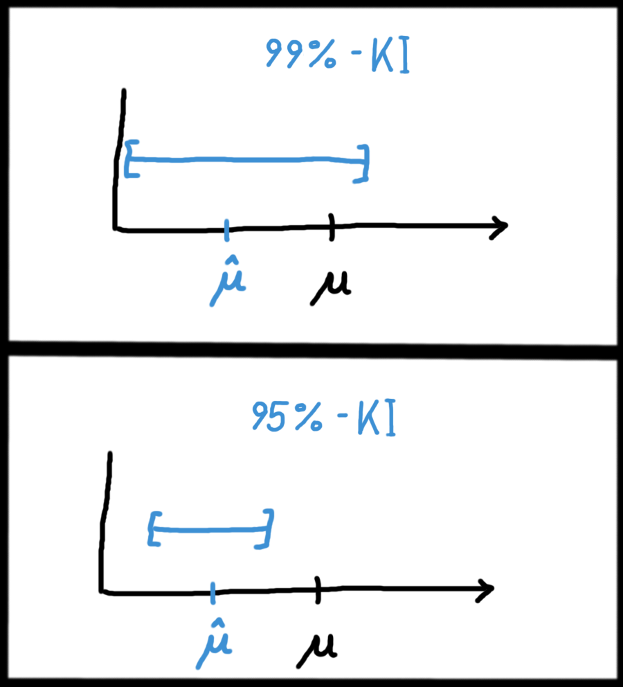

## Was ist ein Konfidenzintervall? {#sec-was-ki}

### Wozu braucht man Konfidenzintervalle?

Im Bereich der *Inferenz*statistik möchten wir ja ganz allgemein gesagt mit Hilfe einer Stichprobe Aussagen über die Grundgesamtheit machen. Im ersten Teil haben wir dazu die *Punktschätzer* (s. Kap. \@ref(sec-wichtigste-parmsch)) kennengelernt: Mit ihnen fassen wir die erhobenen Daten einer Stichprobe so in einen Schätzer zusammen (z.B. in ihren Mittelwert), um damit das Verhalten eines Merkmals in der Grundgesamtheit zu schätzen.

In Kapitel \@ref(sec-wat-parameter) haben wir hierfür ein Beispiel kennengelernt: Wir sind auf dem Oktoberfest, und möchten wissen ob in die Krüge systematisch zu wenig Bier gefüllt wird. Dazu bestellen wir uns 10 Maß Bier, und erhalten z.B. den Stichprobenmittelwert 962ml. Wir *wissen*, dass der Mittelwert *in der Stichprobe* bei 962ml liegt, aber den Mittelwert *der Grundgesamtheit*, also unter allen Krügen auf dem Oktoberfest, können wir nur *schätzen*. Und unsere beste Schätzug dafür sind eben diese 962ml aus der Stichprobe.

Der Punktschätzer oder Parameterschätzer ist hierbei aber nur der erste Schritt: Wir haben lediglich die Frage beantwortet: "Wieviel Bier ist schätzungsweise im Durchschnitt im Krug?". Einige andere wichtige Fragen können wir aber noch nicht beantworten:

- Wie präzise ist diese Schätzung von 962ml?
- In welchem *Bereich* liegt der wahre Mittelwert höchstwahrscheinlich?
- Kann es denn sein, dass der gesamte/wahre Mittelwert auch 950ml ist? Kann es sogar sein, dass in Wirklichkeit im Mittel doch 1000ml in die Krüge gefüllt wird, aber wir in dieser Stichprobe einfach nur Pech hatten?

Diese Fragen kann ein Punktschätzer nicht beantworten - aber ein *Intervallschätzer* kann das!

### Was ist ein Konfidenzintervall?

Die folgende Unterscheidung ist zentral für das Verständnis von Konfidenzintervallen:

- Mit der Stichprobe schätzen wir einen Parameter, zum Beispiel \(\hat{\mu}\)
- Der *wahre* Parameter \(\mu\) in der Grundgesamtheit ist dann zwar in der Nähe von \(\hat{\mu}\), aber quasi nie genau gleich.

Den wahren Parameter \(\mu\) können wir also nie exakt bestimmen, aber wir können ihn quasi "einzäunen" - also einen Bereich bestimmen, in dem er ziemlich sicher liegt.

Dieses "ziemlich sicher" müssen wir natürlich definieren. Wollen wir zu 90% sicher sein, oder zu 95%? Vielleicht sogar 99%? In der Statistik wandeln wir diese Zahl immer in ihre Gegenwahrscheinlichkeit um, denn wir arbeiten lieber mit Irrtumswahrscheinlichkeiten statt Überdeckungswahrscheinlichkeiten. Wenn wir uns also zu 95% sicher sein wollen, dass der wahre Parameter in einem bestimmten Intervall liegt, bedeuetet das ja ebenso, dass er zu 5% *nicht* dort drin liegt.

Diese Irrtumswahrscheinlichkeit, oder *Konfidenzniveau*, ist eine Dezimalzahl, die wir mit \(\alpha\) bezeichnen. Wenn wir einen Bereich berechnen möchten, in dem der wahre Parameter mit 95% Sicherheit liegt, dann ist unser Niveau eben 5%, also \(\alpha = 0.05\).

### Konfidenzintervalle werden auch nur geschätzt

Abbildung \@ref(fig:konfidenzintervall) veranschaulicht ein Beispiel: Es gibt einen wahren Mittelwert \(\mu\) in der Grundgesamtheit - den kennen wir aber in der Realität nicht! Er ist hier nur eingezeichnet, um das Prinzip eines KIs zu veranschaulichen. Wir schätzen nun zuerst mit einem üblichen Parameterschätzer den Mittelwert \(\hat{\mu}\). Als nächstes schätzen wir die obere und untere Grenze des KIs, und zwar wieder mit einer Schätzfunktion, genau wie beim Mittelwert einen Schritt vorher.

(ref:konfidenzintervall-caption) In dieser Grafik sind zwei verschiedene Konfidenzintervalle berechnet und visualisiert worden: Das obere ist ein 99%-KI, also mit einer Irrtumswahrscheinlichkeit von nur 1%. Da wir uns hier sehr sicher (nämlich 99% sicher) sein wollen, dass der wahre Parameter in diesem KI liegt, muss das KI natürlich auch breiter sein, um einen Irrtum unwahrscheinlicher zu machen. Das untere KI ist im Gegensatz dazu "nur" ein 95%-KI, also mit einer Irrtumswahrscheinlichkeit von 5%. In diesem Beispiel ist sogar der unwahrscheinliche Fall eingetreten, dass der wahre Mittelwert \(\mu\) außerhalb des KIs liegt. Das kann natürlich nie komplett ausgeschlossen werden, sondern immer nur durch das Konfidenzniveau \(\alpha\) eingeschränkt werden.

```{r konfidenzintervall, fig.cap="(ref:konfidenzintervall-caption)"}

```

Das Thema "Was ist eine Schätzfunktion?" haben wir im Rahmen der Parameterschätzer in Kapitel \@ref(sec-schaetzfunktionen) bereits besprochen. Ganz knapp gesagt ist eine Schätzfunktion eine Formel, die die Daten der erhobenen Stichprobe auf eine geeignete Art zusammenfasst.

Ein Konfidenzintervall (kurz: KI) wird nun, genauso wie der Parameterschätzer einen Schritt davor, mit Hilfe von Schätzfunktionen erstellt. Das KI wird also durch eine Formel (bzw. zwei Formeln) berechnet, die die Daten in zwei Werte zusammenfassen: die obere sowie die untere Grenze des Intervalls.

### Wie schätzt man ein Konfidenzintervall?

Das zentrale Prinzip für alle Konfidenzintervalle ist, dass man zuerst einen Punktschätzer (s. Kap. \@ref(sec-wichtigste-parmsch)) für einen Parameter berechnet, z.B. für den Anteilswert \(p\). Um diesen einzelnen Punkt herum bildet man dann ein Intervall, das meistens symmetrisch um den Parameterschätzer ist, und enger oder breiter ist, abhängig von der Varianz in der Stichprobe sowie des gewünschten Konfidenzniveaus \(\alpha\).

Um Konfidenzintervalle in einer Klausur schnell und sicher berechnen zu können, muss man fit darin sein, Quantile der Normalverteilung (s. Kap. \@ref(sec-tabelle-normalverteilung)) und der t-Verteilung (s. Kap. \@ref(sec-tabelle-t-verteilung)) aus einer Verteilungstabelle ablesen zu können. In der Realität machen das später meistens Statistikprogramme, aber für die Klausur ist der geübte Umgang mit diesen Tabellen von zentraler Bedeutung.

#### Anmerkung {-}

Ich habe in diesem Kapitel die folgende intuitive Erklärung für ein Konfidenzintervall verwendet:

*Ein 95%-KI ist ein Intervall \([a, b]\), in dem der wahre Parameter, z.B. \(\mu\), mit einer Wahrscheinlichkeit von 95% auch tatsächlich liegt.*

*Das heißt: Der wahre Parameter \(\mu\) (den wir ja nicht kennen!) liegt mit einer Wahrscheinlichkeit von 95% im Intervall \([a,b]\).*

Diese Beschreibung ist einfach und einleuchtend, aber mathematisch nicht zu 100% korrekt. Ich finde aber, darüber kann man hinwegschauen, insbesondere im Bereich der einführenden Statistikveranstaltungen. Wenn man es allerdings ganz genau nehmen will, ist die Definition, und somit auch die Interpretation eines KIs minimal anders:

*Ein 95%-KI ist ein Intervall \([a, b]\), das, wenn es sehr häufig mit neuen Stichproben berechnet wird, den wahren Parameter, z.B. \(\mu\), mit einer Wahrscheinlichkeit von 95% auch überdeckt.*

*Das heißt: Ein einzelnes 95%-KI ist mit 95%-iger Wahrscheinlichkeit eines von denen, das den wahren Parameter \(\mu\) beinhaltet.*

Diese Definition ist etwas umständlicher zu verstehen, aber nun formal korrekt. Wie schon erwähnt, ist diese Unterscheidung aber in einführenden Vorlesungen eher unwichtig - das wird (wenn überhaupt) erst viel später mal relevant.
