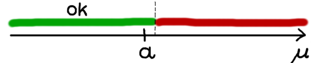

## Vorgehen bei Hypothesentests {#sec-vorgehen-tests}

Das generelle Vorgehen bei einem Hypothesentest ist für alle Varianten gleich:

1. Man stellt seine Hypothesen (Null- und Alternativhypothese) auf
2. Man sucht den für seine Fragestellung passenden Test aus
3. Man legt das Signifikanzniveau \(\alpha\) fest
4. Man sammelt seine Daten
5. Man berechnet mit diesen Daten eine zusammenfassende Kennzahl, die *Prüfgröße* (oder *Teststatistik*)
6. Man bestimmt die Verteilung dieser Prüfgröße
7. Man berechnet entweder den kritischen Bereich oder den p-Wert
8. Man prüft anhand des Ergebnisses aus Schritt 6., ob man die Nullhypothese ablehnt oder beibehält.

Einführend wurden diese acht Schritte schon in Kapitel \@ref(sec-wat-tests) erwähnt. Hier werden diese Schritte nochmal etwas detaillierter beschrieben:

### 1. Hypothesen aufstellen

Zuallererst formuliert man seine Fragestellung, und bringt sie in die Form von zwei Hypothesen. Hier ist wichtig, dass man die Nullhypothese \(H_0\) widerlegen möchte, und nachweisen möchte dass stattdessen die Alternativhypothese, \(H_1\), gilt. Deswegen müssen sich \(H_0\) und \(H_1\) auch widersprechen. In Kapitel \@ref(sec-wat-tests) hatten wir schon das Beispiel mit den Maßkrügen. Dort wollten wir nachweisen, dass auf dem Oktoberfest im Durchschnitt zuwenig Bier in die Maßkrüge gefüllt wird. Unsere Hypothesen werden also wie folgt formuliert:

- \(H_0\): Der durchschnittliche Inhalt eines Maßkruges ist gleich (oder größer) als ein Liter
- \(H_1\): Der durchschnittliche Inhalt eines Maßkruges ist kleiner als ein Liter

Wichtig, wie gesagt, dass unsere Behauptung die wir nachweisen möchten, in der Alternative \(H_1\) formuliert ist. Kapitel \@ref(sec-h0-h1) gibt hier genauer Hilfe.

Stellen wir nun den durchschnittlichen Inhalt eines Maßkruges durch \(\mu\) dar, können wir die Hypothesen kürzer und mathematisch eindeutiger formulieren:

- \(H_0: \; \mu \geq 1 \text{Ltr.}\)
- \(H_1: \; \mu < 1 \text{Ltr.}\)

#### Einseitige und zweiseitige Tests

Es gibt drei mögliche Arten, ein Hypothesenpaar aufzustellen. Sie werden unterteilt in *einseitige* und in *zweiseitige* Tests, je nachdem in welche Richtung die Alternativhypothese zielt:

Einen *einseitigen* Test haben wir gerade eben im Beispiel oben schon gesehen: Wir möchten herausfinden, ob der durchschnittliche Inhalt in einem Maßkrug *kleiner* ist als ein Liter. Die Alternativhypothese geht also nur auf *eine Seite*, nämlich in die Richtung "kleiner als ein Liter". Allgemein sieht das Hypothesenpaar wie folgt aus (s. Abb. \@ref(fig:einseitige-zweiseitige-tests-einseitig-rechts)):

(ref:einseitige-zweiseitige-tests-einseitig-rechts-caption) Einseitiger Hypothesentest, \(H_0: \; \mu \geq a\)

```{r einseitige-zweiseitige-tests-einseitig-rechts, fig.cap="(ref:einseitige-zweiseitige-tests-einseitig-rechts-caption)"}

```

- \(H_0: \; \mu \geq a\)
- \(H_1: \; \mu < a\)

Genauso gibt es einseitige Tests in die andere Richtung. Dann lautet die Alternativhypothese, dass der Parameter *größer* ist als irgendein zuvor festgelegter Wert. Möchte man z.B. Alarm schlagen, wenn die Durchschnittstemperatur irgendwann größer ist als ein bestimmter Wert, dann würde man solch einen Test brauchen. Die Hypothesen lauten dann (s. Abb. \@ref(fig:einseitige-zweiseitige-tests-einseitig-links)):

(ref:einseitige-zweiseitige-tests-einseitig-links-caption) Einseitiger Hypothesentest, \(H_0: \; \mu \leq a\)

```{r einseitige-zweiseitige-tests-einseitig-links, fig.cap="(ref:einseitige-zweiseitige-tests-einseitig-links-caption)"}

```

- \(H_0: \; \mu \leq a\)
- \(H_1: \; \mu > a\)

Bei einem *zweiseitigen* Test möchte man nur herausfinden ob ein Parameter *anders* ist als ein vorher festgelegter Wert - egal ob er nun kleiner oder größer ist. Ein Beispiel wäre ein Test einer Nahrungsmittelfabrik, ob das Füllgewicht in einer Packung konstant den vorgegebenen Wert hält. Man braucht einen Alarm wenn das Gewicht abweicht, egal ob nach oben oder nach unten. Die Hypothesen lauten dann allgemein:

(ref:einseitige-zweiseitige-tests-zweiseitig-caption) Zweiseitiger Hypothesentest, \(H_0: \; \mu = a\)

```{r einseitige-zweiseitige-tests-zweiseitig, fig.cap="(ref:einseitige-zweiseitige-tests-zweiseitig-caption)"}

```

- \(H_0: \; \mu = a\)
- \(H_1: \; \mu \neq a\)

```{exercise, echo=TRUE}

Man möchte durch einen Test nachweisen, dass Berufseinsteiger mit Masterabschluss im Durchschnitt mehr verdienen als Berufseinsteiger mit einem Bachelorabschluss. Dazu befragt man 100 Berufseinsteiger nach ihrem Abschluss und Einstiegsgehalt.

Wie lautet die Null- bzw. Alternativhypothese in diesem Fall?

```
```{solution, echo=TRUE}

Da wir nachweisen wollen, dass Berufseinsteiger mit Masterabschluss ein höheres Einstiegsgehalt haben, muss diese Behauptung in die Alternativhypothese.

\(H_0\): Bachelor- und Masterabsolventen bekommen das gleiche Einstiegsgehalt.

Die Nullhypothese ist das genaue Gegenteil davon. Solange wir keinen Unterschied im Einkommen nachweisen, müssen wir annehmen, dass beide Gruppen dasselbe verdienen:

\(H_1\): Masterabsolventen bekommen ein höheres Einstiegsgehalt als Bachelorabsolventen.

Wenn wir das durchschnittliche Einstiegsgehalt von Bachelorabsolventen mit \(\mu_B\), und das von Masterabsolventen mit \(\mu_M\) bezeichnen, können wir die Hypothesen kürzer formulieren:

\[ H_0: \; \mu_M \leq \mu_B \]
\[ H_1: \; \mu_M > \mu_B \]

```

### 2. Test wählen

Um zu entscheiden, welcher Test der passende ist, muss man erst die Null- und Alternativhypothese aufstellen, und das Skalenniveau aller vorkommenden Variablen (Zielgröße, und evtl. Einflussgröße(n)) festlegen. Die Testwahl ist dann z.B. über eine Tabelle möglich, wie sie in Kapitel \@ref(sec-welchen-test) gezeigt ist. Im Beispiel mit dem Maßkrug oben haben wir eine normalverteilte Zielgröße, und keine Einflussgröße - laut Tabelle passt hier also der Einstichproben-t-Test.

Nachdem man den passenden Test gewählt hat, ergibt sich später auch automatisch, welche Prüfgröße man berechnen muss, und welche Verteilung sie hat.

### 3. Signifikanzniveau festlegen

Eine Hypothese kann nie mit absoluter Sicherheit bestätigt bzw. widerlegt werden, sondern immer nur mit einer gewissen Wahrscheinlichkeit. Es kann also immer passieren, dass wir durch Zufall in unserer Stichprobe viele Maßkrüge mit wenig Bier erhalten, und einen Mittelwert von zum Beispiel \(\bar{x}=940\text{ml}\) berechnen. Wir würden also fälschlicherweise "nachweisen", dass im Mittel zuwenig Bier in die Krüge gefüllt wird, obwohl der echte durchschnittliche Inhalt tatsächlich ein Liter ist.

In statistischer Sprache formuliert heißt das: Wir würden also die Nullhypothese ablehnen, obwohl sie in der Realität wahr ist.

Man muss sich vor Durchführung des Tests auf ein Signifikanzniveau, genannt \(\alpha\), festlegen, das die maximale Wahrscheinlichkeit festlegt, mit der uns so ein Fehler passieren darf. Je sicherer wir mit unserer Entscheidung sein wollen, desto niedriger muss diese Fehlerwahrscheinlichkeit gewählt werden. In den allermeisten Fällen, sowohl in der Praxis als auch in Klausuren, ist dieser Wert festgelegt als \(\alpha = 5\%\).

#### \(\alpha\)- und \(\beta\)-Fehler

Neben dem Fehler, \(H_0\) abzulehnen obwohl sie wahr ist, gibt es eine weitere Fehlentscheidung, die beim Testen passieren kann: Falls tatsächlich im Mittel zuwenig Bier abgefüllt wird, und unser Test dies nicht nachweisen kann. Dann behalten wir die Nullhypothese (genug Bier) bei, obwohl in Wirklichkeit die Alternativhypothese (zuwenig Bier) wahr ist.

Insgesamt können bei einem Test vier Fälle auftreten:

1. **Wir lehnen \(H_0\) ab, also nehmen \(H_1\) an.**
    1. **In Wirklichkeit stimmt \(H_0\)**: Hier lehnen wir \(H_0\) fälschlicherweise ab. Das ist der \(\alpha\)-Fehler, auch Fehler 1. Art genannt. Dieser Fall tritt genau mit einer Wahrscheinlichkeit von \(\alpha\) auf - weil ein Test genau so konstruiert ist. Das Niveau \(\alpha\) regelt also, wie sicher man sich sein kann dass \(H_1\) tatsächlich wahr ist, gegeben man lehnt \(H_0\) auch ab.
    2. **In Wirklichkeit stimmt \(H_1\)**: Alles in Ordnung. \(H_1\) stimmt, und wir nehmen \(H_1\) an.
2. **Wir behalten \(H_0\) bei.**
    1. **In Wirklichkeit stimmt \(H_0\)**: Alles in Ordnung. \(H_0\) stimmt, und wir glauben nicht an \(H_1\).
    2. **In Wirklichkeit stimmt \(H_1\)**: In diesem Fall ist unsere Vermutung wahr (d.h. \(H_1\), die wir ja nachweisen möchten, stimmt), aber durch den Test konnte sie nicht bestätigt werden, da wir \(H_0\) beibehalten. Dies ist der sogenannte \(\beta\)-Fehler, auch Fehler 2. Art genannt. Diese Wahrscheinlichkeit können wir nicht kontrollieren, sie ist abhängig von der Art des Tests und des Signifikanzniveaus \(\alpha\).

### 4. Daten sammeln

Als nächstes erhebt man Daten. Das muss man in einer Klausur natürlich nicht machen, aber in realen Situationen ist die Datenerhebung meist der zeitaufwändigste Schritt.

In unserem Beispiel würden wir aufs Oktoberfest gehen, z.B. zehn Maß Bier bestellen, und deren Inhalt abmessen. Die Ergebnisse könnten so aussehen:

| Bier \(x_i\) | Inhalt (ml) |
| ------------ | ----------- |
| \(x_1\)      | 968         |
| \(x_2\)      | 1001        |
| \(x_3\)      | 987         |
| \(x_4\)      | 995         |
| \(x_5\)      | 1010        |
| \(x_6\)      | 983         |
| \(x_7\)      | 994         |
| \(x_8\)      | 962         |
| \(x_9\)      | 979         |
| \(x_{10}\)   | 965         |

### 5. Prüfgröße berechnen

Nun werden die Daten ausgewertet, und zwar unter der Annahme, dass \(H_0\) gilt, also alles in Ordnung ist, d.h. der durchnittliche Inhalt eines Maßkrugs tatsächlich ein Liter ist.

Um später eine Testentscheidung treffen zu können, muss man aus den Daten eine Kennzahl berechnen, deren Verteilung man kennt (und die in Klausuren meist als Verteilungstabelle in einer Formelsammlung angehängt ist).

Der Test in unserem Fall funktioniert von der Idee her wie folgt: Wir berechnen den durchschnittlichen Inhalt der erhobenen (hihi) Maßkrüge. Dieser ist bei uns \(\bar{x} = 984.4\text{ml}\).

Die Frage, die der Test beantwortet, ist nun: "Angenommen der wahre Durchschnittsinhalt liegt bei 1000ml, ist dieses Ergebnis von 984.4ml noch plausibel genug, dass es durch Zufallsschwankung entstanden sein kann, oder ist es so unplausibel, dass der wahre Mittelwert nicht bei 1000ml, sondern niedriger liegt?"

Wir könnten jetzt natürlich subjektiv sein und sagen: "984ml ist schon niedrig - da ist der Mittelwert bestimmt nicht bei 1000ml." Aber das ist keine klare Entscheidungsregel. Was würden wir bei einem Mittelwert von 985ml sagen? Bei 990ml? Bei 995ml?

Der Test verpackt diese Frage nun in eine mathematische Formel und eine Entscheidungsregel. Es wird dazu eine *Prüfgröße* (oder *Teststatistik*) berechnet, die in diesem Fall eine standardisierte Version des Mittelwerts \(\bar{x}\) ist:

\[ T = \sqrt{n} \frac{\bar{x} - \mu_0}{s} \]

Die ganzen Standardisierungen in dieser Formel sind dazu da, damit dem Test egal ist,

- wie groß die Stichprobe ist (da mit \(\sqrt{n}\) multipliziert wird),
- welchen Mittelwert wir als Nullhypothese festgelegt haben (da die 1000ml, also \(\mu_0\), wieder abgezogen werden),
- welche Streuung die Daten aufweisen (da wir durch die Standardabweichung der Stichprobe, \(s\) teilen).

In unserem Beispiel bestimmen wir \(\bar{x} = 984.4\text{ml}\) und \(s= 16.057\). Den Wert \(\mu_0=1000\) nehmen wir aus der Nullhypothese. Unsere Prüfgröße \(Z\) ist somit

\[ T = \sqrt{n} \frac{\bar{x} - \mu_0}{s} = \sqrt{10} \frac{984.4 - 1000}{16.057} = -3.072\]

### 6. Verteilung der Prüfgröße bestimmen

Um bestimmen zu können, welche Werte für die Prüfgröße "normal", also noch akzeptabel sind, muss man wissen, welche Verteilung diese Prüfgröße hat. Die Prüfgröße bei einem Binomialtest hat z.B. die Verteilung \(B(n,p)\), also eine Binomialverteilung mit n = "Anzahl der Beobachtungen" und p = "Wahrscheinlichkeit in der Nullhypothese". Bei einem t-Test hat die Prüfgröße dann eine \(t(n-1)\)-Verteilung, d.h. eine t-Verteilung mit \(n-1\) Freiheitsgraden.

Ein Test ist meistens so konzipiert, dass die Verteilung "einfach ist", z.B. eine Normalverteilung mit Mittelwert 0 und Standardabweichung 1. Der Grund dafür ist, dass es dann reicht, in Büchern, Klausuren usw. nur *eine* Tabelle für die Normalverteilung abzubilden, nämlich die mit Mittelwert 0 und Standardabweichung 1.

Und diese Tatsache ist übrigens auch der Grund dafür, warum wir die Prüfgröße etwas umständlicher berechnen. Wir könnten als Prüfgröße ja einfach den Mittelwert der Daten nehmen. Stattdessen standardisieren wir ihn, indem wir \(\mu_0\) abziehen und durch \(s\) teilen. Der Vorteil dieser Variante ist nun, wie gerade beschrieben, dass die Prüfgröße in eine Verteilung "gezwängt" wird, für die wir eine Tabelle vorhanden haben.

### 7. Test abschließen: Zwei Möglichkeiten

Nun gibt es zwei Möglichkeiten, die Frage zu beantworten, ob unser Mittelwert noch plausibel ist oder nicht:

#### Von Hand: Über die kritische Schranke und Verteilungstabelle

Bei der ersten Möglichkeit, die Testentscheidung zu treffen, bestimmen wir einen **kritischen Bereich**. Wenn unsere Prüfgröße dann *nicht* in diesem kritischen Bereich liegt, nehmen wir die Maßkrüge als korrekt befüllt an. Wenn die Prüfgröße aber *in dem kritischen Bereich liegt*, haben wir einen Nachweis dafür, dass in Wirklichkeit weniger als 1000ml in einen Maßkrug gefüllt werden.

Der kritische Bereich ist ein fester Bereich für eine bestimmte Testart, der, im Falle dass \(H_0\) gilt, von der Prüfgröße nur sehr selten (nämlich mit einer Wahrscheinlichkeit von \(\alpha\)) erreicht wird. Falls die Prüfgröße nun doch in diesem kritischen Bereich liegt, haben wir einen starken Grund, eher an \(H_1\) zu glauben.

Bei einem einseitigen Test liegt dieser Bereich nur auf einer Seite, es gibt eine *Schranke*, und je nach Testrichtung wird geschaut, ob die Prüfgröße über oder unter dieser Schranke liegt. Bei einem zweiseitigen Test besteht der kritische Bereich aus zwei Gebieten, es gibt also zwei Schranken, je eine links und rechts, und es wird geschaut, ob die Prüfgröße innerhalb der zwei Schranken liegt, oder (in irgendeine Richtung) außerhalb.

Man kann die kritische Schranke recht problemlos an einer Verteilungstabelle ablesen. So hat man das früher, vor dem Computerzeitalter gemacht, und so macht man es in Klausuren auch immernoch. In der Praxis ist es aber inzwischen verbreiteter, mit p-Werten zu arbeiten:

#### Per Computer: mit dem p-Wert

Alternativ können wir aus der Prüfgröße auch einen **p-Wert** berechnen. Dieser Wert sagt uns, wie wahrscheinlich es ist, unter Annahme einer korrekten Befüllung von durchschnittlich 1000ml eine so extreme Abweichung vom Mittelwert \(\mu_0=1000\text{ml}\) zu erhalten.

Wenn diese Wahrscheinlichkeit nun sehr gering ist (genauer: Wenn sie unter dem festgelegten Signifikanzniveau \(\alpha\) liegt), hat man wieder einen Nachweis dafür, dass in Wirklichkeit weniger als 1000ml in einen Maßkrug gefüllt werden. Liegt der p-Wert aber darüber, konnte man das nicht nachweisen und behält die Nullhypothese bei.

### 8. Testentscheidung treffen

Nun hat man alle Werte berechnet, um seine Testentscheidung treffen zu können. Falls man sich in Schritt 7. für den kritischen Bereich entschieden hat, betrachten wir zwei Werte: die Prüfgröße und den kritischen Bereich. Man sieht einfach nach, ob die Prüfgröße innerhalb oder außerhalb dieses Bereichs liegt. Liegt sie außerhalb, dann ist "alles in Ordnung", also behalten wir die Nullhypothese, aber liegt sie innerhalb des kritischen Bereichs, dann haben wir genug Hinweise dafür gefunden, um die Alternativhypothese annehmen zu können.

Wenn man sich in Schritt 6. für den p-Wert entschieden hat, ist der letzte Schritt etwas einfacher: Man betrachtet zwei andere Werte: den p-Wert sowie das Signifikanzniveau \(\alpha\). Liegt der p-Wert über dem Signifikanzniveau \(\alpha\), behalten wir die Nullhypothese, aber falls der p-Wert kleiner ist als \(\alpha\), haben wir genug Hinweise dafür gefunden, um die Alternativhypothese annehmen zu können.