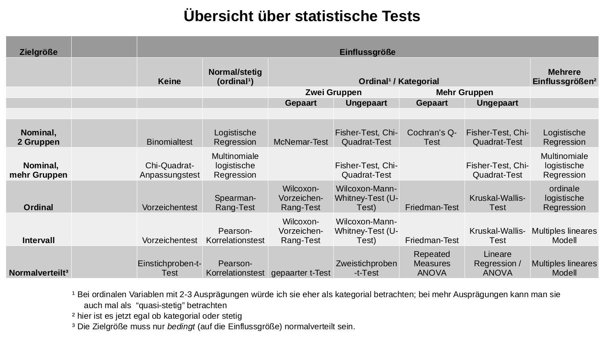

## Welchen statistischen Test soll ich wählen? {#sec-welchen-test}

*Dieses Kapitel basiert auf dem allgemeinen Vorgehen bei Hypothesentests in Kapitel \@ref(sec-vorgehen-tests). Ich empfehle, Kapitel \@ref(sec-vorgehen-tests) vorher zu lesen und zu verstehen; das macht den Lesefluss und das Verständnis dieses Kapitels hier sehr viel einfacher.*

#### Die Tabelle zur Testwahl {-}

Die Tabelle in Abbildung \@ref(fig:WelchenTest) zeigt dir, welcher der geeignete Test für ein bestimmtes Skalenniveau der Ziel- und Einflussgrößen ist.

Die Erklärung dazu findest du im Rest dieses Kapitels. Ganz am Ende gibt es noch ein paar Beispielaufgaben, die die Verwendung dieser Tabelle demonstrieren.

(ref:WelchenTest-caption) Bestimme zuerst die Art deiner Zielgröße, danach die Art deiner Einflussgröße. In dieser Tabelle findest du dann die passende Methode zur Analyse deiner Daten.

```{r WelchenTest, fig.cap="(ref:WelchenTest-caption)"}

```

**Eine kurze Warnung**: Für viele Situationen ist die Wahl des passenden Tests sehr einfach, und es gibt quasi nur eine Möglichkeit. In manchen Fällen gibt es aber auch mehrere passende Tests, die man anwenden könnte. Wenn es z.B. zwei mögliche Tests gibt, dann hat vielleicht einer den Vorteil, dass er weniger Annahmen an die Daten treffen muss (z.B. Normalverteilung), und der andere hätte dafür den Vorteil, dass er einen tatsächlich vorhandenen Effekt besser erkennen kann.

In dieser Tabelle habe ich Tests gesammelt, die für einen bestimmten Datensatz in meinen Augen entweder die einfachste, oder die beste Lösung sind - wichtig ist, im Hinterkopf zu behalten, dass das nicht heißt, andere Tests sind automatisch falsch oder schlechter.

#### Die Erklärung zur Tabelle {-}

Es gibt eine ganze Menge an Testverfahren, die auf den ersten Blick gerne mal überwältigend sind. Welchen Test man in einer bestimmten Situation genau wählen muss, hängt von einigen Fragen ab, die in jeder Situation erneut beantwortet werden müssen.

Eine Google-Bildersuche für "which statistical test" bzw. "welcher statistische test" liefert viele verschiedene Diagramme, die unterschiedlich detailliert sind, und auch unterschiedlich beginnen. Manche sind zielorientiert, d.h. die erste Frage lautet "Was möchte ich erreichen?", und die möglichen Ziele sind z.B. "Einen Mittelwert mit einem hypothetischen Wert vergleichen". Andere Diagramme orientieren sich an den Eigenschaften der Daten. Hier beginnt man mit der Frage "Welcher Art ist die Zielgröße?", ob sie z.B. nominal oder stetig ist. Das ist für den Anfang in meinen Augen leichter, weswegen wir uns diese zwei Fragen stellen:

#### 1.) Welcher Art ist die Zielgröße? {-}

Die Zielgröße ist das Merkmal, das sich durch die Wirkung von Einflussgrößen verändern wird. Sie ist abhängig von den Einflussgrößen. Möchte ich z.B. die blutdrucksenkende Wirkung eines neuen Medikaments nachweisen, dann ist meine Zielgröße der Blutdruck, und die Einflussgröße ist das Medikament (man hätte z.B. zwei Gruppen, einmal Personen ohne Medikament und einmal Personen mit Medikament).

Bestimme nun, von welcher Art (welches *Skalenniveau*, s. Kap. \@ref(merkmals-und-skalentypen)) deine Zielgröße ist:

1. **Nominal?** Das heißt, sie ist eine Kategorie mit zwei oder mehr möglichen Ausprägungen. Ein Beispiel wäre, dass man untersuchen möchte, welche Partei eine bestimmte Person wählen wird.
2. **Ordinal?** Das ist der Fall, wenn man z.B. eine Fragebogenantwort mit den Werten "stimme nicht zu" / "neutral" / "stimme zu" untersucht.
3. **Stetig und intervall- oder verhältnisskaliert?** Stetige Zielgrößen sind z.B. das Einkommen einer Person, oder die Außentemperatur. Man kann hier oft auch Zähldaten mit aufnehmen, wenn die Skala "weit genug" reicht. Zum Beispiel kann man "Anzahl der Anrufe in einer Telefonzentrale" sehr gut verwenden, da es da wohl um größere und breit gestreute Zahlen geht, vielleicht 1000 bis 5000 Anrufe. Aber "Anzahl Autos in einem Haushalt" wäre ein anderes Extrem, da die Antworten hier wohl meist im Bereich von 0 bis 2 liegen. Dann wäre es vielleicht sogar besser, die Zielgröße als ordinal zu betrachten.
4. **Normalverteilt?** Eine stetige Zielgröße die (annähernd) durch eine Normalverteilung beschrieben werden kann. Das klassische Beispiel hierfür ist die Körpergröße einer Person. Eine normalverteilte Zielgröße ist von Vorteil, denn erstens macht das das Testverfahren oft ein bisschen einfacher als bei nicht-normalverteilten Daten, und zweitens können diese Tests einen tatsächlich vorhandenen Effekt schneller, d.h. mit einer geringeren Stichprobengröße, erkennen. Man sagt, diese Tests haben eine höhere *Power* (oder *Güte*).

#### 2.) Wie sehen eventuelle Einflussgrößen aus? {-}

Als zweites müssen wir bestimmen, ob wir überhaupt eine Einflussgröße haben, und wenn ja, welchen Skalentyp sie hat.

*Wichtig*: Bei den Einflussgrößen ist es egal, welche Verteilung sie haben. Ob also eine Einflussgröße normalverteilt ist oder nicht, ist für das Testverfahren egal.

1. **Keine Einflussgröße?** Dann interessiert man sich meist dafür, ob in der Zielgröße die Häufigkeiten in den verschiedenen Ausprägungen eine bestimmte Verteilung (z.B. 50/50) haben.
2. **Eine stetige (evtl. ordinale) Einflussgröße, oder Zähldaten?** Wie eben gesagt, es ist egal welche Verteilung die Einflussgröße dann hat. Alle stetigen Variablen oder Zähldaten fallen in diese Kategorie. Bei ordinalen Variablen kann man sich entweder für diese oder für die nächste Kategorie (ordinale oder kategoriale Einflussgrößen) entscheiden. Ganz korrekt wäre es, die nächste Gruppe dafür zu verwenden. Aber ordinale Variablen werden auch oft als stetig betrachtet, was die Analyse etwas leichter macht, aber technisch nicht ganz korrekt ist.
3. **Ordinale oder kategoriale Einflussgröße?** Dann gibt es zwei Fallunterscheidungen zu beachten:  
    1. Hat die Einflussgröße nur *zwei* mögliche Gruppen?  
        1. Sind die beiden Gruppen *gepaart* (man sagt auch: *verbunden*)? Das ist meistens eine Vorher-Nachher-Untersuchung an denselben Objekten. Man befrägt z.B. *eine* Gruppe von Patienten vor der Medikamentengabe, und dann dieselben Patienten nochmal nach der Medikamentengabe. Die zwei Gruppen wären dann "vorher" und "nachher", aber es handelt sich jeweils um dieselben Patienten.
        2. Sind die beiden Gruppen *unabhängig*? Wenn z.B. eine Gruppe Handwerker und eine andere Gruppe Büroangestellte befragt werden, sind diese zwei Gruppen unabhängig.
    2. Hat die Einflussgröße *mehrere* mögliche Gruppen?
        1. Sind die Gruppen *gepaart*? Ein Beispiel für diese Situation wäre, wenn man einer Gruppe Patienten eine bestimmte Therapie gibt, und für dieselben Personen dann zu fünf verschiedenen Zeitpunkten ("Gruppe" 1 bis 5) dann medizinische Werte erhebt.
        2. Sind die Gruppen *unabhängig*? Das wäre z.B. der Fall bei der Einflussgröße "Automarke einer Person".
4. **Gibt es mehrere Einflussgrößen?** In diesem Fall ist egal, welcher Art sie sind. Es läuft zwangsläufig auf eine Regression hinaus, in der beliebige Kombinationen von Einflussgrößen untersucht werden können.

```{exercise, echo=TRUE}

Bestimme für alle folgenden Fälle, welcher Test jeweils angebracht ist. Identifiziere zuerst die Zielgröße und bestimme ihre Art (nominal, ordinal, etc.). Dann bestimme, ob es eine oder mehrere Einflussgrößen gibt, und welcher Art sie sind. Benutze die Tabelle dann um den passenden Test zu finden.

(Solange es in der Aufgabe nicht besonders angemerkt ist, kannst du nicht von einer Normalverteilung der Variablen ausgehen.)

- 1a) Ein Wissenschaftler entwickelte eine Audio-CD mit einer Rauchentwöhnungsmethode. In einer Studie mit 30 Personen hat er vor Therapiebeginn jeweils die tägliche Anzahl an Zigaretten notiert. Zwei Monate nach der Therapie hat er für dieselben Personen nochmal notiert, wieviele Zigaretten sie nun täglich rauchen. Er möchte wissen ob sich die durchschnittliche tägliche Anzahl durch seine Methode verringert hat.
    - 1b) Welcher Test wäre angebracht, wenn die Anzahl der Zigaretten nicht nur vor und nach der Therapie notiert wurde, sondern zu vier verschiedenen Zeitpunkten?
- 2a) Der örtliche Nahverkehr vermutet, dass 5% seiner Fahrgäste schwarzfahren. Er prüft die Tickets von 800 Fahrgästen und ermittelt 52 Schwarzfahrer. Mit welchem Test überprüft man, ob der Anteil signifikant gestiegen ist?
    - 2b) Nun möchte der Nahverkehr eine erweiterte Studie durchführen: Er vermutet 5% Schwarzfahrer, 55% der Gäste mit Langzeitkarten wie z.B. Monatsticket, und 40% der Gäste mit Einzeltickets. Mit welchem Test wird diese Hypothese überprüft?
- 3a) Eine Bank will herausfinden, was die Wahrscheinlichkeit beeinflußt ob ein Kredit zurückbezahlt wird oder nicht. Als Einflussgrößen betrachtet sie das Alter einer Person, die angefragte Kredithöhe, und den Jobtyp (arbeitslos, angestellt, oder selbstständig).
    - 3b) Die Bank möchte jetzt auch wissen, ob die durchschnittliche angefragte Kredithöhe bei Männern und Frauen unterschiedlich hoch ist.
    - 3c) Was wäre, wenn bei Aufgabe 3b) statt dem Geschlecht der Jobtyp (arbeitslos/angestellt/selbstständig) als Einflussgröße erhoben wird?
- 4) Für eine Abschlußarbeit muss eine Studentin untersuchen, ob der Tagesumsatz eines Bekleidungsgeschäfts von der Außentemperatur (in °C) beeinflusst wird. Wenn man den Tagesumsatz vereinfachend als normalverteilt betrachten kann, welcher Test wäre dann die beste Wahl?
- 5) Haben Linkshänder einen höheren IQ als Rechtshänder? Wir können beim IQ von einer Normalverteilung ausgehen.
- 6) Ein Forschungsinstitut untersucht: Unterscheidet sich das Wählerverhalten (d.h. die gewählte Partei) zwischen Menschen mit verschiedenen Bildungsabschlüssen?
- 7a) Mit welchem Test kann man überprüfen, ob bei Autos die Automarke einen Einfluss auf die durchschnittliche Geschwindigkeit auf der Autobahn hat? Gehe bei der Geschwindigkeit von einer Normalverteilung aus.
    - 7b) Wie verändert sich der Test, wenn zusätzlich noch das Alter und das Geschlecht des Fahrers als Einflussgrößen mit aufgenommen werden?
- 8a) Ist der Median der Noten in einer Klausur 3,0 oder ungleich 3,0?
    - 8b) Ist die Note in einer Klausur abhängig davon, wie lange (in Stunden) ein Student für die Prüfung gelernt hat?
- 9a) Ein neues Medikament gegen Bluthochdruck wird getestet. Bei 45 Personen wird vor und nach Medikamentengabe ermittelt, ob sie Bluthochdruck haben (ja/nein). Mit welchem Test überprüft man eine Wirkung des Medikaments?
    - 9b) Angenommen, statt den zwei Kategorien Bluthochdruck ja bzw. nein wird nun der tatsächliche Blutdruck gemessen (er kann als normalverteilt betrachtet werden). Welcher Test ist nun angebracht?

```

```{solution, echo=TRUE}


- 1a) Die Zielgröße ist hier die Anzahl an Zigaretten pro Tag. Das sind Zähldaten, also ist die Zielgröße ordinalskaliert (man kann sie evtl. auch als intervallskaliert betrachten). Die Einflussgröße ist der Zeitpunkt (vorher/nachher), also eine nominale Variable mit zwei Gruppen. Die beiden Gruppen sind *gepaart*, denn es handelt sich um *verbundene Messungen*: es wurden vor bzw. nach der Therapie dieselben Personen befragt. Der passende Test ist hier laut Tabelle also der **Wilcoxon-Vorzeichen-Rang-Test**.
    - 1b) Hier ändert sich im Vergleich zu 1a) nur die Tatsache, dass die Einflussgröße nicht mehr nur zwei, sondern mehrere Gruppen hat. Wir verwenden hier also laut Tabelle nun den **Friedman-Test**.
- 2a) Hier möchte man einen einfachen Anteil testen. Es gibt eine nominale Zielgröße mit zwei Gruppen, und keine Einflussgröße. Hier ist ein **Binomialtest** der richtige.
    - 2b) Nun gibt es immernoch keine Einflussgröße, aber die Zielgröße hat nun mehrere Gruppen. Hier verwendet man einen **Chi-Quadrat-Anpassungstest**.
- 3a) Hier hat man eine nominale Zielgröße mit zwei Kategorien, und mehrere Einflussgrößen, stetig und kategorial. Eine **logistische Regression** ist hier passend.
    - 3b) Die Zielgröße ist stetig, aber nicht normalverteilt. Die Einflussgröße ist kategorial mit zwei Gruppen. Da die zwei Gruppen (Männer und Frauen) nicht gepaart sind (wie es z.B. bei vorher/nachher-Gruppen der Fall wäre), nimmt man hier am besten einen **Wilcoxon-Mann-Whitney-U-Test**.
    - 3c) Bei mehr als zwei Gruppen verwendet man statt dem Wilcoxon-Mann-Whitney-U-Test den **Kruskal-Wallis-Test**.
- 4) Bei zwei stetigen bzw. normalverteilten Variablen kann man die Korrelation zwischen ihnen berechnen, und den **Pearson-Korrelationstest** durchführen. Es ginge alternativ auch ein lineares Modell (d.h. **lineare Regression**).
- 5) Die Zielgröße ist normalverteilt, und die Einflussgröße ist kategorial mit zwei Gruppen. Hier passt ein **Zweistichproben-t-Test**.
- 6) Die Zielgröße ist die gewählte Partei, also eine kategoriale Variable mit mehreren Gruppen. Die Einflussgröße, der Bildungsabschluss, ist ebenso kategorial. Hier passt daher ein **Chi-Quadrat-Test**. Der **Fisher-Test** ist auch eine Alternative. Er wird in Fällen mit weniger Daten verwendet, z.B. bei weniger als 1000 Beobachtungen, oder wenn in mindestens einer der Zellen der Kreuztabelle weniger als 5 Beobachtungen gelandet sind.
- 7a) Hier wird der Einfluss einer kategorialen Einflussgröße auf eine normalverteilte Zielgröße untersucht. Eine **ANOVA** ist das richtige Werkzeug dafür, als Alternative ginge auch ein **lineares Regressionsmodell**.
    - 7b) Bei mehreren Einflussgrößen weicht man dann auf die **multiple lineare Regression** aus.
- 8a) Hier testet man eine ordinale Zielgröße (ohne Einflussgrößen) auf den Median. Ein **Vorzeichentest** kann das testen.
    - 8b) Die Zielgröße ist immernoch ordinal, aber jetzt kommt eine stetige Einflussgröße dazu. Man kann die Spearman-Rangkorrelation dieser zwei Variablen berechnen, und dann den **Spearman-Test** ausführen, um auf einen Zusammenhang zu testen.
- 9a) Es handelt sich um eine kategoriale Zielgröße mit zwei Gruppen (Bluthochdruck ja/nein). Die Einflussgröße hat ebenso zwei Gruppen, und sie ist gepaart, denn dieselben Personen werden in der Gruppe "vorher" bzw. "nachher" gemessen. Es bietet sich also der **McNemar-Test** an.
    - 9b) Wenn die Zielgröße normalverteilt statt kategorial ist, führt man einen **gepaarten t-Test** aus.


```