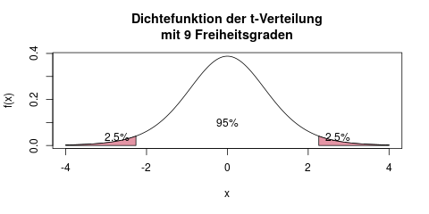
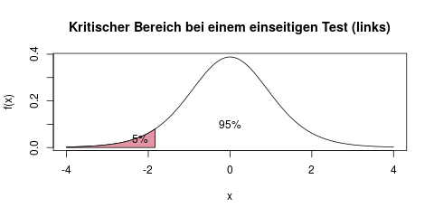
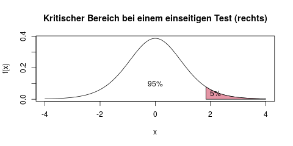

### Einstichproben-\(t\)-Test: Einzelnen Mittelwert testen {#sec-einstichproben-t-test}

#### Wann verwendet man einen Einstichproben-t-Test? {-}

Der t-Test ist wohl der bekannteste und am häufigsten verwendete Hypothesentest. Er kommt immer dann zum Einsatz, wenn man Hypothesen prüfen möchte, die Aussagen über einen *Mittelwert* treffen. Zwei Beispiele:

- "Die Bahn kommt an diesem Bahnhof im Mittel mindestens 3 Minuten zu spät."
- "Der durchschnittliche Blutdruck von Rauchern ist höher als der von Nichtrauchern"

Im zweiten Beispiel, das mit dem Blutdruck, haben wir zwei Gruppen, müssen also zwei Stichproben erheben: Eine von einigen Rauchern, und eine zweite von einigen Nichtrauchern. Das wäre ein Zweistichproben-t-Test, dieser Fall wird in Kapitel \@ref(sec-zweistichproben-t-test) behandelt.

Der einfachere Spezialfall unter den t-Tests ist nun der Einstichproben-t-Test. Er wird immer dann verwendet, wenn man *nur eine Stichprobe (d.h. keine Gruppen)* hat, also nur einen einzelnen Mittelwert testen möchte - so wie es im ersten Beispiel, mit der Verspätung der Bahn, der Fall war.

Dieser Test heißt t-Test, weil die Prüfgröße eine t-Verteilung (s. Kap. \@ref(sec-t-verteilung)) hat.

#### Grundlagen {-}

Zum Einstieg sollte man sich zu Beginn die folgenden beiden Kapitel durchlesen:

- Was sind Hypothesentests? (Kap. \@ref(sec-wat-tests))
- Vorgehen bei Hypothesentests (Kap. \@ref(sec-vorgehen-tests))

In ihnen beschreibe ich ganz allgemein die Schritte, mit denen man einen Hypothesentest durchführt. Dadurch werden die einzelnen Teile in diesem Kapitel verständlicher.

Außerdem macht es Sinn, das Kapitel \@ref(sec-binomialtest) zum Binomialtest zu lesen, da ich dort noch etwas ausführlicher beschrieben habe, wie man die allgemeinen Prinzipien auf einen speziellen Test anwendet. Falls hier etwas nur kurz beschrieben wird, dann ist es im Kapitel \@ref(sec-binomialtest) evtl. ausführlicher verständlicher erklärt worden.

#### 1. Hypothesen aufstellen {-}

Beim t-Test gibt es, genau wie beim Binomialtest, drei verschiedene Möglichkeiten, seine Hypothesen zu formulieren. Welche Variante man verwenden muss, hängt von der Fragestellung ab, die man untersucht. Dazu drei Beispiele:

1. Ein misstrauischer Oktoberfestbesucher möchte nachweisen, dass in den Maßkrügen im Durchschnitt weniger als 1 Liter Bier eingeschenkt wurde. Die Alternativhypothese muss also sagen, dass der Mittelwert kleiner als 1000ml ist. Insgesamt also:  
    - \(H_0: \mu \geq 1000ml\)
    - \(H_1: \mu < 1000ml\)
2. Ein Dorf behauptet, dass seine Bewohner im Mittel über 100 Jahre alt werden. Um das nachzuweisen, muss der Fall "erreichtes Lebensalter (\(\mu\)) ist über 100 Jahre" in die Alternativhypothese \(H_1\) (warum das so ist, wird in Kapitel \@ref(sec-h0-h1) beschrieben). Die Hypothesen lauten also:  
    - \(H_0: \mu \leq 100\)
    - \(H_1: \mu > 100\)
3. In einer Fabrik werden Frühstücksmüslis in Packungen zu 750g abgefüllt. Die Qualitätssicherung überprüft, dass in eine Packung im Durchschnitt weder zu wenig noch zu viel Müsli gefüllt wird. Die Nullhypothese bezeichnet also den Normalzustand, \(\mu = 750g\), und die Alternativhypothese geht nun in beide Richtungen - insgesamt also:  
    - \(H_0: \mu = 750g\)
    - \(H_1: \mu \neq 750g\)

Im restlichen Kapitel verwende ich das dritte Beispiel mit den Müslipackungen, und zeige am Ende noch kurz, welche Veränderungen man in den anderen beiden Fällen vornehmen müsste.

#### 2. Test wählen {-}

Um die Abfolge der 8 Schritte nicht zu verändern, die wir in den Kapiteln \@ref(sec-wat-tests) und \@ref(sec-vorgehen-tests) aufgestellt haben, nehme ich hier den 2. Schritt auch mit auf. Es ist natürlich schon klar, dass wir einen Einstichproben-t-Test verwenden werden.

#### 3. Signifikanzniveau festlegen {-}

Wie in den vorherigen Kapiteln schon beschrieben, legt das Signifikanzniveau die Wahrscheinlichkeit fest, mit der man einen bestimmten Fehler macht, nämlich die fälschliche Entscheidung dass die Alternativhypothese gilt, obwohl in Wirklichkeit die Nullhypothese wahr ist.

Allgemeiner Konsens ist hier ein Wert von 5%, also \(\alpha = 0.05\). In besonders kritischen Fragestellungen, z.B. solchen, die die menschliche Gesundheit betreffen, muß das Signifikanzniveau oft niedriger gewählt werden, der Test wird dann *konservativer*. Hier wählt man z.B. \(\alpha = 0.01\).

Für unsere Beispielaufgabe nehmen wir das übliche Signifikanzniveau von \(\alpha = 0.05\).

#### 4. Daten sammeln {-}

In einer Klausur oder Übung gibt es die Daten natürlich meist schon. Wenn man sie aber selber sammelt, müssen die Daten für einen Einstichproben-t-Test eigentlich nur eine lange Liste von Dezimalzahlen sein. Wir fassen diese Daten dann im 5. Schritt zusammen in zwei Werte, in unserem Beispiel erstens *den Mittelwert der Daten*, \(\bar{x}\), und zweitens *die Standardabweichung*, \(s\). Diese beiden Werte brauchen wir für den Einstichproben-t-Test.

In unserem Beispiel betrachten wir zehn Müslipackungen und wiegen ihren exakten Inhalt ab. Wir erhalten die folgenden Messwerte:

| Packung \(x_i\) | Inhalt (g) |
| --------------- | ---------- |
| 1               | 749        |
| 2               | 755        |
| 3               | 757        |
| 4               | 751        |
| 5               | 743        |
| 6               | 750        |
| 7               | 752        |
| 8               | 750        |
| 9               | 757        |
| 10              | 757        |

#### 5. Prüfgröße berechnen {-}

Die Prüfgröße beim t-Test heißt \(T\), und setzt sich aus vier Zahlen zusammen:

- Der Mittelwert der gemessenen Werte, \(\bar{x}\). Der Mittelwert der zehn Packungen bei uns ist 752.1g.
- Die Standardabweichung der gemessenen Werte, \(s\). Hier ist die Standardabweichung 4.508. In Kapitel \@ref(sec-var-sd) ist eine ausführliche Erklärung dazu.
- Der "tatsächliche" bzw. unterstellte Mittelwert \(\mu_0\). Da wir von einem Packungsinhalt von 750g ausgehen, ist bei uns \(\mu_0 = 750g\)
- Wie groß die Stichprobe ist. Je mehr Daten man erhoben hat, desto genauer ist nämlich die Schätzung für den Mittelwert. Wir haben \(n=10\) Beobachtungen. In der Formel brauchen wir gleich die Wurzel aus dieser Zahl

Die Formel für die Berechnung der Prüfgröße lautet nun

\[ T = \sqrt{n} \cdot \frac{\bar{x} \, - \, \mu_0}{s} \]

Bei uns setzen wir also ein:

\[ T = \sqrt{10} \cdot \frac{752.1 \, - \, 750}{4.508} = 1.473 \]

Unsere Prüfgröße ist also \(T = 1.473\).

#### 6. Verteilung der Prüfgröße bestimmen {-}

Falls in Wirklichkeit tatsächlich durchschnittlich 750g in einer Müslipackung sind, dann ist der Mittelwert t-verteilt mit \(n-1\) Freiheitsgraden. Da unsere Prüfgröße \(T\) schon *standardisiert* ist, ist es ab jetzt egal, welchen Mittelwert \(\mu_0\) wir unterstellen, und welche Standardabweichung die Daten haben.

Die Bezeichnung "Freiheitsgrade" ist ein wenig kompliziert, und ich bin der Meinung, dass man das Konzept nicht unbedingt verstehen muss - man kann das Wort ohne Probleme einfach so akzeptieren. Man muss sich nur merken, dass man bei einer Stichprobe der Größe \(n\) eben die t-Verteilung mit \(n-1\) Freiheitsgraden verwenden muss.

Bei unserem Beispiel ist \(n=10\), wir verwenden also die t-Verteilung mit \(n-1=9\) Freiheitsgraden:

\[ T \sim t(9) \]

#### 7. Kritischen Bereich (oder p-Wert) berechnen {-}

Den kritischen Bereich erhalten wir mit Hilfe der Tabelle der t-Verteilung (s. Kap. \@ref(sec-tabelle-t-verteilung)). Wir suchen einen kritischen Bereich, in dem unser Ergebnis (d.h. die Prüfgröße \(T\)) nur zu 5% (das ist das Signifikanzniveau \(\alpha\)) fallen würde, falls die Nullhypothese gilt. Da wir hier einen zweiseitigen Test verwenden, teilen wir diese 5% auf in jeweils 2.5% links und 2.5% rechts. Man kann sich das so vorstellen, dass sowohl besonders kleine, als auch besonders große Werte von \(\bar{x}\) (und somit auch von \(T\)) gegen die Nullhypothese sprechen.

Mir hat es zum Verständnis immer geholfen, ein Diagramm zu zeichnen, um zu verstehen welche Werte wir suchen (s. Abb. \@ref(fig:hypothesentests-dt9)).

(ref:hypothesentests-dt9-caption) Kritischer Bereich bei einem zweiseitigen \(t\)-Test.

```{r hypothesentests-dt9, fig.cap="(ref:hypothesentests-dt9-caption)"}

```

Wir suchen nun die beiden Grenzen, die den kritischen Bereich einrahmen. An der Grafik erkennt man schon, dass sie ein bisschen über der 2 liegen, vielleicht bei -2,3 und +2,3.

Die genauen Werte erhalten wir aus der Tabelle der t-Verteilung (s. Kap. \@ref(sec-tabelle-t-verteilung)). Die rechte Schranke ist das 97,5%-Quantil der t-Verteilung mit 9 Freiheitsgraden, und aus der Tabelle lesen wir den Wert 2,262 ab. Prüfe das am besten selbst nach, es ist für eine Klausur unerlässlich, das schnell und sicher zu können.

Die linke Schranke ist -2,262, denn da die t-Verteilung symmetrisch um 0 ist, können wir einfach den negativen Wert von der rechten Schranke (2,262) nehmen. Der kritische Bereich ist also der in der Grafik rot eingefärbte Bereich, es ist der Bereich *außerhalb* der beiden Schranken.

#### 8. Testentscheidung treffen {-}

Insgesamt wissen wir nun: Wenn unsere Prüfgröße \(T\) *innerhalb* des Bereichs [-2,262, 2,262] liegt, dann spricht das für die Nullhypothese. Liegt \(T\) aber *außerhalb* (also im kritischen, roten Bereich), dann können wir die Nullhypothese ablehnen, und unsere Testentscheidung fällt zugunsten der Alternativhypothese \(H_1\) aus.

In Schritt 5 haben wir \(T = 1.473\) ausgerechnet. Die Prüfgröße liegt also nicht im kritischen Bereich. Es ist also "alles in Ordnung": Wir können weiterhin von der Nullhypothese ausgehen, und haben keinen Anlass dafür den Abfüllmechanismus in der Müslifabrik zu reparieren.

#### Änderungen bei den zwei anderen Beispielen {-}

Im Beispiel dieses Kapitels haben wir einen *zweiseitigen* t-Test durchgeführt. Falls man einen einseitigen t-Test rechnen möchte, so wie in den anderen beiden Beispielen die oben schon erwähnt wurden, dann ist der kritische Bereich nur auf einer Seite der möglichen Werte für die Prüfgröße \(T\). Im ersten Beispiel, das mit dem misstrauischen Oktoberfestbesucher, ist der kritische Bereich z.B. nur durch zu wenig befüllte Maßkrüge, also durch kleine Werte für die Prüfgröße gegeben. Der kritische Bereich dort wird also das linke Ende der t-Verteilung sein, und zwar die linken 5% (statt der 2,5%, die beim *zweiseitigen* Test verwendet wurden). Die Schranke, die den kritischen Bereich abgrenzt, ist das 5%-Quantil der t-Verteilung (s. Abb. \@ref(fig:hypothesentests-dt9-left)).

(ref:hypothesentests-dt9-left-caption) Kritischer Bereich bei einem nach links einseitigen \(t\)-Test.

```{r hypothesentests-dt9-left, fig.cap="(ref:hypothesentests-dt9-left-caption)"}

```

Wenn also die Prüfgröße \(T\) kleiner als ca. 1,9 ist (der genaue Wert hängt wieder von der Stichprobengröße, also der Anzahl der Freiheitsgrade ab), dann lehnen wir die Nullhypothese in diesem Fall ab.

Falls der Test allerdings einseitig nach rechts testet, z.B. beim 3. Beispiel (die Dorfbewohnern, die behaupten dass sie im Mittel über 100 Jahre werden), dann ist der kritische Bereich das rechte Ende der t-Verteilung. Hier bräuchten wir also das 95%-Quantil als Schranke zum kritischen Bereich (s. Abb. \@ref(fig:hypothesentests-dt9-right)).

(ref:hypothesentests-dt9-right-caption) Kritischer Bereich bei einem nach rechts einseitigen \(t\)-Test.

```{r hypothesentests-dt9-right, fig.cap="(ref:hypothesentests-dt9-right-caption)"}

```