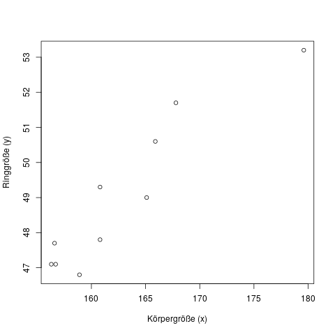
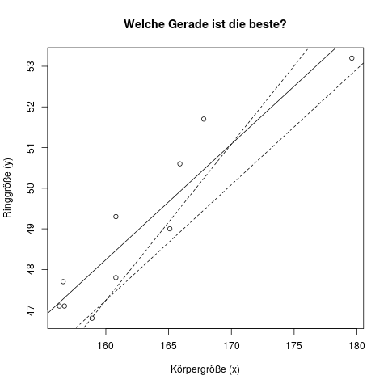

## Ein einführendes Beispiel {#sec-regression-einfuehrung}

**Idee der Regression**

Das Ziel der Regression ist es, den Wert einer bestimmten Variablen anhand einer oder mehrerer bekannter Werte vorherzusagen.

**Beispiel**

Du möchtest deiner Freundin einen Verlobungsring kaufen. Dummerweise kennst du aber ihre Ringgröße nicht. Es ist natürlich zu verdächtig, sie direkt zu fragen, weil sie dann Verdacht schöpfen könnte.

Du weißt aber, dass kleinere Frauen tendenziell auch kleinere Ringgrößen haben, und größere Frauen eben größere. Und nach ihrer Körpergröße kannst du sie ohne Bedenken fragen. Sie ist 170cm groß. Was nun? Kannst du mit dieser Information dein Problem lösen?

Ja! Die lineare Regression hilft dir in dieser Situation!

Du befrägst deinen gesamten weiblichen Bekanntenkreis (10 Personen) nach ihrer Körpergröße **und ihrer Ringgröße**, und erhältst als Ergebnis die in Abbildung \@ref(fig:regression-motivation1) dargestellten Daten.

(ref:regression-motivation1-caption) Körpergröße \(x\) und Ringgröße \(y\) für 10 befragte Personen.

```{r regression-motivation1, fig.cap="(ref:regression-motivation1-caption)"}

```

Deine Tante Emma ist zum Beispiel \(x=\)165cm groß und trägt Ringgröße \(y=\)49. Sie wird durch den Punkt ca. in der Mitte links repräsentiert.

Das sieht hilfreich aus. Da deine Freundin 170cm groß ist (\(x\)-Achse), hat sie wohl in etwa eine Ringgröße von 52 (\(y\)-Achse). Du kaufst ihr einen Ring in dieser Größe, er passt, sie sagt Ja, und ihr seid glücklich bis an euer Lebensende.

Was hier passiert ist, ist dass du in deinem Kopf eine Regression durchgeführt hast, um mit Hilfe einer bekannten Variablen - ihrer Körpergröße - eine unbekannte Variable, nämlich ihre Ringgröße vorherzusagen.

Die Regression in der Statistik ist nun ein mathematisches Werkzeug, um eine exakte Regel zu bauen, mit der man für jede Körpergröße eine "beste" Vorhersage für die Ringgröße erhält. In diesem Beispiel würde man also die "beste" Gerade bestimmen, die durch das Streudiagramm der Punkte geht (s. Abb. \@ref(fig:regression-motivation2)).

(ref:regression-motivation2-caption) Die Regression ist eine Methode, mit der man die "bestmögliche" Gerade durch eine Punktwolke zieht. Das Ziel ist meistens, mit Hilfe dieser Geraden für neue Beobachtungen von \(x\) eine Vorhersage für \(y\) (hier: die Ringgröße) zu machen.

```{r regression-motivation2, fig.cap="(ref:regression-motivation2-caption)"}

```

Wie man diese Gerade berechnet, interpretiert, und mit ihr Vorhersagen macht, sehen wir dann in den nächsten Kapiteln. Das grundlegende Problem, und das Vorgehen bei der Lösung des Problems, ist aber genau dasselbe wie in diesem Beispiel beschrieben wurde.