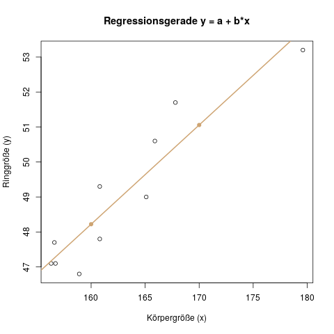

## Kategorien als Einflussgrößen

Die bisherigen Kapitel zur linearen Regression haben sich mit einem Beispiel beschäftigt, in dem wir die Ringgröße für eine Freundin möglichst genau schätzen wollen, um ihr unbemerkt einen (passenden!) Ring zu kaufen.

Zuerst haben wir die Ringgröße anhand ihrer Körpergröße geschätzt (eine einfache lineare Regression, s. Kap. \@ref(sec-regression-einfache)). Danach haben wir zusätzlich ihr Gewicht und ihr Alter verwendet, um mit drei Einflussgrößen eine genauere, sicherere Schätzung zu bekommen (die multiple lineare Regression, s. Kap. \@ref(sec-regression-multiple)).

Alle diese Variablen waren verhältnisskaliert (s. Kap. \@ref(merkmals-und-skalentypen)), also Zahlen, die in diesem Fall von 0 bis unendlich gehen können. Es gibt aber nun noch andere Variablentypen, z.B. nominalskalierte Variablen, wie etwa der Beruf einer Person. Was wäre zum Beispiel, wenn unsere Freundin Handwerkerin ist, und wir wissen, dass Handwerker tendenziell kräftigere, größere Finger haben als Büroarbeiter?

Diese Information ist sicher hilfreich für uns, und wir möchten sie in unserer Regression berücksichtigen.

#### Wie behandelt man eine ja/nein-Einflussgröße? {-}

Denken wir nochmal kurz zürück an das Beispiel aus Kapitel \@ref(sec-regression-einfache): Wir haben eine Einflussgröße \(x\), die Körpergröße, die *stetig* und *intervallskaliert* ist. Die Zielgröße \(y\), die Ringgröße, sagen wir nun vorher durch eine Gerade (s. Abb. \@ref(fig:regression-gerade2)).

(ref:regression-gerade2-caption) Die fertige Regressionsgerade für unser Beispiel mit der Ringgröße.

```{r regression-gerade2, fig.cap="(ref:regression-gerade2-caption)"}

```

Diese Gerade wird durch zwei Parameter, \(a\) und \(b\) beschrieben:

\[ y = a + b \cdot x \]

In unserem Beispiel haben wir die Parameter bestimmt als \(a = 2.8457\) und \(b = 0.2836\), die "fertige" Regressionsgerade, die man auch in dem Bild oben sieht, lautet also

\[y = 2.8457 + 0.2836 \cdot x\]

Wie würde aber nun ein Regressionsmodell aussehen, das *nur aus einer ja/nein-Einflussgröße* besteht - z.B. die Einflussgröße "Handwerker"? Für dieses kurze Gedankenexperiment ignorieren wir die Körpergröße also.

Wir verwenden dieselbe Gleichung für das Modell, \(y = a + b \cdot x\), aber die Einflussgröße \(x\) kann nur die Werte "ja" und "nein" annehmen. Wir müssen die zwei Werte natürlich in zwei Zahlen kodieren. Die Wahl die das spätere Rechnen am einfachsten macht, ist die 0 für "nein", und die 1 für "ja". Für eine Person wäre also \(x=1\) wenn sie einen Handwerkerberuf hat, und \(x=0\), wenn nicht.

Diese Wahl hat einen schönen Vorteil: Die Gleichung wird sehr einfach. Wenn nämlich \(x=0\) ist, dann wird aus der Regressionsgleichung nur noch \(y = a\), weil ja der zweite Teil \(b\cdot x = 0\) (da \(x=0\) ist). Schauen wir uns mal eine "fertige" Regression mit fiktiven Werten als Beispiel an:

\[y = 48.5 + 1.5 \cdot x \]

Was bedeutet das nun, wenn die Einflussgröße \(x\) für die Frage "Handwerker?" steht? Die Variable kann nur zwei Werte annehmen, entweder 0 oder 1. Das heißt auch, dass die Vorhersage für \(y\) nur zwei Werte annehmen kann: Für Nichthandwerker, also z.B. Büroangestellte, ist ja \(x=0\), also wird die Vorhersage für die Ringgröße \(y = 48.5 + 0 \cdot 1.5 = 48.5\) sein. Und für Handwerker prognostizieren wir \(y = 48.5 + 1 \cdot 1.5 = 50\), also einen Ring der Größe 50.

Dieses Modell ist auch sehr einfach zu interpretieren: Die Vorhersage für Nichthandwerker liest man direkt aus dem Intercept, also \(a\), ab: 48.5cm. Und der Parameter \(b\) sagt uns, wieviel größer (oder evtl. kleiner) die Vorhersage für Handwerker wird: 1.5cm.

Das ist dann auch schon fast das ganze Geheimnis hinter kategorialen Einflussgrößen.

#### Stetige und kategoriale Einflussgrößen gemischt {-}

Wir haben ja in Kapitel \@ref(sec-regression-multiple) schon ein Regressionsmodell mit mehreren Einflussgrößen gesehen, die multiple Regression. Wir können die eben betrachtete kategoriale Einflussgröße nun genauso wie eine stetige Einflussgröße zusätzlich in das Modell aufnehmen.

Nennen wir die Einflussgröße für die Frage "Handwerker?" \(x_1\), und die bereits bekannte Einflussgröße für die Körpergröße \(x_2\). Dann haben wir das folgende Regressionsmodell:

\[y = a + b_1 x_1 + b_2 x_2\]

Hierbei kann \(x_1\) nur die Werte 0 oder 1 annehmen, aber \(x_2\) als stetige Einflussgröße alle möglichen Körpergrößen.

Wenn wir nun Daten sammeln, und daraus die Parameter \(a, b_1, b_2\) schätzen wollen, kommt vielleicht das folgende fertige Modell dabei raus:

\[y = 0.16 + 0.28\cdot x_1 + 0.94\cdot x_2\]

Für eine Person mit \(x_1=168\text{cm}\) Körpergröße und einem Job als Handwerker (\(x_2=1\)) prognostizieren wir also eine Ringgröße von \(y=0.16+0.28\cdot 168 + 0.94\cdot 1 = 48.14\) - also sollte ein Ring der Größe 48 hoffentlich passen.

#### Einflussgrößen mit mehr als zwei Kategorien {-}

Ein Problem gibt es noch: Wie gehen wir mit einer Einflussgröße vor, die nicht nur zwei mögliche Ausprägungen "ja/nein", hat, sondern mehrere?

Ein Beispiel: Eine neue Einflussgröße "Sport". Für die Ringgröße ist wohl wichtig, ob die Person Gewichte stemmt oder Marathon läuft. Wir haben also z.B. die Auswahlmöglichkeiten "kein Sport", "Joggen" "Klettern", "Gewichtheben".

Es wäre falsch, nun einfach *eine* Variable \(x_1\) anzulegen, die für diese Sportarten die Werte "kein Sport = 0", "Joggen = 1", "Klettern = 2", und "Gewichtheben = 3" annehmen kann. Das Problem ist, dass wir dann nur einen Parameter \(b_1\) erhalten, und z.B. der Unterschied zwischen "kein Sport" und "joggen" genauso groß sein muss wie der zwischen "Joggen" und "Klettern". Das kann man nachprüfen, indem man für Nichtsportler \(0\cdot b_1\) vergleicht mit \(1\cdot b_1\) für Jogger und \(2\cdot b_1\) für Kletterer. Falls sich aber die Ringgröße z.B. zwischen Joggern und Kletterern gar nicht unterscheidet, könnte unser Modell das gar nicht abbilden. Fachlich heißt das: Wir unterstellen einen linearen Zusammenhang, wo es gar keinen gibt.

Wie lösen wir dieses Problem nun am besten?

Wir müssen einen kleinen Umweg gehen, indem wir die eine Einflussgröße mit vier Kategorien aufteilen in *drei* separate Einflussgrößen mit jeweils zwei Kategorien "ja/nein":

- \(x_1\): Joggen, ja/nein?
- \(x_2\): Klettern, ja/nein?
- \(x_3\): Gewichtheben, ja/nein?

Für eine bestimmte Person ist dann höchstens eine dieser drei Einflussgrößen 1, alle anderen sind 0. Ein Gewichtheber hätte also \(x_1=0\), \(x_2 = 0\), und \(x_3=1\). Für den Fall "kein Sport" brauchen wir keine extra Einflussgröße, denn diese Möglichkeit ergibt sich automatisch, wenn wir \(x_1=0\), \(x_2=0\), und \(x_3=0\) setzen - dann bleibt ja keine andere Möglichkeit übrig. (Es hat auch einen mathematischen Grund, warum wir das so lösen *müssen* - die Regression wäre nämlich sonst nicht eindeutig lösbar - aber darauf möchte ich hier nicht eingehen.)

Ein einfaches lineares Modell mit nur der Einflussgröße "Sport?" sähe also so aus:

\[y = a + b_1 \cdot x_1 + b_2 \cdot x_2 + b_3\cdot x3\]

Es hätte vier Parameter. Man kann sich ausrechnen, dass in diesem Modell die vorhergesagte Ringgröße für jemanden der keinen Sport macht, genau \(a\) ist - denn alle anderen \(x_i\) sind ja Null.

Die Kontrolle, ob du diesen Teil verstanden hast, ist, dass du erklären kannst, warum unsere Vorhersage für einen Gewichtheber nun genau \(a+b_3\) ist.

```{exercise, echo=TRUE}

Ein Forschungslabor untersucht die Auswirkung eines neuen Medikaments auf die Reaktionszeit (in Millisekunden) von Patienten. Es möchte erstens herausfinden, ob die Höhe der Dosis einen Einfluss hat, und zweitens, ob die Schwere der Krankheit einen Einfluss hat. Die Einflussgröße \(x_1\), die Dosis, wird in Milligramm (mg) als stetige Variable gemessen, und die Schwere der Krankheit als kategoriale Variable mit den Ausprägungen "gesund", "leicht krank", und "schwer krank". Die kategoriale Variable wird durch eine Dummykodierung in das Modell eingefügt: Dabei wird "gesund" als Referenzkategorie verwendet, und "leicht krank" wird durch \(x_\text{leicht}\) dargestellt (d.h. \(x_\text{leicht}=1\) wenn der Patient "leicht krank" ist, und \(x_\text{leicht}=0\) falls er gesund oder schwer krank ist). Die Einflussgröße \(x_\text{schwer}\) ist 1 wenn der Patient "schwer krank" ist, und 0 falls er gesund oder leicht krank ist. Für eine gesunde Person ist also \(x_\text{leicht}=0\) und \(x_\text{schwer}=0\).

Es wurden 20 Patienten untersucht, und die Ergebnisse der Regression in der folgenden Tabelle zusammengefasst:

| Parameter           | Schätzer | p-Wert |
| ------------------- | -------- | ------ |
| \(a\)               | 328.22   | 0.000  |
| \(b_1\)             | 0.95     | 0.003  |
| \(b_\text{leicht}\) | 47.67    | 0.406  |
| \(b_\text{schwer}\) | 141.21   | 0.019  |

Die Regressionsgerade für die Zielgröße \(y\), die Reaktionszeit in Sekunden, lautet also:

\[ y = 328.22 + 0.95 \cdot x_1 + 47.67 \cdot x_\text{leicht} + 141.21 \cdot x_\text{schwer} \]

a) Interpretiere die drei Parameter \(b_1, b_\text{leicht}, b_\text{schwer}\). Was bedeuten sie für die Reaktionszeit von Patienten?
b) Interpretiere die drei p-Werte für die drei \(b\)-Parameter. Wir geben ein Signifikanzniveau von \(\alpha=0.05\) vor.
c) Prognostiziere die erwartete Reaktionszeit für einen gesunden Patienten, der eine Dosis von 100mg bekommt.
d) Prognostiziere die erwartete Reaktionszeit für einen leicht kranken Patienten, der eine Dosis von 10mg bekommt.

```

```{solution, echo=TRUE}


a) 

\(b_1\) ist der Einfluss für die metrische Variable "Dosis". Das bedeutet hier: Wenn die Dosis für einen Patienten um 1mg erhöht wird, erwarten wir, dass seine Reaktionszeit um 0.95 Millisekunden steigt (Vorsicht: nicht "um 0.95 Sekunden"! Denn in der Datenerhebung wurde sie in Millisekunden gemessen). Der Einfluss ist positiv, d.h. eine höhere Dosis führt zu einer höheren Reaktionszeit

Der Parameter \(b_\text{leicht}\) beschreibt, wie sehr sich die Reaktionszeit eines leicht kranken Patienten gegenüber eines gesunden Patienten unterscheidet. Der gesunde Patient hat in diesem Modell keinen Parameter, er ist die Referenzkategorie (siehe auch Aufgabe c)). Die Parameter für eine kategoriale Variable bschreiben hier immer die Abweichung zur Referenzkategorie. Ein leicht kranker Patient hat also eine um \(b_\text{leicht}\) = 47.67 Millisekunden langsamere (d.h. höhere) Reaktionszeit als ein gesunder Patient.

Analog dazu hat ein schwer kranker Patient eine um \(b_\text{schwer}\) = 141.21 Millisekunden höhere Reaktionszeit als ein gesunder Patient.

Man kann sich nun auch ausrechnen, dass der Unterschied eines schwer kranken zu einem leicht kranken Patienten genau die Differenz \(b_\text{schwer} - b_\text{leicht}\) ist: \(141.21 - 47.67 = 93.54\). Ein schwer kranker Patient hat also im Mittel eine um 93.54 Millisekunden höhere Reaktionszeit als ein leicht kranker.

b) 

\(b_1\) ist mit einem p-Wert von 0.003 signifikant, denn der p-Wert ist kleiner als das vorgegebene Signifikanzniveau von \(\alpha=0.05\). Damit hat dieses Regressionsmodell gezeigt, dass die Dosis einen signifikanten Einfluss auf die Reaktionszeit hat.

\(b_\text{leicht}\) ist mit einem p-Wert von 0.406 nicht signifikant. Wir konnten nicht nachweisen, dass ein leicht kranker Patient langsamer reagiert als ein gesunder.

\(b_\text{schwer}\) ist mit einem p-Wert von 0.019 allerdings wieder signifikant. Wir konnten also hier nachweisen, dass ein schwer kranker Patient langsamer reagiert als ein gesunder.

c) 

Wir setzen einfach in die Regressionsgleichung ein:

- \(x_1 = 100\)
- \(x_\text{leicht} = 0\)
- \(x_\text{schwer} = 0\)

Damit erhalten wir als Prognose:

\[ y = 328.22 + 0.95 \cdot 100 + 47.67 \cdot 0 + 141.21 \cdot 0 = 423.22 \]

Wir erwarten also eine Reaktionszeit von 423.22 Millisekunden.

d) 

Analog zu Aufgabe c), allerdings ist der Patient jetzt leicht krank:

- \(x_1 = 10\)
- \(x_\text{leicht} = 1\)
- \(x_\text{schwer} = 0\)

Damit erhalten wir als Prognose:

\[ y = 328.22 + 0.95 \cdot 10 + 47.67 \cdot 1 + 141.21 \cdot 0 = 385.39 \]

Wir erwarten also eine Reaktionszeit von 385.39 Millisekunden.

```