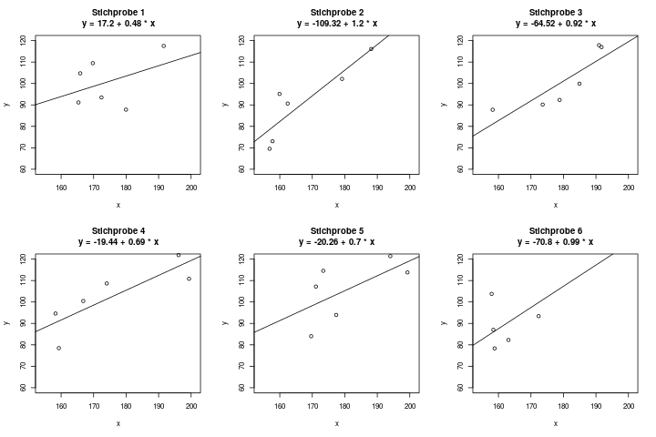

## Konfidenzintervalle für geschätzte Parameter

Stell dir vor, du möchtest den Zusammenhang zwischen den beiden Variablen \(x = \) Körpergröße und \(y = \) Körpergewicht erforschen, und du befrägst \(n=6\) Personen nach diesen beiden Werten. Du erhältst ein Regressionsmodell mit der geschätzten Geraden \(y = 17.2 + 0.48 \cdot x\) (s. Abb. \@ref(fig:regression-ki-1)). Für eine 180cm große Person schätzt dieses Modell also ein Körpergewicht von \(17.2 + 0.48 \cdot 180 = 103.6kg\).

(ref:regression-ki-1-caption) Beispiel einer Stichprobe von Körpergröße und Körpergewicht für 6 Personen.

```{r regression-ki-1, fig.cap="(ref:regression-ki-1-caption)"}
knitr::include_graphics("img/regression-ki-1.png")
```

Fünf deiner Freunde sind aber an derselben Frage interessiert, und fragen selbst jeder \(n=6\) Personen nach diesen Daten. Bei ihnen ergeben sich natürlich andere Regressionsgeraden. Das Ergebnis der 6 Stichproben könnte z.B. wie in Abbildung \@ref(fig:regression-ki-2) aussehen.

(ref:regression-ki-2-caption) Beispiel von sechs wiederholten Stichproben von Körpergröße und Körpergewicht für 6 Personen. Jede Stichprobe ergibt natürlich eine leicht andere Regressionsgerade.

```{r regression-ki-2, fig.cap="(ref:regression-ki-2-caption)"}

```

Wir haben also eine gewisse Unsicherheit in der Schätzung. Die Regressionsgerade (d.h., die beiden *Parameter* \(a\) und \(b\), durch die die Gerade beschrieben wird) kann nie exakt berechnet werden, sondern immer nur geschätzt werden, und ist daher mit Unsicherheit behaftet.

Ein *Konfidenzintervall* kann diese Unsicherheit nun in Zahlen ausdrücken.

#### Was sind Konfidenzintervalle? {-}

Für eine allgemeine Einführung, was ein Konfidenzintervall (abgekürzt: ein **KI**) ist, empfehle ich, erstmal Kapitel \@ref(sec-was-ki) zu lesen und zu verstehen. Um KIs bei der Regression zu verstehen, hilft es enorm, erstmal die einfachere Variante der KIs für Schätzer zu verstehen. Denn die Regression ist im Grunde genommen einfach nur eine Art der Parameterschätzung (s. Kap. \@ref(sec-wat-parameter)): In der einfachen linearen Regression suchen wir die Parameter \(a\) und \(b\), und sie werden genauso geschätzt wie ein einfacher Verteilungsparameter: Durch eine Schätzfunktion, die die Daten aus einer erhobenen Stichprobe auf eine passende Art zusammenfasst. Das Ergebnis ist dann ein *Punktschätzer*, und die kennen wir ja auch schon aus dem Bereich der Parameterschätzer.

Wenn man nun versteht, dass die Parameter \(a\) und \(b\) bei der Regression auf denselben Prinzipien aufbauen wie ein Parameter z.B. beim Schätzen des Mittelwerts einer Normalverteilung, hat man einen großen Vorteil, denn man muss diese Prinzipien nur einmal lernen und verstehen. Und durch die Verknüpfung der beiden Anwendungsmöglichkeiten festigt sich die Information dann viel besser im Gehirn.

Ein Parameter einer Regression ist also ein *Punktschätzer*. Und für ihn gibt es - wieder ganz analog zu allen anderen Punktschätzern - entsprechende Konfidenzintervalle. Diese sagen aus, wie sicher wir uns mit dieser Schätzung sind. Wenn wir also nur sehr wenige Daten haben, ist das Intervall relativ groß, da wir nicht sehr sicher sind, ob der wahre Parameter nicht doch wo ganz anders liegt. Wenn wir aber eine sehr große Stichprobe haben, dann können wir uns ziemlich sicher sein, recht nah am wahren Parameter dran zu sein - das Konfidenzintervall wird also kleiner sein.

Wenn wir eine Regression berechnen, dann gehen wir davon aus, dass es ein *wahres* Modell gibt, also z.B. die Parameter \(a = 3.2\) und \(b = 1.6\). Wir nehmen an dass es diese wahren Parameter gibt, aber in der Praxis kennen wir sie dann nicht - wir möchten sie daher schätzen.

Wir haben als Daten nicht die komplette Grundgesamtheit verfügbar, sondern nur eine kleine Stichprobe. Daher werden die Parameter, die wir *schätzen*, quasi niemals die wahren Parameter sein, sondern nur irgendwo in der Nähe liegen - vielleicht schätzen wir z.B. \(\hat{a} = 3.0\) und \(\hat{b} = 1.63\). Das ist die beste Schätzung die wir mit der Stichprobe machen können, denn die wahren Werte kennen wir ja nicht. Wir werden immer eine gewisse *Unsicherheit* bei der Schätzung dabei haben. Aber: je mehr Daten uns zur Verfügung stehen, also je größer unsere Stichprobe ist, desto sicherer sind wir uns mit dem Ergebnis, d.h. desto kleiner ist unsere Unsicherheit bei der Schätzung. Das zeigt sich dann in einem engeren Konfidenzintervall.

#### Wie werden Konfidenzintervalle interpretiert? {-}

Ein KI für einen Regressionsparameter, nehmen wir zum Beispiel einfach die Steigung \(b\), wird genauso interpretiert wie ein KI für z.B. den Mittelwert von normalverteilten Daten. Wie das geht, kann man in Kapitel \@ref(sec-was-ki) nachlesen.

Das Konfidenzintervall für einen Regressionsparameter, z.B. \(a\) oder \(b\), sagt aus, in welchem Bereich der wahre Parameter "ziemlich sicher" liegen könnte. Wenn wir uns zu 95% sicher sein möchten, heißt dass das wir eine *Irrtumswahrscheinlichkeit* von 5% tolerieren - dann setzen wir das *Konfidenzniveau* \(\alpha\) auf 5%, also ist dann \(\alpha = 0.05\). Genauso wie bei Parameterschätzern einer Verteilung gibt man hier also an, wie sicher man sich mit dem Konfidenzintervall sein möchte. Ein 95%-Konfidenzintervall (d.h. mit \(\alpha = 0.05\)) für den Parameter \(b\) könnte z.B. bei \([1.57, \, 1.69]\) liegen. Dann könnten wir sagen, dass wir den wahren Regressionsparameter \(b\) als 1.63 geschätzt haben, aber der wahre (und uns unbekannte) Wert auch irgendwo zwischen 1.57 und 1.69 liegen könnte - das wäre durch unsere Stichprobe auch noch plausibel.

Man schreibt das KI dann entweder als Intervall, in der Schreibweise \([1.57, \, 1.69]\), oder in der Schreibweise "Schätzer plus/minus Abstand", also z.B. \(1.63 \pm 0.06\). Die beiden Schreibweisen beschreiben aber dasselbe Intervall.

#### Wie werden Konfidenzintervalle berechnet? {-}

Auch beim Berechnen von KIs hilft es, sich noch einmal das Vorgehen für KIs bei Verteilungsparametern durchzulesen (s. Kap. \@ref(sec-was-ki)). Denn ein KI für einen Regressionsparameter berechnet man genau auf die selbe Weise. Wir brauchen dazu:

- den Punktschätzer für den Parameter, z.B. \(\hat{a}\)
    - (die Bedeutung des "Dach" über dem \(a\) wird in Kapitel \@ref(sec-schaetzfunktionen) erklärt)
- die Varianz dieses Parameters, z.B. \(\sigma^2_{\hat{a}}\)
    - Diese Varianz ist etwas komplizierter von Hand zu berechnen. Bei der einfachen linearen Regression geht das noch, aber bei der multiplen Regression, also mit mehreren Einflussgrößen, sollte man das unbedingt per Computer lösen. Sollte man in einer Klausur wirklich mal ein KI von Hand berechnen müssen, dann ist die Varianz hoffentlich schon gegeben.
- das Konfidenzniveau \(\alpha\)
- die Verteilungstabelle der t-Verteilung (s. Kap. \@ref(sec-tabelle-t-verteilung)), um dort die Quantile abzulesen. Wir brauchen das \(1-\frac{\alpha}{2}\)-Quantil der t-Verteilung mit \(n-p-1\) Freiheitsgraden. Das notieren wir insgesamt mit dem Term \(t_{1-\frac{\alpha}{2}}(n-p-1)\). Er sieht auf den ersten Blick etwas kompliziert aus, aber das sind nur zwei Zahlen, die sich da drin verstecken: Das Quantil, und die Anzahl der Freiheitsgrade.  
Dabei ist \(n\) die Stichprobengröße, und \(p\) die Anzahl der Einflussgrößen. Bei der *einfachen* linearen Regression, also mit nur einer Einflussgröße, brauchen wir also z.B. das Quantil mit \(n-2\) Freiheitsgraden.  
Das Quantil ist bei einem Konfidenzniveau von 0.05 dann z.B. das 0.975-Quantil, oder das 97.5%-Quantil.

Das Konfidenzintervall für den ersten Parameter der Regression, also \(a\), lautet dann

\[ \hat{a} \pm \hat{\sigma}_{\hat{a}} \cdot t_{1-\alpha/2}(n-p-1) \]

Wir berechnen also als erstes den Term \(\hat{\sigma}_{\hat{a}} \cdot t_{1-\alpha/2}(n-p-1)\). Angenommen es kommt 1,43 heraus. Das Konfidenzintervall geht dann einfach von der unteren Grenze \(\hat{a} - 1.43\) bis zur oberen Grenze \(\hat{a} + 1.43\). Es ist symmetrisch um den Schätzwert \(\hat{a}\) herum.

Das KI für den zweiten Parameter \(b\) berechnet man genauso, nur dass man in der oberen Formel \(\hat{a}\) durch \(\hat{b}\) ersetzt.