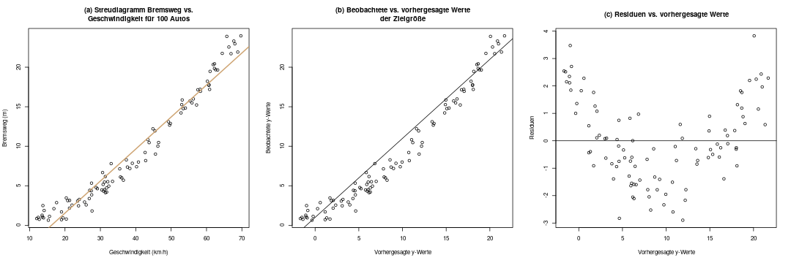
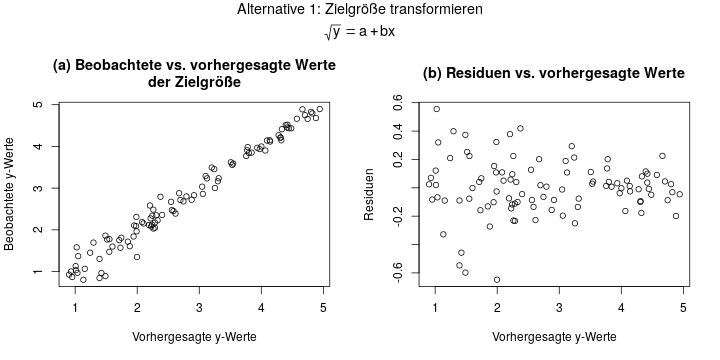
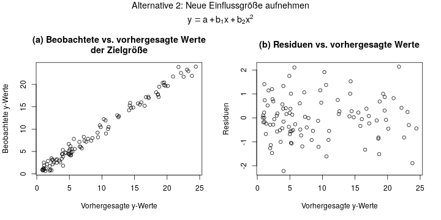
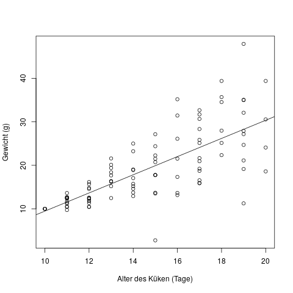
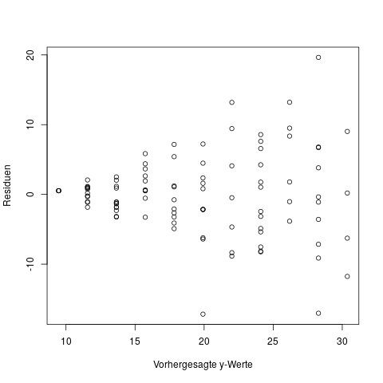

## Modelldiagnose: Ist mein Modell überhaupt sinnvoll? {#sec-modelldiagnose}

Die Ergebnise von statistischen Verfahren, z.B. Hypothesentests, oder eben die Regression, sind immer nur dann gültig, wenn gewisse *Annahmen* auch stimmen. Welche Annahmen bei einer Regression unterstellt werden, ist in Kapitel \@ref(sec-regression-annahmen) bereits erläutert - dieses Kapitel empfehle ich vorher nochmal gründlich durchzulesen, dort sind die Annahmen im linearen Modell ausführlich erklärt. Hier finden wir nun heraus, wie man überprüft ob diese Annahmen auch stimmen.

Bei der Regression geht man meist in der Reihenfolge vor, dass man zuerst das Modell "einfach mal berechnet", und danach am fertig geschätzten Modell überprüft, ob die unterstellten Annahmen realistisch sind.

Grob kann man ein Modell auf zwei verschiedene Arten überprüfen: (a) mit *grafischen Methoden*, also durch Diagramme, und (b) durch *Hypothesentests*, d.h. mit Hilfe eines p-Werts. Die Variante (b), via Hypothesentests, hat den Vorteil dass es eine klare objektive ja/nein-Entscheidung gibt (nämlich den p-Wert), und es theoretisch keinen Ermessensspielraum für die Person gibt, die die Studie durchführt.

Für das Überprüfen der Annahmen einer Regression ist es wichtig zu verstehen, was Residuen sind. Dazu gibt es in Kapitel \@ref(sec-residuen) einen kleinen Exkurs.

**1. Ist der Zusammenhang linear?**

Die Annahme, dass der Zusammenhang zwischen Einflussgrößen und Zielgröße linear sein muss, ist der kritischste Faktor bei der Modelldiagnose. Falls der wahre Zusammenhang nicht linear ist, dann sind die Vorhersagen des Modells quasi unbrauchbar.

**Überprüfen**

Am besten überprüft man diese Annahme mit Grafiken. Man erstellt z.B. ein Diagramm der beobachteten vs. vorhergesagten Zielgröße, oder der Residuen vs. der vorhergesagten Zielgröße. Abbildung \@ref(fig:regression-modelldiagnose-1) zeigt so ein Diagramm.

(ref:regression-modelldiagnose-1-caption) Ein Streudiagramm der Residuen kann Aufschluss darüber geben, ob der Zusammenhang in Wirklichkeit linear ist.

```{r regression-modelldiagnose-1, fig.cap="(ref:regression-modelldiagnose-1-caption)"}

```

Im Diagramm (a) sieht man die Originaldaten, für die eine Regression gerechnet werden soll, also \(x\) und \(y\).

In Diagramm (b) sind nun \(\hat{y}\) und \(y\) abgebildet. Das sieht hier nur zufällig sehr ähnlich zu Diagramm (a) aus, denn es ist eine ganz andere Darstellung: auf der x-Achse sind die *vorhergesagten y-Werte* abgebildet. Im diagnostischen Idealfall sollten die Daten möglichst symmetrisch über und unter der ebenso eingezeichneten Diagonalen \(y=x\) liegen. Man sieht hier schon, dass das nicht der Fall ist.

Diagramm (c) verdeutlicht uns das nun: Hier zeichnen wir die vorhergesagten y-Werte, also \(\hat{y}\), gegen die Residuen \(\epsilon\) ab. Im Idealfall sollte man in diesem Diagramm nur "Zufallsrauschen" erkennen, also keine Systematik. Hier ist das aber leider der Fall: Die Residuen haben eine klare Systematik, nämlich sind sie im niedrigen und im hohen Bereich der x-Achse eher größer als Null, und im mittleren Bereich eher kleiner. Das deutet stark darauf hin, dass wir dieses Problem beheben sollten.

**Beheben**

Zum Beheben solch eines Problems gibt es zwei Alternativen:

1. Wir transformieren die Zielgröße, d.h. statt \(y\) nehmen wir einfach \(\sqrt{y}\) als Zielgröße
2. Wir nehmen eine zusätzliche Einflussgröße in die Regression auf, d.h. als Einflussgrößen haben wir dann einmal \(x\) und einmal \(x^2\).

Wenn man sich für die erste Variante entscheidet, rechnet man also das Regressionsmodell \(\sqrt{y} = a + bx\). Die Diagnosediagramme sähen in diesem Beispiel dann aus wie in Abbildung \@ref(fig:regression-modelldiagnose-2).

(ref:regression-modelldiagnose-2-caption) Wenn wir die Zielgröße \(y\) transformieren, sieht das Streudiagramm der Residuen schon viel besser aus.

```{r regression-modelldiagnose-2, fig.cap="(ref:regression-modelldiagnose-2-caption)"}

```

Hier sieht Diagramm (b) super aus! Die Residuen streuen überall im Bereich um 0, und sind überall symmetrisch und ohne erkennbare Struktur. Das ist nun so ziemlich der Idealfall bei einem Residuenplot.

In der zweiten Variante lässt man die Zielgröße wie sie ist, aber nimmt noch eine zweite Einflussgröße auf. Diese ist einfach bestimmt als das Quadrat der ersten Einflussgröße. Abbildung \@ref(fig:regression-modelldiagnose-3) zeigt das Ergebnis dieser Variante.

(ref:regression-modelldiagnose-3-caption) Wenn wir die Zielgröße \(y\) transformieren, sieht das Streudiagramm der Residuen schon viel besser aus.

```{r regression-modelldiagnose-3, fig.cap="(ref:regression-modelldiagnose-3-caption)"}

```

Das Ergebnis sieht fast gleich aus wie in der 1. Variante, was hier aber daran liegt dass das ein sehr einfaches, künstliches Beispiel ist. Auch hier ist der Residuenplot in Diagramm (b) quasi perfekt: symmetrisch verteilt um y=0 herum, und ohne erkennbare Struktur.

Für welche dieser beiden Varianten man sich entscheidet, ist oft eine Sache des Ausprobierens. Man vergleicht einfach für beide Varianten die Residuenplots, und nimmt dann das Modell, das besser passt.

Manchmal ist die erste Alternative auch gar nicht möglich, wenn z.B. die \(y\)-Werte teilweise negativ sind. Dann kann man keine Wurzel berechnen. In diesem Fall kann man einfach auf die zweite Variante ausweichen.

**2. Sind die Residuen normalverteilt?**

Ein häufiger Fehler bei der Regression ist, dass man denkt, *die Zielgröße* \(y\) muss normalverteilt sein, oder die Einflussgrößen müssen normalverteilt sein.

Das ist nicht der Fall!

Wichtig ist nur, dass *die Residuen*, also die Schätzfehler, \(y - \hat{y}\) normalverteilt sind.

**Überprüfen**

Es gibt zwei Möglichkeiten, die Normalverteilung der Residuen zu überprüfen:

1. Grafisch, mit einem QQ-Plot.
2. Mit einem Hypothesentest, z.B. dem Kolmogorov-Smirnov-Test.

Ein QQ-Plot ist ein Diagramm, in dem auf der x-Achse die Quantile der Normalverteilung, und auf der y-Achse die Quantile der Residuen aus der Stichprobe aufgezeichnet werden. Daher kommt auch der Name "QQ-Plot" - es bedeutet einfach Quantil-Quantil-Plot.

Diese Plots geben aber keine klare Antwort auf die Frage, ob die Residuen nun normalverteilt sind oder nicht. Es bleibt eine subjektive Entscheidung der Person, die den Plot betrachtet. Daher gehen wir hier nicht genauer auf sie ein - ich möchte sie nur kurz erwähnt haben.

Die zweite Möglichkeit, die Normalverteilung von Residuen zu überprüfen, ist via einem Hypothesentest. Der Kolmogorov-Smirnov-Test kann z.B. verwendet werden, um die Nullhypothese \(H_0\): "Die Residuen sind normalverteilt" gegen die Alternativhypothese \(H_1\): "Die Residuen sind nicht normalverteilt" zu testen. (Eine allgemeine Einführung in Hypothesentests gibt es in Kapitel \@ref(sec-wat-tests))

Der Test kann von Hand quasi nicht durchgeführt werden, weswegen er in einer Klausur hoffentlich nie berechnet werden wird. Am Computer ist er allerdings einfach durchzuführen: Man übergibt ihm die Liste aller Residuen, und bekommt als Ergebnis einen p-Wert. Ist dieser kleiner als eine bestimmte Schranke (meist wird 0.05 gewählt), müssen wir davon ausgehen, dass die Residuen nicht normalverteilt sind.

Andere Tests (z.B. der Shapiro-Wilk-Test), sind für diese Aufgabe auch verbreitet. Sie beantworten genau dieselbe Frage, aber werden etwas anders berechnet.

**Beheben**

Wenn die Residuen nicht normalverteilt sind, ist der Grund oft, dass die 1. Annahme der Linearität verletzt ist. Dann ist der Ausweg derselbe wie bei der 1. Annahme: Eine Variablentransformation, z.B. indem man die Zielgröße \(y\) mit der Wurzel oder mit einem Logarithmus transformiert. Oder eben durch das Aufnehmen einer weiteren Einflussgröße, z.B. \(x^2\) wie oben in der 1. Annahme, der Linearität.

**3. Ist die Varianz der Residuen gleichbleibend?**

Für ein gültiges lineares Modell muss jedes Residuum die gleiche Verteilung haben: Eine Normalverteilung mit Mittelwert 0 und jeweils der gleichen Varianz \(\sigma^2\).

Schauen wir uns in Abbildung \@ref(fig:regression-modelldiagnose-heteroskedastie) direkt ein Beispiel an, in dem diese Annahme verletzt ist - die Residuen also unterschiedliche Varianz haben.

(ref:regression-modelldiagnose-heteroskedastie-caption) Streudiagramm des Gewichts von Küken (y-Achse) vs. des Alters (x-Achse).

```{r regression-modelldiagnose-heteroskedastie, fig.cap="(ref:regression-modelldiagnose-heteroskedastie-caption)"}

```


In diesem Diagramm sehen wir auf der x-Achse das Alter von Küken in Tagen, und auf der y-Achse ihr Gewicht in Gramm. Wir können schon mit dem Auge erkennen, dass neugeborene Küken alle etwa dasselbe Gewicht haben, und je älter sie werden, desto stärker schwankt das Gewicht. Mit Hilfe der Regressionsgeraden erkennen wir schon, dass die Residuen, d.h. der Abstand der Punkte \(y\) von der Regressionsgeraden \(\hat{y}\), mit steigendem Alter der Küken tendenziell größer wird - also eine höhere Varianz hat.

Der Fachbegriff für diese Situation nennt sich *heteroskedastische Fehler*, d.h. Fehler mit verschiedener Varianz. Der Begriff für Fehler mit gleicher Varianz (die Situation die wir bei der linearen Regression brauchen) lautet *homoskedastische Fehler*.

**Überprüfen**

Bei einem multiplen Regressionsmodell, d.h. mit mehr als einer Einflussgröße \(x\), kann man nicht einfach ein Diagramm von x versus y zeichnen. Hier diagnostiziert man heteroskedastische Fehler dann mit derselben Methode die wir schon für nichtlineare Einflüsse verwendet haben: Wir zeichnen in Abbildung \@ref(fig:regression-modelldiagnose-heteroskedastie-diagnose) einen Plot der beobachteten y-Werte vs. der vorhergesagten y-Werte.

(ref:regression-modelldiagnose-heteroskedastie-diagnose-caption) Residuen vs. vorhergesagte y-Werte für die Regression.

```{r regression-modelldiagnose-heteroskedastie-diagnose, fig.cap="(ref:regression-modelldiagnose-heteroskedastie-diagnose-caption)"}

```

*Beheben**

Zum Beheben dieser Situation kommt ebenfalls eine Variablentransformation in Frage: Falls die Residuen eher prozentual konstant sind, macht eine log-Transformation der Zielgröße Sinn. Dazu muss die Zielgröße allerdings strikt positiv sein. Im Anschluß an einen Versuch der Transformation sollte man sich wieder die Diagnoseplots ansehen, und entscheiden ob die Situation nun besser geworden ist.

**4. Sind die Residuen unabhängig?**

Dieses Problem tritt häufig auf, wenn man eine *Zeitreihe* analysiert, wenn also die Zielgröße \(y\) und die Einflussgrößen \(x\) über einen bestimmten Zeitraum immer wieder gemessen wurden. Um eine Abhängigkeit der Residuen festzustellen, muss es nämlich eine gewisse *Reihenfolge* in den Daten geben, und das ist insbesondere dann der Fall, wenn eine Einflussgröße die Zeit ist. In allen anderen Fällen könnte man die Reihen des Datensatzes ja ohne Auswirkung beliebig umsortieren.

Falls eine der anderen drei Annahmen verletzt ist, z.B. dass der Zusammenhang zwischen Einflussgröße und Zielgröße nicht linear ist, dann ist meistens auch automatisch diese Annahme der unabhängigen Residuen verletzt. Wenn man sich z.B. das Diagramm aus Abschnitt 1 ansieht, in dem der Zusammenhang eher einer Parabel folgt, dann erkennt man dass die Größe vom Residuum z.B. ganz am rechten Ende der x-Achse mit der Größe vom "vorletzten" Residuum direkt nebenan zusammenhängt - also abhängig ist.

**Überprüfen**

Die Zeitreihenanalyse geht etwas über den Themenumfang heraus, daher gebe ich nur ein paar Begriffe als Ansatz zur weiteren Recherche. Ganz grob gesagt erkennt man eine Abhängigkeit z.B. über Plots der Residuen vs. der Zeitachse. Eine andere Möglichkeit ist ein Diagramm der sogenannten *Autokorrelationsfunktion* der Residuen. Zuletzt gibt es noch den *Durbin-Watson-Test*, mit dem man einen Hypothesentest auf Autokorrelation durchführen kann.

**Beheben**

Um eine ernsthafte, problematische Abhängigkeit der Residuen zu beheben, muss man sich mit der Zeitreihenanalyse beschäftigen. Es bietet sich als Ausweg an, ein ARIMA-Modell zu rechnen, und z.B. einen AR(1) oder einen MA(1)-Term mit ins Modell aufzunehmen.

**Weiterführende Literatur**

Die oben beschriebenen vier Annahmen sind hier auf Englisch nochmal detailliert beschrieben: http://people.duke.edu/~rnau/testing.htm

- Das Buch "Regression" von Fahrmeir, Kneib, Lang (auf deutsch und englisch verfübar) hat ein ausführliches Kapitel über die Modelldiagnose. In der 2. Auflage der deutschen Ausgabe von 2009 ist Abschnitt 3.6.4 über die Modelldiagnose.
  - Seite 168 beschreibt 3 Ziele der Modelldiagnose
  - Seite 179 zeigt einige Auswege, falls Annahmen verletzt sind
  - Zwei weitere Situationen die man in der Modelldiagnose überprüfen kann, sind *Multikollinearität* (Seite 170) und *Ausreißeranalyse* bzw. einflussreiche Beobachtungen (Seite 173)